Centralia soil Virus and CRISPR Analysis
================
Sam Barnett
24 May, 2024

-   [Introduction](#introduction)
    -   [Import data](#import-data)
-   [CRISPRs](#crisprs)
    -   [CRISPRs across fire classifications, time, and
        temperature](#crisprs-across-fire-classifications-time-and-temperature)
-   [Filter viral contigs](#filter-viral-contigs)
-   [Import vOTU coverages](#import-votu-coverages)
    -   [Percent of reads mapped to
        vOTU](#percent-of-reads-mapped-to-votu)
-   [vOTU alpha diversity](#votu-alpha-diversity)
    -   [vOTU richness](#votu-richness)
    -   [vOTU evenness](#votu-evenness)
    -   [Species accumulation curves](#species-accumulation-curves)
-   [Beta diversity](#beta-diversity)
    -   [PERMANOVA](#permanova)
    -   [Ordination](#ordination)
    -   [Beta dispersion across fire
        classifications](#beta-dispersion-across-fire-classifications)
    -   [Partition beta diversity](#partition-beta-diversity)
    -   [Post hoc PERMANOVA](#post-hoc-permanova)
    -   [CCA analysis](#cca-analysis)
    -   [Trajectory analysis](#trajectory-analysis)
    -   [Community distances to reference over time and disturbance
        intensity](#community-distances-to-reference-over-time-and-disturbance-intensity)
    -   [Plot all betadiversity figures
        together](#plot-all-betadiversity-figures-together)
-   [vOTU taxonomy](#votu-taxonomy)
    -   [Taxonomy abundances](#taxonomy-abundances)
-   [vOTU to host hits](#votu-to-host-hits)
    -   [CRISPR matches](#crispr-matches)
-   [Auxilliary metabolic genes](#auxilliary-metabolic-genes)
    -   [Occurance and abundance of vOTU containing
        AMGs](#occurance-and-abundance-of-votu-containing-amgs)
    -   [Abundance of AMG containing
        vOTU](#abundance-of-amg-containing-votu)
    -   [Specific types of AMGs](#specific-types-of-amgs)
-   [vOTU abundances](#votu-abundances)
    -   [Log10 RPKM abundance](#log10-rpkm-abundance)
    -   [Abundance zscores](#abundance-zscores)
-   [Session info](#session-info)

# Introduction

From our Centralia, PA metagenomes, we saw some interesting trends in
both CRISPR and viral genes. Thus we took it upon ourselves to examine
the soil viruses found in these soils. Here is the analysis used for
this soil virus study. Sequence processing was performed as described in
the accompanying manuscript and within the accompanying code. Most input
data is found locally and can be accessed from Sam.

``` r
# Libraries for data
library(dplyr)
library(phyloseq)
library(ape)
library(readxl)
library(network)

# Libraries for analysis
library(vegan)
library(picante)
library(Nonpareil)
library(ecotraj)
library(betapart)
library(pvclust)


# Libraries for plotting
library(ggplot2)
library(ggnetwork)
library(ggdendro)
library(ggtree)
library(treeio)
library(ggnewscale)
library(ggh4x)

source("/Users/sambarnett/Documents/Misc_code/paul_tol_colors.R")

# Functon for extracting legends
g_legend<-function(a.gplot){
  tmp <- ggplot_gtable(ggplot_build(a.gplot))
  leg <- which(sapply(tmp$grobs, function(x) x$name) == "guide-box")
  legend <- tmp$grobs[[leg]]
  return(legend)} 


# Site lists
used_sites = c("Cen08", "Cen11", "Cen14", "Cen15", "Cen16", "Cen17", "Cen19", 
               "Cen21", "Cen22", "Cen23")

# Setting repeated plot aesthetics
## Sites
site.col = paultol_colors(length(used_sites))
names(site.col) = used_sites

site.shape = c(22, 24, 24, 24, 24, 22, 24, 24, 24, 22)
names(site.shape) = used_sites

## Fire Classifications
FC.col = c("FireAffected" = "red", "Reference" = "grey")
FC.shape = c("FireAffected" = 24, "Reference" = 22)

# Basic plotting theme so as not to continually repeat it
publication_theme = theme_bw() +
  theme(axis.text = element_text(size=6),
        axis.title = element_text(size=7),
        legend.text = element_text(size=6),
        legend.title = element_text(size=7, hjust=0.5),
        strip.text = element_text(size=7),
        plot.title = element_text(size=8, hjust=0.5))

present_theme = theme_bw() +
  theme(axis.text = element_text(size=10),
        axis.title = element_text(size=12),
        legend.text = element_text(size=10),
        legend.title = element_text(size=12, hjust=0.5),
        strip.text = element_text(size=10),
        plot.title = element_text(size=14, hjust=0.5))
```

## Import data

Lets import the initial data used for this analysis including metadata.

### Metadata and read stats

Metadata and number of reads mapped in the metagenome.

``` r
# Sample metadata
sample.meta = read_xlsx("/Users/sambarnett/Documents/Shade_lab/Centralia_project/Centralia_soil_metadata.xlsx", 
                        sheet = "Metagenomic_samples", na="NA") %>%
  filter(SampleID != "Cen08_07102019_R1") %>%
  arrange(SiteID, Year) %>%
  mutate(Seq_number = row_number()) %>%
  mutate(nonpareil_file = paste("/Users/sambarnett/Documents/Shade_lab/Centralia_project/Metagenomics/Data/nonpareil/", SampleID, "_S", Seq_number, ".npo", sep=""),
         SequenceID = paste(SampleID, Seq_number, sep="_S"))

# Read stats
total_reads.df = read.table("/Users/sambarnett/Documents/Shade_lab/Centralia_project/Metagenomics/Data/Filtered_read_statistics.txt", 
                            header=TRUE, sep="\t", comment.char = "", quote = "") %>%
  mutate(total_reads = Forward_read_count + Reverse_read_count) %>%
  select(SampleID, total_reads) %>%
  rename(SequenceID = SampleID) 


mapped_reads.df = read.table("/Users/sambarnett/Documents/Shade_lab/Centralia_project/Metagenomics/Data/Mapped_read_totals.txt", 
                          header=TRUE, sep="\t", comment.char = "", quote = "")
```

### Single copy genes

Identities of single copy genes to be used for the CRISPR investment
analysis. Single copy genes are found using HMMSEARCH from ANVIO list of
single copy genes.

``` r
Single_copy.df = read.table("/Users/sambarnett/Documents/Shade_lab/Centralia_project/Metagenomics/Data/Annotations/SingleCopyGene_annotations.txt",
           header=TRUE, sep="\t", comment.char = "", quote = "") %>%
  filter(alignment_probability >= 0.8) %>%
  group_by(locus_tag, SequenceID) %>%
  mutate(min_E = min(E_value)) %>%
  ungroup %>%
  filter(E_value == min_E) %>%
  select(Target, locus_tag, SequenceID, Reference_HMM) %>%
  unique

median_SC_gene.df = Single_copy.df %>%
  filter(Reference_HMM == "Bacterial_71",
         grepl("Ribosomal", Target)) %>%
  group_by(SequenceID, Target) %>%
  summarize(n_genes = n()) %>%
  ungroup %>%
  group_by(SequenceID) %>%
  summarize(genome_estimate = median(n_genes)) %>%
  ungroup
```

### Site metadata for manuscript

For the manuscript we wanted a table with some basic site metadata. Lets
make that table here.

``` r
Site.meta = read_xlsx("/Users/sambarnett/Documents/Shade_lab/Centralia_project/Centralia_soil_metadata.xlsx", 
                        sheet = "Metagenomic_samples", na="NA") %>%
  filter(SiteID %in% used_sites, Year != 2014) %>%
  mutate(Year_col = paste("Temp", Year, sep = "_")) %>%
  select(SiteID, FireClassification, Year_col, CoreTemp_C) %>%
  tidyr::spread(key=Year_col, value=CoreTemp_C) %>%
  left_join(read_xlsx("/Users/sambarnett/Documents/Shade_lab/Centralia_project/Centralia_soil_metadata.xlsx", sheet = "Site_metadata")  %>%
              mutate(longitude = as.numeric(measurements::conv_unit(longitude, from = 'deg_dec_min', to = 'dec_deg')),
                     latitude = as.numeric(measurements::conv_unit(latitude, from = 'deg_dec_min', to = 'dec_deg'))) %>%
              mutate(Lat_Long = paste(round(latitude, digits=4), "N", " ", round(longitude, digits=4), "W", sep="")) %>%
              select(SiteID, Lat_Long))
Site.meta
```

    ## # A tibble: 10 × 10
    ##    SiteID FireClassifi…¹ Temp_…² Temp_…³ Temp_…⁴ Temp_…⁵ Temp_…⁶ Temp_…⁷ Temp_…⁸
    ##    <chr>  <chr>            <dbl>   <dbl>   <dbl>   <dbl>   <dbl>   <dbl>   <dbl>
    ##  1 Cen08  Reference         12.7    11.1    13.3    16.1    16.3    11.6    15.8
    ##  2 Cen11  FireAffected      27.4    25.1    23.2    21.8    19.3    19.5    20  
    ##  3 Cen14  FireAffected      28.9    29.4    28.5    30      26.9    25.4    22.1
    ##  4 Cen15  FireAffected      35.3    31.8    27.2    28.6    25      22.3    21.8
    ##  5 Cen16  FireAffected      22.4    20.9    18.9    22.2    17.1    14.4    19.5
    ##  6 Cen17  Reference         14.4    13.2    13.8    18      15.1    12.5    16.8
    ##  7 Cen19  FireAffected      31      46.3    41.3    27.3    23.7    15.9    20.1
    ##  8 Cen21  FireAffected      33.8    37.3    31.5    31.7    30      24.5    23.5
    ##  9 Cen22  FireAffected      37.4    36.6    32.3    33.9    30.8    32.5    26.4
    ## 10 Cen23  Reference         13.9    13.1    12.5    16.7    15      12.1    16  
    ## # … with 1 more variable: Lat_Long <chr>, and abbreviated variable names
    ## #   ¹​FireClassification, ²​Temp_2015, ³​Temp_2016, ⁴​Temp_2017, ⁵​Temp_2018,
    ## #   ⁶​Temp_2019, ⁷​Temp_2020, ⁸​Temp_2021

``` r
#write.table(Site.meta, file="/Users/sambarnett/Documents/Shade_lab/Centralia_project/Phage_analysis/Analysis/Figures/TableS1.txt",
#            sep="\t", quote=FALSE, row.names = FALSE)
```

# CRISPRs

First lets see what trends there are in CRISPR investment across
samples. CRISPRS were identified using minced. For this analysis, we
define population investment as number of CRISPR arrays found divided by
the median number of ribosomal protein gene copies.

``` r
# Read in CRISPR data
CRISPR.df = read.table("/Users/sambarnett/Documents/Shade_lab/Centralia_project/Metagenomics/Data/Annotations/Contig_taxonomy.txt",
                       header=TRUE, sep="\t", comment.char = "", quote = "") %>%
  mutate(ContigID = paste(gsub(".*_", "NODE_", ContigID))) %>%
  right_join(read.table("/Users/sambarnett/Documents/Shade_lab/Centralia_project/Metagenomics/Data/Annotations/CRISPR_annotations.txt",
                        header=TRUE, sep="\t", comment.char = "", quote = ""),
             by=c("SequenceID", "ContigID"))

# Summarize CRISPRs
CRISPR.sum = CRISPR.df %>%
  group_by(SequenceID, ContigID, CRISPR_ID) %>%
  summarize(n_Spacers = n()) %>%
  ungroup %>%
  group_by(SequenceID) %>%
  summarize(n_Arrays = n(),
            n_Spacers = sum(n_Spacers)) %>%
  ungroup %>%
  mutate(mean_Spacers_per_Array = n_Spacers/n_Arrays) %>%
  full_join(sample.meta, by = "SequenceID") %>%
  mutate(n_Arrays = ifelse(is.na(n_Arrays), 0, n_Arrays),
         n_Spacers = ifelse(is.na(n_Spacers), 0, n_Spacers)) %>%
  left_join(median_SC_gene.df, by = "SequenceID") %>%
  left_join(mapped_reads.df, by = "SequenceID") %>%
  mutate(genome_adj_n_Arrays = n_Arrays/genome_estimate,
         genome_adj_n_Spacers = n_Spacers/genome_estimate,
         read_adj_n_Spacers = n_Spacers/total_mapped_reads*1000000)
```

## CRISPRs across fire classifications, time, and temperature

Is there difference in CRISPR investment across fire classifications?
How about across temperature?

``` r
# Wilcoxon test across fire classification
genome_adj_n_Arrays.wilcox = wilcox.test(x=filter(CRISPR.sum, FireClassification=="Reference")$genome_adj_n_Arrays,
                                         y=filter(CRISPR.sum, FireClassification=="FireAffected")$genome_adj_n_Arrays,
                                         conf.int=TRUE, conf.level=0.95)
genome_adj_n_Arrays.wilcox
```

    ## 
    ##  Wilcoxon rank sum test with continuity correction
    ## 
    ## data:  filter(CRISPR.sum, FireClassification == "Reference")$genome_adj_n_Arrays and filter(CRISPR.sum, FireClassification == "FireAffected")$genome_adj_n_Arrays
    ## W = 49, p-value = 5.639e-09
    ## alternative hypothesis: true location shift is not equal to 0
    ## 95 percent confidence interval:
    ##  -2.256407 -1.017087
    ## sample estimates:
    ## difference in location 
    ##              -1.441025

``` r
wilcox.p = ifelse(genome_adj_n_Arrays.wilcox$p.value < 0.001, "p < 0.001",
                  paste("p = ", round(genome_adj_n_Arrays.wilcox$p.value, digits = 3), sep=""))

# Linear mixed effects over time
genome_adj_n_Arrays_time.model.df = data.frame()

for(FC in unique(CRISPR.sum$FireClassification)){
  sub_genome_adj_n_Arrays.model = lme(genome_adj_n_Arrays ~ Year, random = ~1|SiteID,
                                      data=filter(CRISPR.sum, FireClassification==FC))
  genome_adj_n_Arrays_time.model.df = rbind(genome_adj_n_Arrays_time.model.df,
                                            data.frame(summary(sub_genome_adj_n_Arrays.model)$tTable) %>%
                                              tibble::rownames_to_column(var="factor") %>%
                                              mutate(FireClassification = FC))
}

genome_adj_n_Arrays_time.model.reg = genome_adj_n_Arrays_time.model.df %>%
  mutate(p_slope = ifelse(factor == "Year", p.value, 1),
         factor = ifelse(factor == "(Intercept)", "Intercept", factor)) %>%
  group_by(FireClassification) %>%
  mutate(p_slope = min(p_slope)) %>%
  ungroup %>%
  select(FireClassification, factor, Value, p_slope) %>%
  tidyr::spread(key="factor", value="Value") %>%
  mutate(sig = ifelse(p_slope < 0.05, "< 0.05", "≥ 0.05"))

genome_adj_n_Arrays_time.model.reg
```

    ## # A tibble: 2 × 5
    ##   FireClassification      p_slope Intercept    Year sig   
    ##   <chr>                     <dbl>     <dbl>   <dbl> <chr> 
    ## 1 FireAffected       0.0000000147     780.  -0.386  < 0.05
    ## 2 Reference          0.165             62.4 -0.0308 ≥ 0.05

``` r
# Linear mixed effects over temperature
genome_adj_n_Arrays.model = lme(genome_adj_n_Arrays ~ CoreTemp_C, random = ~1|SiteID, data=CRISPR.sum)
genome_adj_n_Arrays.model.sum = summary(genome_adj_n_Arrays.model)
genome_adj_n_Arrays.model.sum
```

    ## Linear mixed-effects model fit by REML
    ##   Data: CRISPR.sum 
    ##        AIC      BIC    logLik
    ##   160.2312 169.0499 -76.11558
    ## 
    ## Random effects:
    ##  Formula: ~1 | SiteID
    ##         (Intercept)  Residual
    ## StdDev:    0.268048 0.6533976
    ## 
    ## Fixed effects:  genome_adj_n_Arrays ~ CoreTemp_C 
    ##                  Value  Std.Error DF   t-value p-value
    ## (Intercept) -1.8710665 0.30701319 58 -6.094417       0
    ## CoreTemp_C   0.1457539 0.01225295 58 11.895411       0
    ##  Correlation: 
    ##            (Intr)
    ## CoreTemp_C -0.926
    ## 
    ## Standardized Within-Group Residuals:
    ##         Min          Q1         Med          Q3         Max 
    ## -1.73908591 -0.65883143 -0.02948993  0.70810904  2.72574129 
    ## 
    ## Number of Observations: 69
    ## Number of Groups: 10

Now lets plot

``` r
# Plot boxplot over fire classification
genome_adj_n_Arrays_FC.plot = ggplot(data=CRISPR.sum, aes(x=FireClassification, y=genome_adj_n_Arrays)) +
  geom_boxplot(outlier.shape = NA) +
  geom_jitter(aes(shape=FireClassification, fill=SiteID), size=2,
              width = 0.25, height = 0) +
  annotate("text", x=1.5, y=max(CRISPR.sum$genome_adj_n_Arrays), size = 6*5/14,
           label=wilcox.p) +
  scale_shape_manual(values=FC.shape) +
  scale_fill_manual(values=site.col) +
  labs(x="Fire Classification", y="Number of CRISPR Arrays\nadjusted by estimated number of genomes") +
  publication_theme +
  guides(fill=guide_legend(override.aes=list(shape=site.shape)))

# Plot lines over time
genome_adj_n_Arrays_time.plot = ggplot(data=CRISPR.sum, aes(x=Year, y=genome_adj_n_Arrays)) +
  geom_line(aes(group=SiteID), color="black", size=1) + 
  geom_line(aes(color=SiteID), size=0.5) + 
  geom_point(aes(shape=FireClassification, fill=SiteID), size=2) +
  geom_abline(data=genome_adj_n_Arrays_time.model.reg,
              aes(intercept = Intercept, slope = Year),
              linetype=1, size=2, color="black") +
  geom_abline(data=genome_adj_n_Arrays_time.model.reg,
              aes(intercept = Intercept, slope = Year, linetype = sig)
              , size=1, color="white") +
  scale_shape_manual(values=FC.shape) +
  scale_fill_manual(values=site.col) +
  scale_color_manual(values=site.col) +
  scale_linetype_manual(values=c("< 0.05" = 1, "≥ 0.05" = 2)) +
  labs(x="Year", y="Number of CRISPR Arrays\nadjusted by estimated number of genomes",
       linetype = "LME p-value") +
  publication_theme +
  theme(legend.position = "bottom",
        legend.direction = "vertical") +
  guides(fill=guide_legend(override.aes=list(shape=site.shape), nrow = 2),
         linetype=guide_legend(override.aes=list(color="black"))) +
  facet_wrap(~FireClassification)

# Plot scatterplot with regression over temperature
genome_adj_n_Arrays_temp.plot = ggplot(data=CRISPR.sum, aes(x=CoreTemp_C, y=genome_adj_n_Arrays)) +
  geom_point(aes(shape=FireClassification, fill=SiteID), size=2) +
  geom_abline(intercept = genome_adj_n_Arrays.model.sum$tTable[1], 
              slope = genome_adj_n_Arrays.model.sum$tTable[2],
              linetype = 1, size=2, color="black") +
  geom_abline(intercept = genome_adj_n_Arrays.model.sum$tTable[1], 
              slope = genome_adj_n_Arrays.model.sum$tTable[2],
              linetype = 1, size=1, color="white") +
  scale_shape_manual(values=FC.shape) +
  scale_fill_manual(values=site.col) +
  labs(x="Soil temperature (˚C)", y="Number of CRISPR Arrays\nadjusted by estimated number of genomes") +
  publication_theme +
  theme(legend.position = "bottom",
        legend.direction = "vertical") +
  guides(fill=guide_legend(override.aes=list(shape=site.shape), nrow = 3))

genome_adj_n_Arrays.leg = g_legend(genome_adj_n_Arrays_time.plot)


genome_adj_n_Arrays.plot = cowplot::plot_grid(cowplot::plot_grid(genome_adj_n_Arrays_FC.plot + theme(legend.position = "none"), 
                                                                 genome_adj_n_Arrays_temp.plot + 
                                                                   theme(axis.title.y=element_blank(), 
                                                                         axis.text.y = element_blank(), 
                                                                         legend.position = "none",
                                                                         plot.margin = unit(c(0,2,0,5), "mm")),
                                                                 rel_widths = c(0.5, 1), nrow=, labels=c("A", "B"), label_size = 8, align = "h"),
                                              genome_adj_n_Arrays_time.plot + theme(legend.position = "none"),
                                              genome_adj_n_Arrays.leg, rel_heights = c(1, 1, 0.3), labels=c("", "C", ""), label_size = 8, ncol=1)
genome_adj_n_Arrays.plot
```

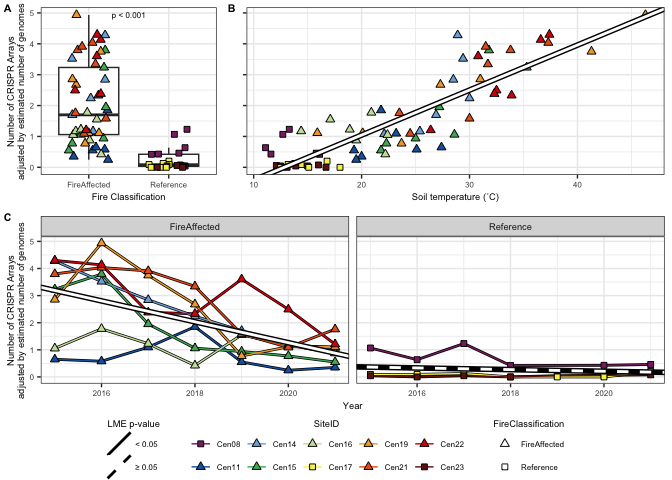<!-- -->

``` r
#ggsave(genome_adj_n_Arrays.plot, file="/Users/sambarnett/Documents/Shade_lab/Centralia_project/Phage_analysis/Analysis/Figures/Fig2.tiff",
#       device="tiff", width=7, height=5, units="in", bg="white")
```

# Filter viral contigs

Before looking at the soil viruses, we first have to identify which
sequences are viral. This section is used in conjuction with the
sequence processing code to filter processed contigs to identify viral
ones. Then these sequences will be input into MMseqs clustering to get
vOTUs.

For this filtering we will be mostly following the VirSorter2 SOP from
<https://www.protocols.io/view/viral-sequence-identification-sop-with-virsorter2-5qpvoyqebg4o/v3>.

``` r
checkV_contam.df = read.table("/Users/sambarnett/Documents/Shade_lab/Centralia_project/Phage_analysis/Data/checkV_contamination.txt",
                              header=TRUE, sep="\t", comment.char = "", quote = "") %>%
  rename(checkV_length = contig_length,
         viralID = contig_id) %>%
  mutate(viralID = gsub("\\|\\|", "__", viralID)) %>%
  mutate(contig_id = gsub("__.*", "", viralID)) %>%
  select(SequenceID, contig_id, viralID, viral_genes, host_genes, checkV_length)
  
VS2_scores.df = read.table("/Users/sambarnett/Documents/Shade_lab/Centralia_project/Phage_analysis/Data/virsorter2_scores.txt",
                           header=TRUE, sep="\t", comment.char = "", quote = "") %>%
  rename(viralID = seqname,
         VS2_length = length) %>%
  mutate(viralID = gsub("\\|\\|", "__", viralID)) %>%
  mutate(contig_id = gsub("__.*", "", viralID)) %>%
  select(SequenceID, contig_id, viralID, max_score, hallmark, VS2_length)

# Criteria
## Keep1: viral_gene > 0
## Keep2: viral_gene = 0 AND (host_gene = 0 OR score >= 0.95 OR hallmark >2)
## Manual check: (NOT in Keep1 OR Keep2) AND viral_gene = 0 AND host_gene = 1 AND length >= 10kb
## Discard: the rest

keep_contigs.df = inner_join(checkV_contam.df, VS2_scores.df, by = c("SequenceID", "contig_id", "viralID")) %>%
  replace(is.na(.), 0) %>%
  mutate(keep_cat = ifelse(viral_genes > 0, "Keep1",
                           ifelse(host_genes == 0 | max_score >= 0.95 | hallmark > 2, "Keep2", 
                                  ifelse(host_genes == 1 & VS2_length >= 10000, "Manual", "Discard"))))

checkV_contam.df = NULL
VS2_scores.df = NULL
```

``` r
# Suspect products from https://bitbucket.org/MAVERICLab/virsorter2-sop/raw/03b8f28bee979e2b7fd99d7375d915c29c938339/resource/suspicious-gene.list
suspect_products = paste("carbohydrate kinase", "carbohydrate-kinase", "glycosyltransferase", 
                         "glycosyl transferase", "glycosyl transferaseendonuclease", 
                         "nucleotide sugar epimerase", "nucleotide sugar-epimerase", 
                         "nucleotide-sugar epimerase", "nucleotide-sugar-epimerase", 
                         "nucleotidyltransferase", "nucleotidyl transferase", "nucleotidyl-transferase", 
                         "plasmid stability", "endonuclease", sep="|")

DRAMv_dist.df = read.table("/Users/sambarnett/Documents/Shade_lab/Centralia_project/Phage_analysis/Data/DRAMv_distallates.txt",
                           header=TRUE, sep="\t", comment.char = "", quote = "") %>%
  rename(viralID = Unnamed..0) %>%
  mutate(viralID = gsub("-.*", "", viralID)) %>%
  mutate(contig_id = gsub("__.*", "", viralID))

DRAMv.df = read.table("/Users/sambarnett/Documents/Shade_lab/Centralia_project/Phage_analysis/Data/DRAMv_annotations.txt",
                      header=TRUE, sep="\t", comment.char = "", quote = "") %>%
  mutate(across(everything(), ~replace(., . ==  "" , NA))) %>%
  rename(geneID = Unnamed..0,
         viralID = scaffold) %>%
  mutate(viralID = gsub("-.*", "", viralID)) %>%
  mutate(contig_id = gsub("__.*", "", viralID)) %>%
  #select(SequenceID, contig_id, geneID, ko_id, kegg_hit, viral_id, pfam_hits, amg_flags) %>%
  inner_join(keep_contigs.df, by = c("SequenceID", "contig_id", "viralID")) %>%
  mutate(suspect_gene = ifelse(keep_cat == "Keep2", 
                          ifelse(grepl(suspect_products, tolower(kegg_hit)) | grepl(suspect_products, tolower(pfam_hits)),
                                 1, 0),
                          0)) %>%
  group_by(SequenceID, contig_id, viralID) %>%
  mutate(is.suspect = max(suspect_gene)) %>%
  ungroup
```

Criteria for calling a contig viral

``` r
## Cat 1: Structural genes, hallmark genes, depletion in annotations or enrichment for hypotheticals (~10% genes having non-hypothetical annotations)
manual_viral_cat1.df = DRAMv.df %>%
  select(SequenceID, contig_id, viralID, keep_cat, is.suspect, hallmark) %>%
  unique %>%
  filter(is.suspect == 1 | keep_cat == "Manual") %>%
  inner_join(DRAMv_dist.df, by = c("SequenceID", "contig_id", "viralID")) %>%
  mutate(perc_hypothetical = Viral.hypothetical.genes/Gene.count*100) %>%
  filter(Viral.structure.genes > 0 | hallmark > 0 | perc_hypothetical > 90) %>%
  select(SequenceID, contig_id, viralID)

## Cat 2: Lacking hallmarks but >=50% of annotated genes hit to a virus and at least half of those have viral bitcore >100 and the contig is <50kb in length
manual_viral_cat2.df = DRAMv.df %>%
  filter(is.suspect == 1 | keep_cat == "Manual") %>%
  filter(hallmark == 0) %>%
  mutate(is_viral_hit = ifelse(!is.na(viral_id), 1, 0),
         viral_bitscore_G100 = ifelse(viral_bitScore > 100, 1, 0)) %>%
  group_by(SequenceID, contig_id, viralID, VS2_length) %>%
  summarize(n_genes = n(),
            n_viral_hits = sum(is_viral_hit),
            n_viral_bitscore_G100 = sum(viral_bitscore_G100, na.rm = TRUE)) %>%
  ungroup %>%
  mutate(perc_viral = n_viral_hits/n_genes*100,
         perc_bitscore = n_viral_bitscore_G100/n_viral_hits*100) %>%
  filter(perc_viral >= 50, perc_bitscore >= 50, VS2_length < 50000) %>%
  select(SequenceID, contig_id, viralID)

manual_approved.df = full_join(manual_viral_cat1.df, manual_viral_cat2.df, 
                               by = c("SequenceID", "contig_id", "viralID")) %>%
  mutate(manual_approve = "Approved")

phage_contig.list = DRAMv.df %>%
  select(SequenceID, contig_id, viralID, VS2_length, keep_cat, is.suspect) %>%
  unique() %>%
  left_join(manual_approved.df, by = c("SequenceID", "contig_id" ,"viralID")) %>%
  mutate(manual_approve = ifelse(is.na(manual_approve), "Unapproved", manual_approve)) %>%
  mutate(is_phage = ifelse((keep_cat == "Keep1") | 
                            (keep_cat == "Keep2" & is.suspect == 0) |
                            (keep_cat == "Keep2" & is.suspect == 1 & manual_approve == "Approved") |
                            (keep_cat == "Manual" & manual_approve == "Approved"), 1, 0))

# Save file
#write.table(phage_contig.list, file="/Users/sambarnett/Documents/Shade_lab/Centralia_project/Phage_analysis/Data/phage_contig_list.txt",
#            sep="\t", quote=FALSE, row.names = FALSE)
```

# Import vOTU coverages

Now that we have our vOTUs, lets check out their coverage and
abundances. For further analysis with abundance we will generally be
using the term reads per kilobase per million mapped reads (RPKM). This
is calculated by taking the number of reads (both forward and reverse)
mapped to a vOTU dividing by the vOTU length in kilobases and dividing
by the total number of reads mapped to all vOTU in millions of reads.

``` r
# Read in the vOTU coverage table
vOTU_coverage.df = read.table("/Users/sambarnett/Documents/Shade_lab/Centralia_project/Phage_analysis/Data/vOTU.comb_cov.txt",
           header=TRUE, sep="\t", comment.char = "", quote = "") %>%
  filter(Covered_percent >= 75,
         Avg_fold >= 1) %>%
  rename(vOTU = ContigID) %>%
  left_join(total_reads.df, by = "SequenceID") %>%
  mutate(vOTU = gsub(" ", "", vOTU),
         mapped_reads = Plus_reads + Minus_reads) %>%
  group_by(SequenceID) %>%
  mutate(total_mapped_reads = sum(mapped_reads)) %>%
  ungroup %>%
  mutate(RPKM = mapped_reads/((Length/1000)*(total_mapped_reads/1000000))) %>%
  mutate(RPKM = ifelse(is.na(RPKM), 0, RPKM))

vOTU.sum = vOTU_coverage.df %>%
  group_by(SequenceID, total_mapped_reads) %>%
  summarize(n_vOTU = n(),
            median_length = median(Length),
            mean_length = mean(Length),
            wmean_length = weighted.mean(Length, w = RPKM),
            mean_RPKM = mean(RPKM),
            sum_RPKM = sum(RPKM)) %>%
  left_join(sample.meta, by="SequenceID") %>%
  left_join(total_reads.df, by = "SequenceID") %>%
  left_join(median_SC_gene.df, by = "SequenceID") %>%
  mutate(n_vOTU_per100000r = n_vOTU/total_mapped_reads*100000,
         perc_reads_mapped = total_mapped_reads/total_reads*100)

# How many vOTU are there?
paste("There are", length(unique(vOTU_coverage.df$vOTU)), "vOTU found")
```

    ## [1] "There are 6929 vOTU found"

## Percent of reads mapped to vOTU

How much of our sequencing was mapped to vOTU? This can give us an idea
of overall abundance.

``` r
# Wilcoxon test across fire classification
perc_reads_mapped.wilcox = wilcox.test(x=filter(vOTU.sum, FireClassification=="Reference")$perc_reads_mapped,
                                         y=filter(vOTU.sum, FireClassification=="FireAffected")$perc_reads_mapped,
                                         conf.int=TRUE, conf.level=0.95)
perc_reads_mapped.wilcox
```

    ## 
    ##  Wilcoxon rank sum exact test
    ## 
    ## data:  filter(vOTU.sum, FireClassification == "Reference")$perc_reads_mapped and filter(vOTU.sum, FireClassification == "FireAffected")$perc_reads_mapped
    ## W = 42, p-value = 5.164e-12
    ## alternative hypothesis: true location shift is not equal to 0
    ## 95 percent confidence interval:
    ##  -0.7619534 -0.3896629
    ## sample estimates:
    ## difference in location 
    ##             -0.5530914

``` r
wilcox.p = ifelse(perc_reads_mapped.wilcox$p.value < 0.001, "p < 0.001",
                  paste("p = ", round(perc_reads_mapped.wilcox$p.value, digits = 3), sep=""))

# Linear mixed effects over time
perc_reads_mapped_time.model.df = data.frame()

for(FC in unique(vOTU.sum$FireClassification)){
  sub_perc_reads_mapped.model = lme(perc_reads_mapped ~ Year, random = ~1|SiteID,
                                      data=filter(vOTU.sum, FireClassification==FC))
  perc_reads_mapped_time.model.df = rbind(perc_reads_mapped_time.model.df,
                                            data.frame(summary(sub_perc_reads_mapped.model)$tTable) %>%
                                              tibble::rownames_to_column(var="factor") %>%
                                              mutate(FireClassification = FC))
}

perc_reads_mapped_time.model.reg = perc_reads_mapped_time.model.df %>%
  mutate(p_slope = ifelse(factor == "Year", p.value, 1),
         factor = ifelse(factor == "(Intercept)", "Intercept", factor)) %>%
  group_by(FireClassification) %>%
  mutate(p_slope = min(p_slope)) %>%
  ungroup %>%
  select(FireClassification, factor, Value, p_slope) %>%
  tidyr::spread(key="factor", value="Value") %>%
  mutate(sig = ifelse(p_slope < 0.05, "< 0.05", "≥ 0.05"))

perc_reads_mapped_time.model.reg
```

    ## # A tibble: 2 × 5
    ##   FireClassification  p_slope Intercept     Year sig   
    ##   <chr>                 <dbl>     <dbl>    <dbl> <chr> 
    ## 1 FireAffected       0.000855    148.   -0.0731  < 0.05
    ## 2 Reference          0.818        -5.23  0.00270 ≥ 0.05

``` r
# Linear mixed effects over temperature
perc_reads_mapped.model = lme(perc_reads_mapped ~ CoreTemp_C, random = ~1|SiteID, data=vOTU.sum)
perc_reads_mapped.model.sum = summary(perc_reads_mapped.model)
perc_reads_mapped.model.sum
```

    ## Linear mixed-effects model fit by REML
    ##   Data: vOTU.sum 
    ##        AIC      BIC    logLik
    ##   35.48666 44.30543 -13.74333
    ## 
    ## Random effects:
    ##  Formula: ~1 | SiteID
    ##         (Intercept)  Residual
    ## StdDev:    0.218004 0.2394778
    ## 
    ## Fixed effects:  perc_reads_mapped ~ CoreTemp_C 
    ##                   Value  Std.Error DF   t-value p-value
    ## (Intercept) -0.18024593 0.15008346 58 -1.200971  0.2346
    ## CoreTemp_C   0.03629841 0.00561883 58  6.460141  0.0000
    ##  Correlation: 
    ##            (Intr)
    ## CoreTemp_C -0.867
    ## 
    ## Standardized Within-Group Residuals:
    ##        Min         Q1        Med         Q3        Max 
    ## -2.5465826 -0.5274866 -0.1003216  0.2989515  2.8117256 
    ## 
    ## Number of Observations: 69
    ## Number of Groups: 10

Now plot these all together.

``` r
# Plot boxplot over fire classification
perc_reads_mapped_FC.plot = ggplot(data=vOTU.sum, aes(x=FireClassification, y=perc_reads_mapped)) +
  geom_boxplot(outlier.shape = NA) +
  geom_jitter(aes(shape=FireClassification, fill=SiteID), size=2,
              width = 0.25, height = 0) +
  annotate("text", x=1.5, y=max(vOTU.sum$perc_reads_mapped), size = 6*5/14,
           label=wilcox.p) +
  scale_shape_manual(values=FC.shape) +
  scale_fill_manual(values=site.col) +
  labs(x="Fire Classification", y="Percent of reads mapped to vOTU") +
  publication_theme +
  guides(fill=guide_legend(override.aes=list(shape=site.shape)))

# Plot lines over time
perc_reads_mapped_time.plot = ggplot(data=vOTU.sum, aes(x=Year, y=perc_reads_mapped)) +
  geom_line(aes(group=SiteID), color="black", size=1) + 
  geom_line(aes(color=SiteID), size=0.5) + 
  geom_point(aes(shape=FireClassification, fill=SiteID), size=2) +
  geom_abline(data=perc_reads_mapped_time.model.reg,
              aes(intercept = Intercept, slope = Year),
              linetype=1, size=2, color="black") +
  geom_abline(data=perc_reads_mapped_time.model.reg,
              aes(intercept = Intercept, slope = Year, linetype = sig)
              , size=1, color="white") +
  scale_shape_manual(values=FC.shape) +
  scale_fill_manual(values=site.col) +
  scale_color_manual(values=site.col) +
  scale_linetype_manual(values=c("< 0.05" = 1, "≥ 0.05" = 2)) +
  labs(x="Year", y="Percent of reads mapped to vOTU",
       linetype = "LME p-value") +
  publication_theme +
  theme(legend.position = "bottom",
        legend.direction = "vertical") +
  guides(fill=guide_legend(override.aes=list(shape=site.shape), nrow = 2),
         linetype=guide_legend(override.aes=list(color="black"))) +
  facet_wrap(~FireClassification)

# Plot scatterplot with regression over temperature
perc_reads_mapped_temp.plot = ggplot(data=vOTU.sum, aes(x=CoreTemp_C, y=perc_reads_mapped)) +
  geom_point(aes(shape=FireClassification, fill=SiteID), size=2) +
  geom_abline(intercept = perc_reads_mapped.model.sum$tTable[1], 
              slope = perc_reads_mapped.model.sum$tTable[2],
              linetype = 1, size=2, color="black") +
  geom_abline(intercept = perc_reads_mapped.model.sum$tTable[1], 
              slope = perc_reads_mapped.model.sum$tTable[2],
              linetype = 1, size=1, color="white") +
  scale_shape_manual(values=FC.shape) +
  scale_fill_manual(values=site.col) +
  labs(x="Soil temperature (˚C)", y="Percent of reads mapped to vOTU") +
  publication_theme +
  theme(legend.position = "bottom",
        legend.direction = "vertical") +
  guides(fill=guide_legend(override.aes=list(shape=site.shape), nrow = 3))

perc_reads_mapped.leg = g_legend(perc_reads_mapped_time.plot)


perc_reads_mapped.plot = cowplot::plot_grid(cowplot::plot_grid(perc_reads_mapped_FC.plot + theme(legend.position = "none"), 
                                                                 perc_reads_mapped_temp.plot + 
                                                                   theme(axis.title.y=element_blank(), 
                                                                         axis.text.y = element_blank(), 
                                                                         legend.position = "none",
                                                                         plot.margin = unit(c(0,2,0,5), "mm")),
                                                                 rel_widths = c(0.5, 1), nrow=, labels=c("A", "B"), label_size = 8, align = "h"),
                                              perc_reads_mapped_time.plot + theme(legend.position = "none"),
                                              perc_reads_mapped.leg, rel_heights = c(1, 1, 0.3), labels=c("", "C", ""), label_size = 8, ncol=1)
perc_reads_mapped.plot
```

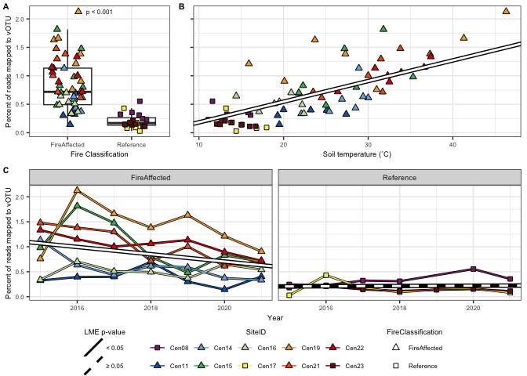<!-- -->

``` r
#ggsave(perc_reads_mapped.plot, file="/Users/sambarnett/Documents/Shade_lab/Centralia_project/Phage_analysis/Analysis/Figures/FigS2.tiff",
#       device="tiff", width=7, height=5, units="in", bg="white")
```

# vOTU alpha diversity

Now that we have our vOTUs, lets check out their within sample diversity
or alpha diversity. We’ll try a few different methods for this.

## vOTU richness

For richness lets use a measure where we take into account the varying
sequencing depths of our samples. Specificially lets count the number of
vOTU found per 100,000 reads since presumably, the more reads you get,
the more vOTU you’ll find.

``` r
# Wilcoxon test across fire classification
n_vOTU_per100000r.wilcox = wilcox.test(x=filter(vOTU.sum, FireClassification=="Reference")$n_vOTU_per100000r,
                                         y=filter(vOTU.sum, FireClassification=="FireAffected")$n_vOTU_per100000r,
                                         conf.int=TRUE, conf.level=0.95)
n_vOTU_per100000r.wilcox
```

    ## 
    ##  Wilcoxon rank sum exact test
    ## 
    ## data:  filter(vOTU.sum, FireClassification == "Reference")$n_vOTU_per100000r and filter(vOTU.sum, FireClassification == "FireAffected")$n_vOTU_per100000r
    ## W = 898, p-value = 1.952e-09
    ## alternative hypothesis: true location shift is not equal to 0
    ## 95 percent confidence interval:
    ##  20.15231 39.32745
    ## sample estimates:
    ## difference in location 
    ##               29.41381

``` r
wilcox.p = ifelse(n_vOTU_per100000r.wilcox$p.value < 0.001, "p < 0.001",
                  paste("p = ", round(n_vOTU_per100000r.wilcox$p.value, digits = 3), sep=""))

# Linear mixed effects over time
n_vOTU_per100000r_time.model.df = data.frame()

for(FC in unique(vOTU.sum$FireClassification)){
  sub_n_vOTU_per100000r.model = lme(n_vOTU_per100000r ~ Year, random = ~1|SiteID,
                                      data=filter(vOTU.sum, FireClassification==FC))
  n_vOTU_per100000r_time.model.df = rbind(n_vOTU_per100000r_time.model.df,
                                            data.frame(summary(sub_n_vOTU_per100000r.model)$tTable) %>%
                                              tibble::rownames_to_column(var="factor") %>%
                                              mutate(FireClassification = FC))
}

n_vOTU_per100000r_time.model.reg = n_vOTU_per100000r_time.model.df %>%
  mutate(p_slope = ifelse(factor == "Year", p.value, 1),
         factor = ifelse(factor == "(Intercept)", "Intercept", factor)) %>%
  group_by(FireClassification) %>%
  mutate(p_slope = min(p_slope)) %>%
  ungroup %>%
  select(FireClassification, factor, Value, p_slope) %>%
  tidyr::spread(key="factor", value="Value") %>%
  mutate(sig = ifelse(p_slope < 0.05, "< 0.05", "≥ 0.05"))

n_vOTU_per100000r_time.model.reg
```

    ## # A tibble: 2 × 5
    ##   FireClassification  p_slope Intercept  Year sig   
    ##   <chr>                 <dbl>     <dbl> <dbl> <chr> 
    ## 1 FireAffected       0.000633    -6074.  3.03 < 0.05
    ## 2 Reference          0.358       -4026.  2.03 ≥ 0.05

``` r
# Linear mixed effects over temperature
n_vOTU_per100000r.model = lme(n_vOTU_per100000r ~ CoreTemp_C, random = ~1|SiteID, data=vOTU.sum)
n_vOTU_per100000r.model.sum = summary(n_vOTU_per100000r.model)
n_vOTU_per100000r.model.sum
```

    ## Linear mixed-effects model fit by REML
    ##   Data: vOTU.sum 
    ##        AIC      BIC    logLik
    ##   579.5765 588.3953 -285.7883
    ## 
    ## Random effects:
    ##  Formula: ~1 | SiteID
    ##         (Intercept) Residual
    ## StdDev:    5.130271  15.1132
    ## 
    ## Fixed effects:  n_vOTU_per100000r ~ CoreTemp_C 
    ##                Value Std.Error DF   t-value p-value
    ## (Intercept) 92.07708  6.711337 58 13.719632       0
    ## CoreTemp_C  -1.62717  0.269246 58 -6.043409       0
    ##  Correlation: 
    ##            (Intr)
    ## CoreTemp_C -0.932
    ## 
    ## Standardized Within-Group Residuals:
    ##          Min           Q1          Med           Q3          Max 
    ## -1.768969445 -0.711258566 -0.009503881  0.525572884  2.859736868 
    ## 
    ## Number of Observations: 69
    ## Number of Groups: 10

Now plot.

``` r
# Plot boxplot over fire classification
n_vOTU_per100000r_FC.plot = ggplot(data=vOTU.sum, aes(x=FireClassification, y=n_vOTU_per100000r)) +
  geom_boxplot(outlier.shape = NA) +
  geom_jitter(aes(shape=FireClassification, fill=SiteID), size=2,
              width = 0.25, height = 0) +
  annotate("text", x=1.5, y=max(vOTU.sum$n_vOTU_per100000r), size = 6*5/14,
           label=wilcox.p) +
  scale_shape_manual(values=FC.shape) +
  scale_fill_manual(values=site.col) +
  labs(x="Fire Classification", y="vOTU richness per 100,000 reads") +
  publication_theme +
  guides(fill=guide_legend(override.aes=list(shape=site.shape)))

# Plot lines over time
n_vOTU_per100000r_time.plot = ggplot(data=vOTU.sum, aes(x=Year, y=n_vOTU_per100000r)) +
  geom_line(aes(group=SiteID), color="black", size=1) + 
  geom_line(aes(color=SiteID), size=0.5) + 
  geom_point(aes(shape=FireClassification, fill=SiteID), size=2) +
  geom_abline(data=n_vOTU_per100000r_time.model.reg,
              aes(intercept = Intercept, slope = Year),
              linetype=1, size=2, color="black") +
  geom_abline(data=n_vOTU_per100000r_time.model.reg,
              aes(intercept = Intercept, slope = Year, linetype = sig)
              , size=1, color="white") +
  scale_shape_manual(values=FC.shape) +
  scale_fill_manual(values=site.col) +
  scale_color_manual(values=site.col) +
  scale_linetype_manual(values=c("< 0.05" = 1, "≥ 0.05" = 2)) +
  labs(x="Year", y="vOTU richness per 100,000 reads",
       linetype = "LME p-value") +
  publication_theme +
  theme(legend.position = "bottom",
        legend.direction = "vertical") +
  guides(fill=guide_legend(override.aes=list(shape=site.shape), nrow = 2),
         linetype=guide_legend(override.aes=list(color="black"))) +
  facet_wrap(~FireClassification)

# Plot scatterplot with regression over temperature
n_vOTU_per100000r_temp.plot = ggplot(data=vOTU.sum, aes(x=CoreTemp_C, y=n_vOTU_per100000r)) +
  geom_point(aes(shape=FireClassification, fill=SiteID), size=2) +
  geom_abline(intercept = n_vOTU_per100000r.model.sum$tTable[1], 
              slope = n_vOTU_per100000r.model.sum$tTable[2],
              linetype = 1, size=2, color="black") +
  geom_abline(intercept = n_vOTU_per100000r.model.sum$tTable[1], 
              slope = n_vOTU_per100000r.model.sum$tTable[2],
              linetype = 1, size=1, color="white") +
  scale_shape_manual(values=FC.shape) +
  scale_fill_manual(values=site.col) +
  labs(x="Soil temperature (˚C)", y="vOTU richness per 100,000 reads") +
  publication_theme +
  theme(legend.position = "bottom",
        legend.direction = "vertical") +
  guides(fill=guide_legend(override.aes=list(shape=site.shape), nrow = 3))

n_vOTU_per100000r.leg = g_legend(n_vOTU_per100000r_time.plot)


n_vOTU_per100000r.plot = cowplot::plot_grid(cowplot::plot_grid(n_vOTU_per100000r_FC.plot + theme(legend.position = "none"), 
                                                                 n_vOTU_per100000r_temp.plot + 
                                                                   theme(axis.title.y=element_blank(), 
                                                                         axis.text.y = element_blank(), 
                                                                         legend.position = "none",
                                                                         plot.margin = unit(c(0,2,0,5), "mm")),
                                                                 rel_widths = c(0.5, 1), nrow=, labels=c("A", "B"), label_size = 8, align = "h"),
                                              n_vOTU_per100000r_time.plot + theme(legend.position = "none"),
                                              n_vOTU_per100000r.leg, rel_heights = c(1, 1, 0.3), labels=c("", "C", ""), label_size = 8, ncol=1)
n_vOTU_per100000r.plot
```

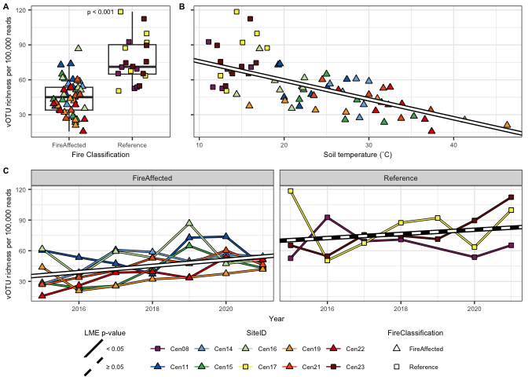<!-- -->

``` r
#ggsave(n_vOTU_per100000r.plot, file="/Users/sambarnett/Documents/Shade_lab/Centralia_project/Phage_analysis/Analysis/Figures/FigS3.tiff",
#       device="tiff", width=7, height=5, units="in", bg="white")
```

## vOTU evenness

As another measure that takes into account abundance, lets look at vOTU
evenness. This could tell us something about the vOTU dynamics as
evenness might be indicitaive of host-pathogen interactions
(predator-prey interactions).

First calculate Pielou’s evenness.

``` r
vOTU_RPKM.mat = vOTU_coverage.df %>%
  select(vOTU, SequenceID, RPKM) %>%
  tidyr::spread(key=SequenceID, value=RPKM) %>%
  tibble::column_to_rownames(var="vOTU") %>%
  as.matrix

vOTU_RPKM.mat[is.na(vOTU_RPKM.mat)] = 0
  
vOTU_diversity.df = data.frame(Shannons = diversity(t(vOTU_RPKM.mat)),
                               richness = specnumber(t(vOTU_RPKM.mat))) %>%
  mutate(evenness = Shannons/log(richness)) %>%
  tibble::rownames_to_column(var="SequenceID") %>%
  left_join(sample.meta, by = "SequenceID")
```

Now test.

``` r
# Wilcoxon test across fire classification
evenness.wilcox = wilcox.test(x=filter(vOTU_diversity.df, FireClassification=="Reference")$evenness,
                                         y=filter(vOTU_diversity.df, FireClassification=="FireAffected")$evenness,
                                         conf.int=TRUE, conf.level=0.95)
evenness.wilcox
```

    ## 
    ##  Wilcoxon rank sum exact test
    ## 
    ## data:  filter(vOTU_diversity.df, FireClassification == "Reference")$evenness and filter(vOTU_diversity.df, FireClassification == "FireAffected")$evenness
    ## W = 874, p-value = 3.038e-08
    ## alternative hypothesis: true location shift is not equal to 0
    ## 95 percent confidence interval:
    ##  0.02813246 0.06024331
    ## sample estimates:
    ## difference in location 
    ##             0.04179256

``` r
wilcox.p = ifelse(evenness.wilcox$p.value < 0.001, "p < 0.001",
                  paste("p = ", round(evenness.wilcox$p.value, digits = 3), sep=""))

# Linear mixed effects over time
evenness_time.model.df = data.frame()

for(FC in unique(vOTU_diversity.df$FireClassification)){
  sub_evenness.model = lme(evenness ~ Year, random = ~1|SiteID,
                                      data=filter(vOTU_diversity.df, FireClassification==FC))
  evenness_time.model.df = rbind(evenness_time.model.df,
                                            data.frame(summary(sub_evenness.model)$tTable) %>%
                                              tibble::rownames_to_column(var="factor") %>%
                                              mutate(FireClassification = FC))
}

evenness_time.model.reg = evenness_time.model.df %>%
  mutate(p_slope = ifelse(factor == "Year", p.value, 1),
         factor = ifelse(factor == "(Intercept)", "Intercept", factor)) %>%
  group_by(FireClassification) %>%
  mutate(p_slope = min(p_slope)) %>%
  ungroup %>%
  select(FireClassification, factor, Value, p_slope) %>%
  tidyr::spread(key="factor", value="Value") %>%
  mutate(sig = ifelse(p_slope < 0.05, "< 0.05", "≥ 0.05"))

evenness_time.model.reg
```

    ## # A tibble: 2 × 5
    ##   FireClassification    p_slope Intercept     Year sig   
    ##   <chr>                   <dbl>     <dbl>    <dbl> <chr> 
    ## 1 FireAffected       0.00000825   -28.6   0.0146   < 0.05
    ## 2 Reference          0.875          0.447 0.000252 ≥ 0.05

``` r
# Linear mixed effects over temperature
evenness.model = lme(evenness ~ CoreTemp_C, random = ~1|SiteID, data=vOTU_diversity.df)
evenness.model.sum = summary(evenness.model)
evenness.model.sum
```

    ## Linear mixed-effects model fit by REML
    ##   Data: vOTU_diversity.df 
    ##         AIC       BIC   logLik
    ##   -225.3308 -216.5121 116.6654
    ## 
    ## Random effects:
    ##  Formula: ~1 | SiteID
    ##         (Intercept)   Residual
    ## StdDev:   0.0199555 0.03592196
    ## 
    ## Fixed effects:  evenness ~ CoreTemp_C 
    ##                 Value   Std.Error DF  t-value p-value
    ## (Intercept)  1.030795 0.018723098 58 55.05474       0
    ## CoreTemp_C  -0.005015 0.000736896 58 -6.80554       0
    ##  Correlation: 
    ##            (Intr)
    ## CoreTemp_C -0.913
    ## 
    ## Standardized Within-Group Residuals:
    ##        Min         Q1        Med         Q3        Max 
    ## -3.3483089 -0.2894110  0.1481162  0.6079055  1.3444561 
    ## 
    ## Number of Observations: 69
    ## Number of Groups: 10

Now plot.

``` r
# Plot boxplot over fire classification
evenness_FC.plot = ggplot(data=vOTU_diversity.df, aes(x=FireClassification, y=evenness)) +
  geom_boxplot(outlier.shape = NA) +
  geom_jitter(aes(shape=FireClassification, fill=SiteID), size=2,
              width = 0.25, height = 0) +
  annotate("text", x=1.5, y=max(vOTU_diversity.df$evenness), size = 6*5/14,
           label=wilcox.p) +
  scale_shape_manual(values=FC.shape) +
  scale_fill_manual(values=site.col) +
  labs(x="Fire Classification", y="Pielou’s evenness") +
  publication_theme +
  guides(fill=guide_legend(override.aes=list(shape=site.shape)))

# Plot lines over time
evenness_time.plot = ggplot(data=vOTU_diversity.df, aes(x=Year, y=evenness)) +
  geom_line(aes(group=SiteID), color="black", size=1) + 
  geom_line(aes(color=SiteID), size=0.5) + 
  geom_point(aes(shape=FireClassification, fill=SiteID), size=2) +
  geom_abline(data=evenness_time.model.reg,
              aes(intercept = Intercept, slope = Year),
              linetype=1, size=2, color="black") +
  geom_abline(data=evenness_time.model.reg,
              aes(intercept = Intercept, slope = Year, linetype = sig)
              , size=1, color="white") +
  scale_shape_manual(values=FC.shape) +
  scale_fill_manual(values=site.col) +
  scale_color_manual(values=site.col) +
  scale_linetype_manual(values=c("< 0.05" = 1, "≥ 0.05" = 2)) +
  labs(x="Year", y="Pielou’s evenness",
       linetype = "LME p-value") +
  publication_theme +
  theme(legend.position = "bottom",
        legend.direction = "vertical") +
  guides(fill=guide_legend(override.aes=list(shape=site.shape), nrow = 2),
         linetype=guide_legend(override.aes=list(color="black"))) +
  facet_wrap(~FireClassification)

# Plot scatterplot with regression over temperature
evenness_temp.plot = ggplot(data=vOTU_diversity.df, aes(x=CoreTemp_C, y=evenness)) +
  geom_point(aes(shape=FireClassification, fill=SiteID), size=2) +
  geom_abline(intercept = evenness.model.sum$tTable[1], 
              slope = evenness.model.sum$tTable[2],
              linetype = 1, size=2, color="black") +
  geom_abline(intercept = evenness.model.sum$tTable[1], 
              slope = evenness.model.sum$tTable[2],
              linetype = 1, size=1, color="white") +
  scale_shape_manual(values=FC.shape) +
  scale_fill_manual(values=site.col) +
  labs(x="Soil temperature (˚C)", y="Pielou’s evenness") +
  publication_theme +
  theme(legend.position = "bottom",
        legend.direction = "vertical") +
  guides(fill=guide_legend(override.aes=list(shape=site.shape), nrow = 3))

evenness.leg = g_legend(evenness_time.plot)


evenness.plot = cowplot::plot_grid(cowplot::plot_grid(evenness_FC.plot + theme(legend.position = "none"), 
                                                                 evenness_temp.plot + 
                                                                   theme(axis.title.y=element_blank(), 
                                                                         axis.text.y = element_blank(), 
                                                                         legend.position = "none",
                                                                         plot.margin = unit(c(0,2,0,5), "mm")),
                                                                 rel_widths = c(0.5, 1), nrow=, labels=c("A", "B"), label_size = 8, align = "h"),
                                              evenness_time.plot + theme(legend.position = "none"),
                                              evenness.leg, rel_heights = c(1, 1, 0.3), labels=c("", "C", ""), label_size = 8, ncol=1)
evenness.plot
```

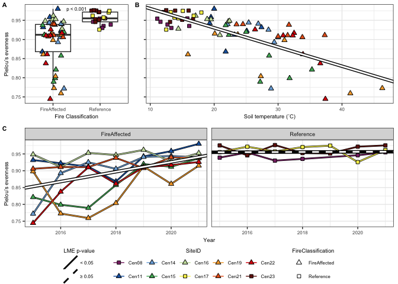<!-- -->

``` r
#ggsave(evenness.plot, file="/Users/sambarnett/Documents/Shade_lab/Centralia_project/Phage_analysis/Analysis/Figures/Fig3.tiff",
#       device="tiff", width=7, height=5, units="in", bg="white")
```

## Species accumulation curves

Lets try one more more thing to look at with richness. Lets see how many
vOTU accumulate as we increase sampling. We will look at two aspects,
increased years and increased number of sites within a year. Another
term for these analyses are species accumulation curves.

### Accumulation over years

First lets look at the accumulation of vOTU with additional sampling
years. Stable viral communities with little immigration might manifest
with a horizontal asymptope. Unstable communities will continuously
increase. For this analysis lets do years sequentially.

``` r
yearly_accumulation.df = vOTU_coverage.df %>%
  select(SequenceID, vOTU, RPKM) %>%
  left_join(sample.meta) %>%
  group_by(SiteID, FireClassification, vOTU) %>%
  summarize(first_year = min(Year)) %>%
  ungroup %>%
  group_by(SiteID, FireClassification, first_year) %>%
  summarize(n_new_vOTU = n()) %>%
  ungroup %>%
  arrange(first_year) %>%
  group_by(SiteID, FireClassification) %>%
  mutate(Cum_n_vOTU = cumsum(n_new_vOTU)) %>%
  ungroup

cum_vOTU_year.plot = ggplot(data=yearly_accumulation.df, aes(x=first_year, y=Cum_n_vOTU)) +
  geom_line(aes(group=SiteID), size=1) +
  geom_line(aes(color=SiteID), size=0.5) +
  geom_point(aes(fill=SiteID, shape=FireClassification), size=2) +
  scale_shape_manual(values=c("FireAffected" = 24, "Recovered" = 21, "Reference" = 22)) +
  scale_fill_manual(values=site.col) +
  scale_color_manual(values=site.col) +
  lims(y=c(0,2500)) +
  labs(x="Year", y="Cumulative vOTU count") +
  publication_theme +
  theme(legend.position = "bottom",
        legend.direction = "vertical") +
  guides(fill = guide_legend(override.aes=list(shape=site.shape), nrow=5))
cum_vOTU_year.plot
```

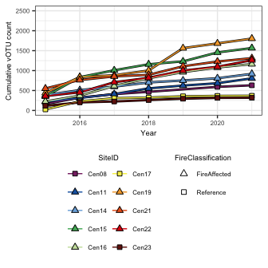<!-- -->

### Accumulation with sites

Next, lets look at accumulation within each year with added sites. High
dispersal may manifest as a horizontal asymptotic while unique viral
communities in each site will manifest as continual increase. For this
analysis lets look at all sets of sites. This might take a little while
to run. We will plot the average number of unique vOTU with standard
error across all site sets.

``` r
site_shared_OTU.df = data.frame()
for (yr in seq(2015, 2021)){
  yr_test.df = vOTU_coverage.df %>%
    select(SequenceID, vOTU, RPKM) %>%
    left_join(sample.meta) %>%
    filter(Year == yr)
  
  inc_sites = filter(sample.meta, Year == yr)$SiteID
  for (cmb in seq(1,length(inc_sites))){
    site_comb = combn(inc_sites,cmb)
    for (cmb_col in seq(1, ncol(site_comb))){
      n_shared_OTU = yr_test.df %>%
        filter(SiteID %in% site_comb[,cmb_col]) %>%
        mutate(n_sites = cmb, rep = cmb_col) %>%
        select(Year, n_sites, rep, vOTU) %>%
        unique() %>%
        group_by(Year, n_sites, rep) %>%
        summarize(n_vOTU = n()) %>%
        ungroup
      site_shared_OTU.df = rbind(site_shared_OTU.df, n_shared_OTU)
    }
  }
}

site_shared_OTU.df
```

    ## # A tibble: 6,649 × 4
    ##     Year n_sites   rep n_vOTU
    ##    <dbl>   <int> <int>  <int>
    ##  1  2015       1     1    161
    ##  2  2015       1     2    219
    ##  3  2015       1     3    385
    ##  4  2015       1     4    353
    ##  5  2015       1     5    224
    ##  6  2015       1     6     26
    ##  7  2015       1     7    439
    ##  8  2015       1     8    551
    ##  9  2015       1     9    361
    ## 10  2015       1    10    116
    ## # … with 6,639 more rows

``` r
site_shared_OTU.sum = site_shared_OTU.df %>%
  group_by(Year, n_sites) %>%
  summarize(mean_n_vOTU = mean(n_vOTU),
            sd_n_vOTU = sd(n_vOTU),
            n_reps = n()) %>%
  ungroup %>%
  mutate(SE_n_vOTU = sd_n_vOTU/sqrt(n_reps))

ggplot(data=site_shared_OTU.df, aes(x=n_sites, y=n_vOTU)) +
  geom_point(size=2) +
  present_theme +
  facet_wrap(~Year)
```

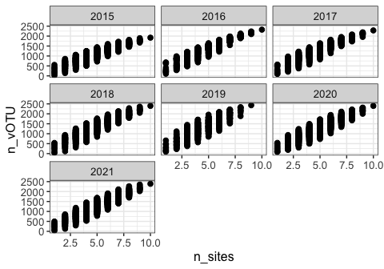<!-- -->

``` r
cum_vOTU_site.plot = ggplot(data=site_shared_OTU.sum, aes(x=n_sites, y=mean_n_vOTU)) +
  geom_line() +
  #geom_point(size=2, shape=21) +
  geom_errorbar(aes(ymin = mean_n_vOTU-SE_n_vOTU, ymax = mean_n_vOTU+SE_n_vOTU)) +
  lims(y=c(0,2500)) +
  labs(x="Number of sites", y="Cumulative vOTU count") +
  scale_x_continuous(breaks=seq(0, 10, 2)) +
  publication_theme +
  facet_wrap(~Year, nrow=1)

cum_vOTU_site.plot
```

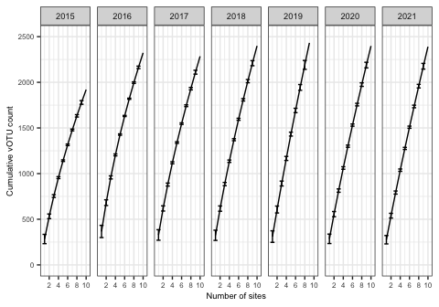<!-- -->

Combine all alpha diversity figures for publication

``` r
alpha.plot = cowplot::plot_grid(cowplot::plot_grid(evenness_FC.plot + theme(legend.position = "none"), 
                                                   evenness_temp.plot + theme(axis.title.y=element_blank(), 
                                                                              axis.text.y = element_blank(), 
                                                                              legend.position = "none",
                                                                              plot.margin = unit(c(0,2,0,5), "mm")),
                                                   rel_widths = c(0.5, 1), nrow=1, labels=c("A", "B"), label_size = 8, align = "h"),
                                evenness_time.plot + theme(legend.position = "none"),
                                cowplot::plot_grid(cum_vOTU_year.plot + theme(legend.position = "none"), 
                                                   cum_vOTU_site.plot, align = "h", axis = "tb",
                                                   rel_widths = c(0.3, 1), nrow=1, labels=c("D", "E"), label_size = 8),
                                evenness.leg, rel_heights = c(1, 1, 1, 0.3), labels=c("", "C", "", ""), label_size = 8, ncol=1)
alpha.plot
```

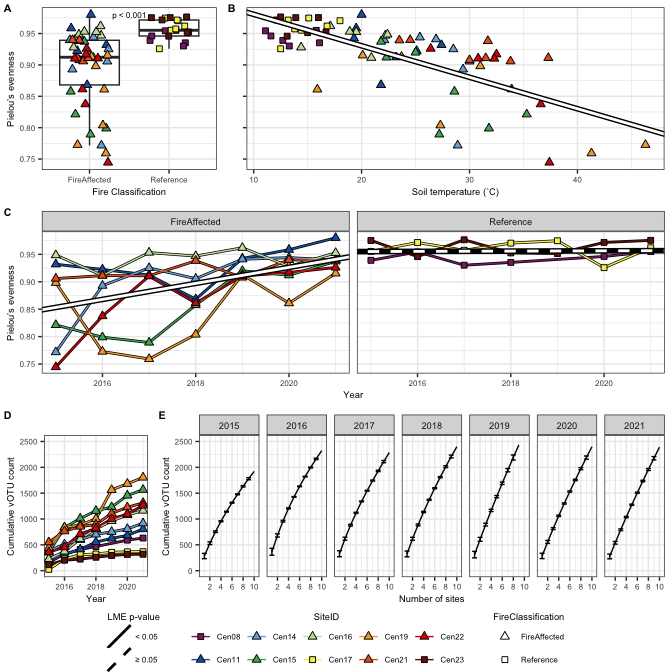<!-- -->

``` r
##ggsave(alpha.plot, file="/Users/sambarnett/Documents/Shade_lab/Centralia_project/Phage_analysis/Analysis/Figures/Fig3.tiff",
##       device="tiff", width=7, height=7, units="in", bg="white")
```

# Beta diversity

Now lets see how the vOTU community varies across samples. For this we
will use Bray-Curtis dissimilarity.

## PERMANOVA

First lets use a permanova to see if there is variation explained by
fire classification, time, and their interaction.

``` r
# Get the Bray-Curtis dissimilarity
BC.dist = vegdist(t(vOTU_RPKM.mat), method="bray", binary=FALSE, diag=TRUE, upper=TRUE)
BC.dist = as.dist(as.matrix(BC.dist)[sample.meta$SequenceID,sample.meta$SequenceID])


# Set up the blocking design for the permanova. In this case since we are repeatedly sampling the same sites over multiple years I include SiteID as the block. This is similar to "strata" in the old version of adonis.
perm <- how(nperm = 999)
setBlocks(perm) <- with(sample.meta, SiteID)

# Run adonis2 
set.seed(4242)
BC.adonis = adonis2(formula = BC.dist ~ FireClassification*as.factor(Year), 
                    permutations = perm, data = sample.meta)
BC.adonis
```

    ## Permutation test for adonis under reduced model
    ## Terms added sequentially (first to last)
    ## Blocks:  with(sample.meta, SiteID) 
    ## Permutation: free
    ## Number of permutations: 999
    ## 
    ## adonis2(formula = BC.dist ~ FireClassification * as.factor(Year), data = sample.meta, permutations = perm)
    ##                                    Df SumOfSqs      R2      F Pr(>F)    
    ## FireClassification                  1   2.5774 0.08585 5.9706  0.002 ** 
    ## as.factor(Year)                     6   1.9138 0.06374 0.7389  0.001 ***
    ## FireClassification:as.factor(Year)  6   1.7900 0.05962 0.6911  0.005 ** 
    ## Residual                           55  23.7428 0.79079                  
    ## Total                              68  30.0240 1.00000                  
    ## ---
    ## Signif. codes:  0 '***' 0.001 '**' 0.01 '*' 0.05 '.' 0.1 ' ' 1

## Ordination

Lets visualize that

``` r
set.seed(4242)
BC.ord = pcoa(BC.dist)
Xaxis = paste("PCo1 (", round(BC.ord$values[1,2]*100, digits=2), "%)", sep="")
Yaxis = paste("PCo2 (", round(BC.ord$values[2,2]*100, digits=2), "%)", sep="")

BC.ord.df = data.frame(BC.ord$vectors) %>%
  tibble::rownames_to_column(var="SequenceID") %>%
  select(SequenceID, Axis.1, Axis.2) %>%
  left_join(sample.meta, by = "SequenceID")

BC_pcoa.plot = ggplot(data=BC.ord.df, aes(x=Axis.1, y=Axis.2)) +
  geom_point(aes(shape=FireClassification, fill=SiteID, alpha=Year), size=2) +
  scale_shape_manual(values=FC.shape) +
  scale_fill_manual(values=site.col) +
  labs(x=Xaxis, y=Yaxis) +
  publication_theme +
  theme(legend.position = "bottom", 
        legend.direction = "vertical") +
  guides(fill=guide_legend(override.aes=list(shape=site.shape), ncol=2))
BC_pcoa.plot
```

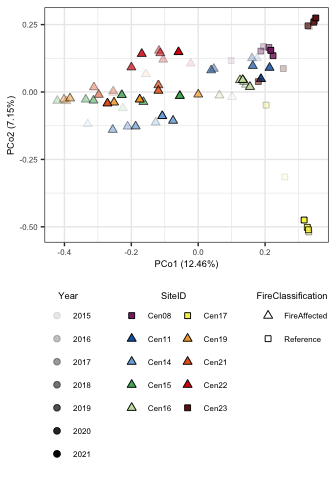<!-- -->

## Beta dispersion across fire classifications

ARe fire affected or reference sites more dispersed?

``` r
batadisp.groups = factor(sample.meta$FireClassification)
betadisper.res = betadisper(BC.dist, batadisp.groups)
anova(betadisper.res)
```

    ## Analysis of Variance Table
    ## 
    ## Response: Distances
    ##           Df  Sum Sq   Mean Sq F value Pr(>F)
    ## Groups     1 0.00215 0.0021519  0.4267 0.5159
    ## Residuals 67 0.33793 0.0050437

``` r
betadisper.HSD <- TukeyHSD(betadisper.res)
betadisper.HSD
```

    ##   Tukey multiple comparisons of means
    ##     95% family-wise confidence level
    ## 
    ## Fit: aov(formula = distances ~ group, data = df)
    ## 
    ## $group
    ##                              diff         lwr        upr     p adj
    ## Reference-FireAffected 0.01230905 -0.02530495 0.04992304 0.5158712

## Partition beta diversity

Now lets see if dissimilarity is greater across years within a site or
across sites within a year. Lets also partition this dissimilarity to
see how much change is due to different species (vOTU) or not.

### Abundance gradient

First lets do this using the abundance based metric (based on
Bray-Curtis dissimilarity). This can help tell us whether new species
(vOTU) are leading to more of the dissimilarity compared to varying
abundances of the same vOTU.

``` r
vOTU.bray.part = bray.part(t(vOTU_RPKM.mat))

vOTU.bray.bal = as.matrix(vOTU.bray.part$bray.bal)
vOTU.bray.bal[upper.tri(vOTU.bray.bal, diag=TRUE)] = NA
vOTU.bray.gra = as.matrix(vOTU.bray.part$bray.gra)
vOTU.bray.gra[upper.tri(vOTU.bray.gra, diag=TRUE)] = NA
vOTU.bray.full = as.matrix(vOTU.bray.part$bray)
vOTU.bray.full[upper.tri(vOTU.bray.full, diag=TRUE)] = NA

test.df = full_join(data.frame(vOTU.bray.bal) %>%
                      tibble::rownames_to_column(var="SequenceID_1") %>%
                      tidyr::gather(key="SequenceID_2", value="bal", -SequenceID_1) %>%
                      filter(!is.na(bal)),
                    data.frame(vOTU.bray.gra) %>%
                      tibble::rownames_to_column(var="SequenceID_1") %>%
                      tidyr::gather(key="SequenceID_2", value="gra", -SequenceID_1) %>%
                      filter(!is.na(gra))) %>%
  full_join(data.frame(vOTU.bray.full) %>%
                      tibble::rownames_to_column(var="SequenceID_1") %>%
                      tidyr::gather(key="SequenceID_2", value="bray", -SequenceID_1) %>%
                      filter(!is.na(bray))) %>%
  left_join(select(sample.meta, SequenceID, SiteID, Year, FireClassification) %>%
              rename(SequenceID_1=SequenceID, SiteID_1=SiteID, Year_1=Year, FireClassification_1 = FireClassification)) %>%
  left_join(select(sample.meta, SequenceID, SiteID, Year, FireClassification) %>%
              rename(SequenceID_2=SequenceID, SiteID_2=SiteID, Year_2=Year, FireClassification_2 = FireClassification)) %>%
  mutate(site_comp = ifelse(SiteID_1 == SiteID_2, "Temporal", "Spatial")) %>%
  filter((site_comp == "Spatial" & Year_1 == Year_2) | site_comp == "Temporal") %>%
  mutate(FC_comp = ifelse(FireClassification_1 == FireClassification_2, FireClassification_1, "Between fire classes")) %>%
  mutate(per_bal = bal/bray*100,
         per_gra = gra/bray*100)

print("Bray-Curtis dissimilarity")
```

    ## [1] "Bray-Curtis dissimilarity"

``` r
BCfull_SpatialTemporal.wlx = wilcox.test(bray~site_comp, data=test.df)
BCfull_SpatialTemporal.wlx
```

    ## 
    ##  Wilcoxon rank sum test with continuity correction
    ## 
    ## data:  bray by site_comp
    ## W = 57064, p-value < 2.2e-16
    ## alternative hypothesis: true location shift is not equal to 0

``` r
BCfull_SpatialTemporal.plot = ggplot(data=test.df, aes(x=site_comp, y=bray)) +
  geom_boxplot(outlier.shape = NA) +
  geom_jitter(width = 0.25, height=0, size=1, alpha=0.5) +
  annotate("text", x=1.5, y=1.1, size = 6*5/14,
           label="p < 0.001") +
  labs(x="Sample comparison scale", y="Bray-Curtis\ndissimilarity") +
  publication_theme

print("Abundance gradient partition")
```

    ## [1] "Abundance gradient partition"

``` r
wilcox.test(gra~site_comp, data=test.df)
```

    ## 
    ##  Wilcoxon rank sum test with continuity correction
    ## 
    ## data:  gra by site_comp
    ## W = 7557, p-value < 2.2e-16
    ## alternative hypothesis: true location shift is not equal to 0

``` r
GraPart_SpatialTemporal.plot = ggplot(data=test.df, aes(x=site_comp, y=gra)) +
  geom_boxplot(outlier.shape = NA) +
  geom_jitter(width = 0.25, height=0, size=1, alpha=0.5) +
  annotate("text", x=1.5, y=max(test.df$gra), size = 6*5/14,
           label="p < 0.001") +
  labs(x="Sample comparison scale", y="Abundance gradient\npartition") +
  publication_theme

print("Balanced species abundances partition")
```

    ## [1] "Balanced species abundances partition"

``` r
wilcox.test(bal~site_comp, data=test.df)
```

    ## 
    ##  Wilcoxon rank sum test with continuity correction
    ## 
    ## data:  bal by site_comp
    ## W = 57210, p-value < 2.2e-16
    ## alternative hypothesis: true location shift is not equal to 0

``` r
BalPart_SpatialTemporal.plot = ggplot(data=test.df, aes(x=site_comp, y=bal)) +
  geom_boxplot(outlier.shape = NA) +
  geom_jitter(width = 0.25, height=0, size=1, alpha=0.5) +
  annotate("text", x=1.5, y=1.1, size = 6*5/14,
           label="p < 0.001") +
  labs(x="Sample comparison scale", y="Balanced variation in\nvOTU abundance partition") +
  publication_theme

cowplot::plot_grid(BCfull_SpatialTemporal.plot, GraPart_SpatialTemporal.plot, BalPart_SpatialTemporal.plot,
                   nrow = 1)
```

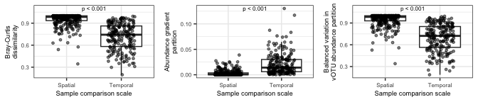<!-- --> ###
Abundance gradient Next lets do this using the a binary metric (Sorensen
dissimilarity). This can help tell us whether nestedness or turnover is
driving dissimilarity.

``` r
vOTU_binary.mat = vOTU_RPKM.mat
vOTU_binary.mat[vOTU_binary.mat > 0] = 1
vOTU.sor.part = beta.pair(t(vOTU_binary.mat))

vOTU.sor.sim = as.matrix(vOTU.sor.part$beta.sim)
vOTU.sor.sim[upper.tri(vOTU.sor.sim, diag=TRUE)] = NA
vOTU.sor.sne = as.matrix(vOTU.sor.part$beta.sne)
vOTU.sor.sne[upper.tri(vOTU.sor.sne, diag=TRUE)] = NA
vOTU.sor.full = as.matrix(vOTU.sor.part$beta.sor)
vOTU.sor.full[upper.tri(vOTU.sor.full, diag=TRUE)] = NA

test.df = full_join(data.frame(vOTU.sor.sim) %>%
                      tibble::rownames_to_column(var="SequenceID_1") %>%
                      tidyr::gather(key="SequenceID_2", value="sim", -SequenceID_1) %>%
                      filter(!is.na(sim)),
                    data.frame(vOTU.sor.sne) %>%
                      tibble::rownames_to_column(var="SequenceID_1") %>%
                      tidyr::gather(key="SequenceID_2", value="sne", -SequenceID_1) %>%
                      filter(!is.na(sne))) %>%
  full_join(data.frame(vOTU.sor.full) %>%
                      tibble::rownames_to_column(var="SequenceID_1") %>%
                      tidyr::gather(key="SequenceID_2", value="sor", -SequenceID_1) %>%
                      filter(!is.na(sor))) %>%
  left_join(select(sample.meta, SequenceID, SiteID, Year, FireClassification) %>%
              rename(SequenceID_1=SequenceID, SiteID_1=SiteID, Year_1=Year, FireClassification_1 = FireClassification)) %>%
  left_join(select(sample.meta, SequenceID, SiteID, Year, FireClassification) %>%
              rename(SequenceID_2=SequenceID, SiteID_2=SiteID, Year_2=Year, FireClassification_2 = FireClassification)) %>%
  mutate(site_comp = ifelse(SiteID_1 == SiteID_2, "Temporal", "Spatial")) %>%
  filter((site_comp == "Spatial" & Year_1 == Year_2) | site_comp == "Temporal") %>%
  mutate(FC_comp = ifelse(FireClassification_1 == FireClassification_2, FireClassification_1, "Between fire classes")) %>%
  mutate(per_sim = sim/sor*100,
         per_sne = sne/sor*100)

print("Sorensen dissimilarity")
```

    ## [1] "Sorensen dissimilarity"

``` r
SORfull_SpatialTemporal.wlx = wilcox.test(sor~site_comp, data=test.df)
SORfull_SpatialTemporal.wlx
```

    ## 
    ##  Wilcoxon rank sum test with continuity correction
    ## 
    ## data:  sor by site_comp
    ## W = 57546, p-value < 2.2e-16
    ## alternative hypothesis: true location shift is not equal to 0

``` r
SORfull_SpatialTemporal.plot = ggplot(data=test.df, aes(x=site_comp, y=sor)) +
  geom_boxplot(outlier.shape = NA) +
  geom_jitter(width = 0.25, height=0, size=1, alpha=0.5) +
  annotate("text", x=1.5, y=1.1, size = 6*5/14,
           label="p < 0.001") +
  labs(x="Sample comparison scale", y="Sorensen dissimilarity") +
  publication_theme

print("Nestedness partition")
```

    ## [1] "Nestedness partition"

``` r
wilcox.test(sne~site_comp, data=test.df)
```

    ## 
    ##  Wilcoxon rank sum test with continuity correction
    ## 
    ## data:  sne by site_comp
    ## W = 12979, p-value < 2.2e-16
    ## alternative hypothesis: true location shift is not equal to 0

``` r
snePart_SpatialTemporal.plot = ggplot(data=test.df, aes(x=site_comp, y=sne)) +
  geom_boxplot(outlier.shape = NA) +
  geom_jitter(width = 0.25, height=0, size=1, alpha=0.5) +
  annotate("text", x=1.5, y=max(test.df$sne), size = 6*5/14,
           label="p < 0.001") +
  labs(x="Sample comparison scale", y="Nestedness partition") +
  publication_theme

print("Turnover partition")
```

    ## [1] "Turnover partition"

``` r
wilcox.test(sim~site_comp, data=test.df)
```

    ## 
    ##  Wilcoxon rank sum test with continuity correction
    ## 
    ## data:  sim by site_comp
    ## W = 57532, p-value < 2.2e-16
    ## alternative hypothesis: true location shift is not equal to 0

``` r
simPart_SpatialTemporal.plot = ggplot(data=test.df, aes(x=site_comp, y=sim)) +
  geom_boxplot(outlier.shape = NA) +
  geom_jitter(width = 0.25, height=0, size=1, alpha=0.5) +
  annotate("text", x=1.5, y=1.1, size = 6*5/14,
           label="p < 0.001") +
  labs(x="Sample comparison scale", y="Turnover partition") +
  publication_theme

cowplot::plot_grid(SORfull_SpatialTemporal.plot, snePart_SpatialTemporal.plot, simPart_SpatialTemporal.plot,
                   nrow = 1)
```

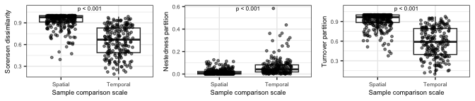<!-- -->

## Post hoc PERMANOVA

Now run a permanova over time within each fire class.

``` r
# Get the Bray-Curtis dissimilarity
Ref.BC.dist = vegdist(t(vOTU_RPKM.mat[,filter(sample.meta, FireClassification == "Reference")$SequenceID]), method="bray", binary=FALSE, diag=TRUE, upper=TRUE)
FA.BC.dist = vegdist(t(vOTU_RPKM.mat[,filter(sample.meta, FireClassification == "FireAffected")$SequenceID]), method="bray", binary=FALSE, diag=TRUE, upper=TRUE)

# Set up the blocking design for the permanova. In this case since we are repeatedly sampling the same sites over multiple years I include SiteID as the block. This is similar to "strata" in the old version of adonis.
Ref.perm <- how(nperm = 999)
setBlocks(Ref.perm) <- with(filter(sample.meta, FireClassification == "Reference"), SiteID)
FA.perm <- how(nperm = 999)
setBlocks(FA.perm) <- with(filter(sample.meta, FireClassification == "FireAffected"), SiteID)

# Run adonis2 
set.seed(4242)
Ref.BC.adonis = adonis2(formula = Ref.BC.dist ~ as.factor(Year), 
                    permutations = Ref.perm, data = filter(sample.meta, FireClassification == "Reference"))
Ref.BC.adonis
```

    ## Permutation test for adonis under reduced model
    ## Terms added sequentially (first to last)
    ## Blocks:  with(filter(sample.meta, FireClassification == "Reference"),  
    ## Permutation: free
    ## Number of permutations: 999
    ## 
    ## adonis2(formula = Ref.BC.dist ~ as.factor(Year), data = filter(sample.meta, FireClassification == "Reference"), permutations = Ref.perm)
    ## Model: adonis0(formula = ~as.factor(Year), data = data, method = method)
    ##                 Df SumOfSqs      R2      F Pr(>F)
    ## as.factor(Year)  6   1.7347 0.21342 0.5879  0.404
    ## Residual        13   6.3936 0.78658              
    ## Total           19   8.1283 1.00000

``` r
set.seed(4242)
FA.BC.adonis = adonis2(formula = FA.BC.dist ~ as.factor(Year), 
                    permutations = FA.perm, data = filter(sample.meta, FireClassification == "FireAffected"))
FA.BC.adonis
```

    ## Permutation test for adonis under reduced model
    ## Terms added sequentially (first to last)
    ## Blocks:  with(filter(sample.meta, FireClassification == "FireAffected"),  
    ## Permutation: free
    ## Number of permutations: 999
    ## 
    ## adonis2(formula = FA.BC.dist ~ as.factor(Year), data = filter(sample.meta, FireClassification == "FireAffected"), permutations = FA.perm)
    ## Model: adonis0(formula = ~as.factor(Year), data = data, method = method)
    ##                 Df SumOfSqs      R2      F Pr(>F)   
    ## as.factor(Year)  6   1.9691 0.10193 0.7945  0.003 **
    ## Residual        42  17.3492 0.89807                 
    ## Total           48  19.3183 1.00000                 
    ## ---
    ## Signif. codes:  0 '***' 0.001 '**' 0.01 '*' 0.05 '.' 0.1 ' ' 1

``` r
p.adjust(c("Reference" = Ref.BC.adonis$`Pr(>F)`[1], "FireAffected" = FA.BC.adonis$`Pr(>F)`[1]), method = "BH")
```

    ##    Reference FireAffected 
    ##        0.404        0.006

Now run a permanova between fire classes within each year.

``` r
year.BC.pvalues = c()
for (yr in c(2015, 2016, 2017, 2018, 2019, 2020, 2021)){
  print(paste("Running", yr))
  # Get the Bray-Curtis dissimilarity
  year.BC.dist = vegdist(t(vOTU_RPKM.mat[,filter(sample.meta, Year == yr)$SequenceID]), method="bray", binary=FALSE, diag=TRUE, upper=TRUE)
  # Set up the blocking design for the permanova. In this case since we are repeatedly sampling the same sites over multiple years I include SiteID as the block. This is similar to "strata" in the old version of adonis.
  year.perm <- how(nperm = 999)
  # Run adonis2 
  set.seed(4242)
  year.BC.adonis = adonis2(formula = year.BC.dist ~ FireClassification, 
                           permutations = year.perm, data = filter(sample.meta, Year == yr))
  print(year.BC.adonis)
  year.BC.pvalues[paste("Year", yr, sep="_")] = year.BC.adonis$`Pr(>F)`[1]
}
```

    ## [1] "Running 2015"
    ## Permutation test for adonis under reduced model
    ## Terms added sequentially (first to last)
    ## Permutation: free
    ## Number of permutations: 999
    ## 
    ## adonis2(formula = year.BC.dist ~ FireClassification, data = filter(sample.meta, Year == yr), permutations = year.perm)
    ##                    Df SumOfSqs      R2      F Pr(>F)  
    ## FireClassification  1   0.5955 0.14684 1.3769  0.036 *
    ## Residual            8   3.4601 0.85316                
    ## Total               9   4.0557 1.00000                
    ## ---
    ## Signif. codes:  0 '***' 0.001 '**' 0.01 '*' 0.05 '.' 0.1 ' ' 1
    ## [1] "Running 2016"
    ## Permutation test for adonis under reduced model
    ## Terms added sequentially (first to last)
    ## Permutation: free
    ## Number of permutations: 999
    ## 
    ## adonis2(formula = year.BC.dist ~ FireClassification, data = filter(sample.meta, Year == yr), permutations = year.perm)
    ##                    Df SumOfSqs      R2      F Pr(>F)  
    ## FireClassification  1   0.6989 0.17409 1.6862  0.021 *
    ## Residual            8   3.3157 0.82591                
    ## Total               9   4.0146 1.00000                
    ## ---
    ## Signif. codes:  0 '***' 0.001 '**' 0.01 '*' 0.05 '.' 0.1 ' ' 1
    ## [1] "Running 2017"
    ## Permutation test for adonis under reduced model
    ## Terms added sequentially (first to last)
    ## Permutation: free
    ## Number of permutations: 999
    ## 
    ## adonis2(formula = year.BC.dist ~ FireClassification, data = filter(sample.meta, Year == yr), permutations = year.perm)
    ##                    Df SumOfSqs      R2      F Pr(>F)  
    ## FireClassification  1   0.6680 0.16794 1.6147  0.013 *
    ## Residual            8   3.3095 0.83206                
    ## Total               9   3.9774 1.00000                
    ## ---
    ## Signif. codes:  0 '***' 0.001 '**' 0.01 '*' 0.05 '.' 0.1 ' ' 1
    ## [1] "Running 2018"
    ## Permutation test for adonis under reduced model
    ## Terms added sequentially (first to last)
    ## Permutation: free
    ## Number of permutations: 999
    ## 
    ## adonis2(formula = year.BC.dist ~ FireClassification, data = filter(sample.meta, Year == yr), permutations = year.perm)
    ##                    Df SumOfSqs      R2      F Pr(>F)   
    ## FireClassification  1   0.6753 0.17053 1.6447  0.008 **
    ## Residual            8   3.2847 0.82947                 
    ## Total               9   3.9601 1.00000                 
    ## ---
    ## Signif. codes:  0 '***' 0.001 '**' 0.01 '*' 0.05 '.' 0.1 ' ' 1
    ## [1] "Running 2019"
    ## Permutation test for adonis under reduced model
    ## Terms added sequentially (first to last)
    ## Permutation: free
    ## Number of permutations: 999
    ## 
    ## adonis2(formula = year.BC.dist ~ FireClassification, data = filter(sample.meta, Year == yr), permutations = year.perm)
    ##                    Df SumOfSqs      R2      F Pr(>F)  
    ## FireClassification  1   0.5632 0.15066 1.2417  0.031 *
    ## Residual            7   3.1750 0.84934                
    ## Total               8   3.7382 1.00000                
    ## ---
    ## Signif. codes:  0 '***' 0.001 '**' 0.01 '*' 0.05 '.' 0.1 ' ' 1
    ## [1] "Running 2020"
    ## Permutation test for adonis under reduced model
    ## Terms added sequentially (first to last)
    ## Permutation: free
    ## Number of permutations: 999
    ## 
    ## adonis2(formula = year.BC.dist ~ FireClassification, data = filter(sample.meta, Year == yr), permutations = year.perm)
    ##                    Df SumOfSqs      R2      F Pr(>F)  
    ## FireClassification  1   0.5972 0.14242 1.3286  0.051 .
    ## Residual            8   3.5961 0.85758                
    ## Total               9   4.1933 1.00000                
    ## ---
    ## Signif. codes:  0 '***' 0.001 '**' 0.01 '*' 0.05 '.' 0.1 ' ' 1
    ## [1] "Running 2021"
    ## Permutation test for adonis under reduced model
    ## Terms added sequentially (first to last)
    ## Permutation: free
    ## Number of permutations: 999
    ## 
    ## adonis2(formula = year.BC.dist ~ FireClassification, data = filter(sample.meta, Year == yr), permutations = year.perm)
    ##                    Df SumOfSqs      R2      F Pr(>F)  
    ## FireClassification  1   0.5869 0.14012 1.3037  0.024 *
    ## Residual            8   3.6017 0.85988                
    ## Total               9   4.1886 1.00000                
    ## ---
    ## Signif. codes:  0 '***' 0.001 '**' 0.01 '*' 0.05 '.' 0.1 ' ' 1

``` r
p.adjust(year.BC.pvalues, method = "BH")
```

    ## Year_2015 Year_2016 Year_2017 Year_2018 Year_2019 Year_2020 Year_2021 
    ##     0.042     0.042     0.042     0.042     0.042     0.051     0.042

## CCA analysis

Now lets see how the beta diversity variation is related to various soil
properties. For the properties, I’ll test soil temp, CO2, pH, phosphate,
potassium, calcium, magnesium, iron, SOM, Nitrate, ammonium, sulfate,
and arsenic. Note that it is likely that many of these covary. For this
again I will use weighted UniFrac.

``` r
var_goodnames = data.frame(labels = c("CoreTemp_C", "Ca_ppm", "Fe_ppm", "NO3N_ppm",
                                      "Mg_ppm", "OrganicMatter_360", "pH", "P_ppm",
                                      "CarbonDioxide_ppm", "NH4N_ppm", "K_ppm", "As_ppm"),
                           goodnames = c("Temp.", "Ca", "Fe", "NO3", "Mg", "SOM", 
                                         "pH", "P", "CO2", "NH4", "K", "As"))

vOTU.physeq = phyloseq(otu_table(vOTU_RPKM.mat, taxa_are_rows = TRUE),
                       sample_data(sample.meta %>% tibble::column_to_rownames(var="SequenceID")))

set.seed(4242)
cap_ord.full <- ordinate(physeq = vOTU.physeq, method = "CAP", distance = BC.dist, 
                    formula = ~ CoreTemp_C + pH + CarbonDioxide_ppm + OrganicMatter_360 +
                      P_ppm + K_ppm + Ca_ppm + Mg_ppm + Fe_ppm + NO3N_ppm + NH4N_ppm + 
                      SulfateSulfur_ppm + As_ppm)

set.seed(4242)
cap_ord.null <- ordinate(physeq = vOTU.physeq, method = "CAP", distance = BC.dist, 
                         formula = ~ 1)

# Model selection to get just significant variables
set.seed(4242)
ordistep.res = ordistep(cap_ord.null, scope = formula(cap_ord.full), perm.max = 1000, trace=F)
goodform = ordistep.res$call$formula
set.seed(4242)
cap_ord <- ordinate(physeq = vOTU.physeq, method = "CAP", distance = BC.dist, formula = goodform)

# CAP plot
cap.ord.df = data.frame(vegan::scores(cap_ord, display="sites")) %>%
  tibble::rownames_to_column(var="SequenceID") %>%
  select(SequenceID, CAP1, CAP2) %>%
  left_join(sample.meta, by = "SequenceID") %>%
  arrange(Year) %>%
  group_by(SiteID) %>%
  mutate(YearRank = row_number()) %>%
  ungroup %>%
  mutate(AirTemperature_C = as.numeric(AirTemperature_C)) %>%
  mutate(diff_temp = CoreTemp_C-AirTemperature_C)

eigvec = vegan::eigenvals(cap_ord)
fracvar = round(eigvec/sum(eigvec)*100, 2)

cap_plot = ggplot(data=cap.ord.df, aes(x=CAP1, y=CAP2)) +
  geom_point(aes(fill=Year, shape=FireClassification), size=2) +
  scale_shape_manual(values=c("FireAffected" = 24, "Recovered" = 21, "Reference" = 22)) +
  scale_fill_gradient(low="white", high="black") +
  labs(x=paste("CAP1 (", fracvar[1], "%)", sep=""),
       y=paste("CAP2 (", fracvar[2], "%)", sep=""))

# Now add the environmental variables as arrows
arrowmat <- vegan::scores(cap_ord, display = "bp")

# Add labels, make a data.frame
arrowdf <- data.frame(labels = rownames(arrowmat), arrowmat) %>%
  mutate(labels = gsub("\\.", ":", labels))
colnames(arrowdf) = c("labels", "xend", "yend")
arrowdf = arrowdf %>%
  left_join(var_goodnames, by = "labels") %>%
  rename(old_labels = labels) %>%
  rename(labels = goodnames)

# Define the arrow aesthetic mapping
arrow_map <- aes(xend = xend, yend = yend, x = 0, y = 0, 
                 color = NULL)

label_map <- aes(x = xend + 0.02*xend/abs(xend), y = yend, 
                 color = NULL, label = labels)

arrowhead = arrow(length = unit(0.02, "npc"), type = "closed")

# Make a new graphic
cap.plot = cap_plot + 
  geom_segment(mapping = arrow_map, size = 1.2, data = arrowdf, color = "black", arrow = arrowhead) + 
  geom_segment(mapping = arrow_map, size = 0.5, data = arrowdf, color = "orange", arrow = arrowhead) + 
  geom_label(mapping = label_map, data = filter(arrowdf, xend < 0), show.legend = FALSE, size=6*5/14, hjust=1, fill="orange", color="black") +
  geom_label(mapping = label_map, data = filter(arrowdf, xend > 0), show.legend = FALSE, size=6*5/14, hjust=0, fill="orange", color="black") +
  labs(title = paste("Variables explain ", round(100*RsquareAdj(cap_ord)$r.squared, 3), "% of whole community variation", sep="")) +
  publication_theme +
  theme(legend.position="bottom",
        legend.direction = "vertical") +
  guides(shape = guide_legend(order = 1),
         fill = guide_legend(order = 2, override.aes=list(shape=22), ncol=2))
cap.plot
```

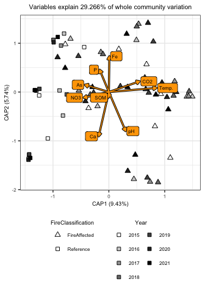<!-- -->

## Trajectory analysis

Now we want to see if the communities are changing directionally over
time which would potentially indicate a change in community state.

``` r
# Metadata for both samples
SiteID_1.meta = data.frame(sample_data(vOTU.physeq)) %>%
  group_by(SiteID, FireClassification) %>%
  summarize(mean_pH_1 = mean(pH),
            sd_pH_1 = sd(pH),
            n_year_1 = n(),
            max_temp_1 = max(CoreTemp_C),
            min_temp_1 = min(CoreTemp_C)) %>%
  ungroup %>%
  rename(SiteID_1 = SiteID,
         FireClassification_1 = FireClassification)

SiteID_2.meta = data.frame(sample_data(vOTU.physeq)) %>%
  group_by(SiteID, FireClassification) %>%
  summarize(mean_pH_2 = mean(pH),
            sd_pH_2 = sd(pH),
            n_year_2 = n(),
            max_temp_2 = max(CoreTemp_C),
            min_temp_2 = min(CoreTemp_C)) %>%
  ungroup %>%
  rename(SiteID_2 = SiteID,
         FireClassification_2 = FireClassification)

# data for analysis
D = as.matrix(BC.dist)
All.samples.meta = sample.meta %>%
  arrange(SiteID, Year) %>%
  mutate(survey = Year-2014)
D = D[All.samples.meta$SequenceID, All.samples.meta$SequenceID] %>%
  as.dist()
sites = All.samples.meta$SiteID
surveys = All.samples.meta$survey

# Trajectory directionality
traj.direct.df = data.frame(directionality = trajectoryDirectionality(D, sites, surveys)) %>%
  tibble::rownames_to_column(var="SiteID_1") %>%
  left_join(SiteID_1.meta, by = "SiteID_1") %>%
  mutate(delta_temp = max_temp_1-min_temp_1)
```

First look at directionaitiy across fire classifications

``` r
traj.direct.wilcox = wilcox.test(directionality~FireClassification_1, data=traj.direct.df)
traj.direct.wilcox
```

    ## 
    ##  Wilcoxon rank sum exact test
    ## 
    ## data:  directionality by FireClassification_1
    ## W = 17, p-value = 0.1833
    ## alternative hypothesis: true location shift is not equal to 0

Next look at directionality over maximum disturbance intensity

``` r
traj_max_temp.model = lm(directionality~max_temp_1, data=traj.direct.df)
summary(traj_max_temp.model)
```

    ## 
    ## Call:
    ## lm(formula = directionality ~ max_temp_1, data = traj.direct.df)
    ## 
    ## Residuals:
    ##       Min        1Q    Median        3Q       Max 
    ## -0.051996 -0.018496  0.004374  0.018591  0.036416 
    ## 
    ## Coefficients:
    ##              Estimate Std. Error t value Pr(>|t|)    
    ## (Intercept) 0.3065235  0.0286209  10.710 5.08e-06 ***
    ## max_temp_1  0.0024053  0.0009439   2.548   0.0343 *  
    ## ---
    ## Signif. codes:  0 '***' 0.001 '**' 0.01 '*' 0.05 '.' 0.1 ' ' 1
    ## 
    ## Residual standard error: 0.0293 on 8 degrees of freedom
    ## Multiple R-squared:  0.448,  Adjusted R-squared:  0.379 
    ## F-statistic: 6.494 on 1 and 8 DF,  p-value: 0.03427

Now plot these results

``` r
# Across fire class
traj.direct.plot = ggplot(data=traj.direct.df, aes(x=FireClassification_1, y=directionality)) +
  geom_boxplot(outlier.shape = NA) +
  geom_jitter(height=0, width=0.25, size=2, aes(shape=FireClassification_1, fill=SiteID_1)) +
  annotate("text", x=1.5, y=0.45, size=6*5/14,
           label=paste("p=", round(traj.direct.wilcox$p.value, digits = 3), sep="")) +
  scale_shape_manual(values=c("FireAffected" = 24, "Reference" = 22)) +
  scale_fill_manual(values=site.col) +
  lims(y=c(0.25, 0.45)) +
  labs(x = "Fire Classification", y = "Trajectory directionality",
       shape="Fire Classification", fill="SiteID") +
  publication_theme +
  theme(legend.position = "bottom",
        legend.direction = "vertical") +
  guides(fill=guide_legend(override.aes=list(shape=site.shape), ncol=4))

traj.direct.leg = g_legend(traj.direct.plot)
traj.direct.plot = traj.direct.plot + theme(legend.position = "none")

# Across disturbance intensity
traj_max_temp.plot = ggplot(data=traj.direct.df, aes(x=max_temp_1, y=directionality)) +
  geom_point(aes(shape=FireClassification_1, fill=SiteID_1), size=2) +
  geom_abline(intercept = summary(traj_max_temp.model)$coefficients[[1]], 
              slope = summary(traj_max_temp.model)$coefficients[[2]], 
              linetype = 1, size=2, color="black") +
  geom_abline(intercept = summary(traj_max_temp.model)$coefficients[[1]], 
              slope = summary(traj_max_temp.model)$coefficients[[2]], 
              linetype = 1, size=1, color="white") +
  scale_shape_manual(values=c("FireAffected" = 24, "Reference" = 22)) +
  scale_fill_manual(values=site.col) +
  lims(y=c(0.25, 0.45)) +
  labs(x="Maximum soil temperature (˚C)", y="Trajectory directionality") +
  publication_theme +
  theme(legend.position = "none")

trajectory_full.plot = cowplot::plot_grid(traj.direct.plot, traj_max_temp.plot,
                                          traj.direct.leg, rel_heights = c(1, 1, 0.5),
                                          ncol=1, labels = c("B", "C", ""), label_size = 8)
trajectory_full.plot
```

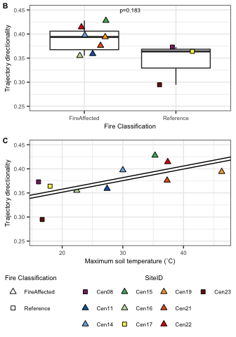<!-- -->

## Community distances to reference over time and disturbance intensity

Unfortunately, our sampling design precludes us from directly measuring
resiliance and resistance. Instead lets take a look at how the viral
communities in the fire affected soils differ from reference communities
across time and disturbance intensity.

First we need a dataframe of paired sample distance/dissimilarity
measures and metadata with average measures across reference sites.
These will be disturbed sites paired with reference sites within the
same year. We also need average distances among reference sites.

``` r
# Metadata dataframe
Reference.meta = sample.meta %>%
  filter(FireClassification == "Reference") %>%
  select(SequenceID, Year) %>%
  rename(Reference_sample = SequenceID)
Disturbed.meta = sample.meta %>%
  filter(FireClassification == "FireAffected") %>%
  rename(Disturbed_sample = SequenceID)

# Distance and dissimilarity Dataframe for disturbed soils
Disturbed_Dist.df = data.frame(as.matrix(BC.dist)) %>%
  tibble::rownames_to_column(var="Disturbed_sample") %>%
  tidyr::gather(key="Reference_sample", value="BC", -Disturbed_sample) %>%
  filter(!is.na(BC)) %>%
  inner_join(Disturbed.meta, by = "Disturbed_sample") %>%
  inner_join(Reference.meta, by = c("Reference_sample", "Year")) %>%
  group_by(Disturbed_sample) %>%
  summarize(mean_BC = mean(BC),
            sd_BC = sd(BC),
            n_comp = n()) %>%
  ungroup %>%
  mutate(SE_BC = sd_BC/sqrt(n_comp)) %>%
  left_join(Disturbed.meta, by = "Disturbed_sample")
  
# Distance and dissimilarity Dataframe for reference soils
BC.dist.mat = as.matrix(BC.dist)
BC.dist.mat[upper.tri(BC.dist.mat, diag = TRUE)] = NA
Reference_Dist.df = data.frame(BC.dist.mat) %>%
  tibble::rownames_to_column(var="Reference_sample1") %>%
  tidyr::gather(key="Reference_sample2", value="BC", -Reference_sample1) %>%
  filter(!is.na(BC)) %>%
  inner_join(rename(Reference.meta, Reference_sample1 = Reference_sample), 
             by = c("Reference_sample1")) %>%
  inner_join(rename(Reference.meta, Reference_sample2 = Reference_sample), 
             by = c("Reference_sample2", "Year"))
```

Now lets plot the distances/dissimilarites over temperature

``` r
# Weighted UniFrac
BC_by_temp.model = lme(mean_BC ~ CoreTemp_C, random = ~1|SiteID, data=Disturbed_Dist.df)
BC_by_temp.model.sum = summary(BC_by_temp.model)$tTable
BC_by_temp.model.sum
```

    ##                     Value    Std.Error DF    t-value      p-value
    ## (Intercept)  0.9964055170 0.0056195194 41 177.311517 8.819044e-61
    ## CoreTemp_C  -0.0002051852 0.0001900441 41  -1.079671 2.865991e-01

``` r
BC_by_temp.plot = ggplot(data=Disturbed_Dist.df, aes(x=CoreTemp_C, y=mean_BC)) +
  geom_hline(yintercept = Reference_Dist.df$BC, color="grey", linetype=2) +
  geom_errorbar(aes(ymin=mean_BC-SE_BC, ymax=mean_BC+SE_BC), color="black", size=1, width=0) +
  geom_errorbar(aes(ymin=mean_BC-SE_BC, ymax=mean_BC+SE_BC, color=SiteID), size=0.5, width=0) +
  geom_point(size=2, aes(fill=SiteID, shape=FireClassification)) +
  #geom_abline(slope=BC_by_temp.model.sum[2], intercept = BC_by_temp.model.sum[1], size=1, color="black") +
  #geom_abline(slope=BC_by_temp.model.sum[2], intercept = BC_by_temp.model.sum[1], size=0.5, color="white", linetype=2) +
  #scale_linetype_manual(values=c("< 0.05" = 1, "≥ 0.05" = 2)) +
  scale_shape_manual(values=FC.shape) +
  scale_fill_manual(values=site.col) +
  scale_color_manual(values=site.col) +
  labs(x="Soil temperature (˚C)", y="Mean Bray-Curtis dissimilarity\nto references", linetype="Regression\nslope p-value") +
  lims(y=c(0, 1)) +
  publication_theme +
  theme(legend.position = "none")


BC_by_temp.plot
```

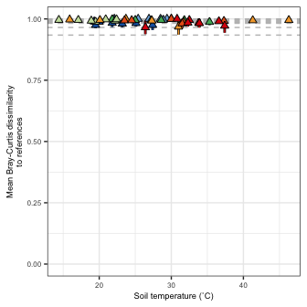<!-- -->

## Plot all betadiversity figures together

``` r
betaplot_A = cowplot::plot_grid(BC_pcoa.plot + theme(legend.position = "none"),
                                g_legend(BC_pcoa.plot))

betaplot_BCD = cowplot::plot_grid(BCfull_SpatialTemporal.plot, GraPart_SpatialTemporal.plot, BalPart_SpatialTemporal.plot,
                   nrow = 1, labels = c("B", "C", "D"), label_size = 8)

betaplot_EF = cowplot::plot_grid(traj.direct.plot, traj_max_temp.plot,
                                 rel_widths = c(0.5,1),
                                 nrow=1, labels = c("E", "F"), label_size = 8)

betaplot_ABCDEF = cowplot::plot_grid(betaplot_A, betaplot_BCD, betaplot_EF,
                                     rel_heights = c(1, 0.8, 1),
                                     ncol=1, labels=c("A", ""), label_size = 8)

betaplot = cowplot::plot_grid(betaplot_ABCDEF, BC_by_temp.plot + lims(y=c(0.9, 1)),
                              rel_heights = c(1,0.5), 
                              ncol=1, labels=c("", "G"), label_size = 8)

betaplot
```

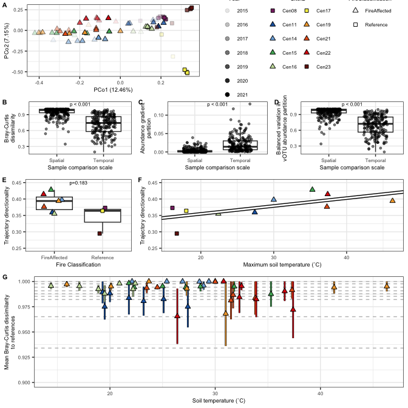<!-- -->

``` r
#ggsave(betaplot, file="/Users/sambarnett/Documents/Shade_lab/Centralia_project/Phage_analysis/Analysis/Figures/Fig4.tiff",
#       device="tiff", width=7, height=7, units="in", bg="white")
```

# vOTU taxonomy

Let’s take a look at what viruses are represented in our vOTUs. We used
vContact2 to classify these viral sequences.

``` r
vContact2.df = read.table("/Users/sambarnett/Documents/Shade_lab/Centralia_project/Phage_analysis/Data/vcontact2custom_taxonomy_table__graphanalyzer_mqc.txt", 
                          sep="\t", header=TRUE, stringsAsFactors = FALSE)

vContact2.df[vContact2.df == "n.a."] = NA

vContact2.df = vContact2.df %>%
  mutate(Taxa = ifelse(is.na(Family), "Unclassified",
                       ifelse(Family == "Unclassified",
                              ifelse(is.na(Class), "Unclassified", paste(Family, Class)), 
                              paste(Class, Family)))) %>%
  rename(vOTU = Scaffold)

vContact2.df %>%
  group_by(Taxa) %>%
  summarize(n_vOTU = n()) %>%
  ungroup %>%
  mutate(per_vOTU = n_vOTU/sum(n_vOTU)*100) %>%
  arrange(-per_vOTU)
```

    ## # A tibble: 16 × 3
    ##    Taxa                               n_vOTU per_vOTU
    ##    <chr>                               <int>    <dbl>
    ##  1 Unclassified                         6814  90.6   
    ##  2 Unclassified Caudoviricetes           648   8.62  
    ##  3 Tectiliviricetes Tectiviridae          27   0.359 
    ##  4 Caudoviricetes Autographiviridae        9   0.120 
    ##  5 Caudoviricetes Steigviridae             5   0.0665
    ##  6 Caudoviricetes Mesyanzhinovviridae      3   0.0399
    ##  7 Caudoviricetes Winoviridae              3   0.0399
    ##  8 Caudoviricetes Herelleviridae           2   0.0266
    ##  9 Caudoviricetes Peduoviridae             2   0.0266
    ## 10 Faserviricetes Inoviridae               2   0.0266
    ## 11 Caudoviricetes Anaerodiviridae          1   0.0133
    ## 12 Caudoviricetes Kyanoviridae             1   0.0133
    ## 13 Caudoviricetes Podoviridae              1   0.0133
    ## 14 Caudoviricetes Pungoviridae             1   0.0133
    ## 15 Caudoviricetes Zobellviridae            1   0.0133
    ## 16 Malgrandaviricetes Microviridae         1   0.0133

## Taxonomy abundances

Lets plot the relative abundances including unclassified vOTU and then
only classified vOTU.

``` r
vOTU_tax_coverage.sum = vOTU_coverage.df %>%
  left_join(vContact2.df, by = "vOTU") %>%
  group_by(SequenceID) %>%
  mutate(total_RPKM = sum(RPKM)) %>%
  ungroup %>%
  group_by(SequenceID, total_RPKM, Taxa) %>%
  summarize(summed_RPKM = sum(RPKM)) %>%
  ungroup %>%
  mutate(Rel_summed_RPKM = summed_RPKM/total_RPKM) %>%
  left_join(sample.meta, by = "SequenceID")

taxa_list = unique(vContact2.df$Taxa)

family_col = c("#777777", paultol_colors(length(taxa_list)-1))
names(family_col) = c("Unclassified", taxa_list[taxa_list != "Unclassified"])

vOTU_tax_coverage.sum$Taxa = factor(vOTU_tax_coverage.sum$Taxa, 
                                    levels = c("Unclassified", taxa_list[taxa_list != "Unclassified"]))

ggplot(data=vOTU_tax_coverage.sum, aes(x=Year, y=summed_RPKM)) +
  geom_bar(stat="identity", aes(fill=Taxa), color="black") +
  scale_fill_manual(values = family_col) +
  present_theme +
  facet_wrap(~FireClassification*SiteID)
```

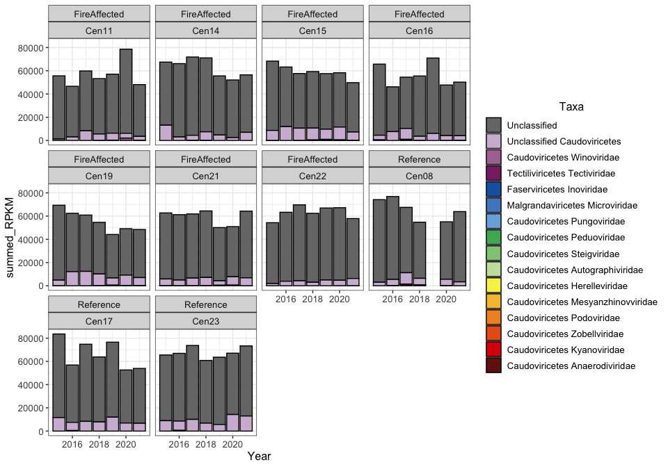<!-- -->

``` r
ggplot(data=filter(vOTU_tax_coverage.sum, !(Taxa %in% "Unclassified")), 
                   aes(x=Year, y=summed_RPKM)) +
  geom_bar(stat="identity", aes(fill=Taxa), color="black") +
  scale_fill_manual(values = family_col) +
  present_theme +
  facet_wrap(~FireClassification*SiteID)
```

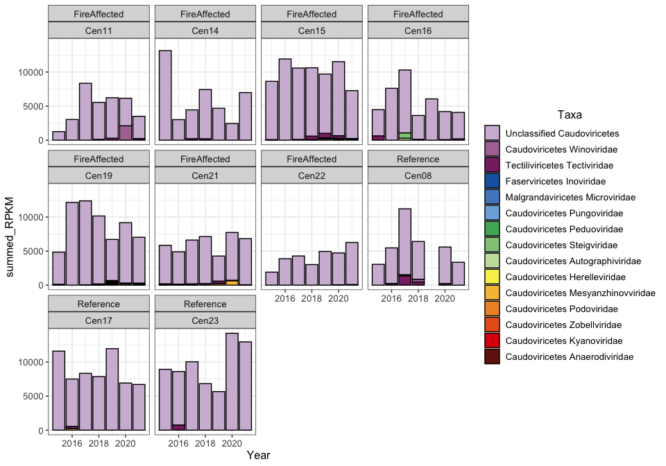<!-- -->

``` r
ggplot(data=filter(vOTU_tax_coverage.sum, !(Taxa %in% c("Unclassified", "Unclassified Caudoviricetes"))), 
                   aes(x=Year, y=summed_RPKM)) +
  geom_bar(stat="identity", aes(fill=Taxa), color="black") +
  scale_fill_manual(values = family_col) +
  present_theme +
  facet_wrap(~FireClassification*SiteID)
```

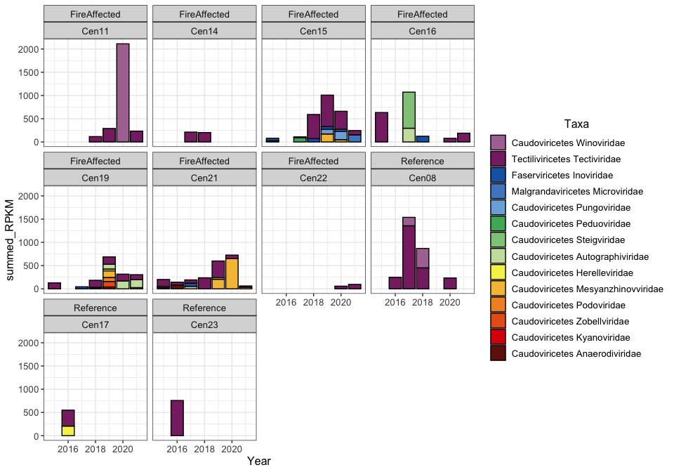<!-- -->

# vOTU to host hits

There are a number of ways to try to match vOTU to their hosts. In this
analysis we will try to link vOTU to hosts containing matching CRISPR
spacers.

## CRISPR matches

``` r
# Load map of short vOTU names
vOTU.map = read.table("/Users/sambarnett/Documents/Shade_lab/Centralia_project/Phage_analysis/Data/vOTU_map.txt", 
                          header=TRUE, sep="\t", comment.char = "", quote = "") %>%
  rename(vOTU_shortID = ShortID)

# Load blast results from CRISPR
CRISPR.blast = read.table("/Users/sambarnett/Documents/Shade_lab/Centralia_project/Phage_analysis/Data/CRISPR_vOTU_blast.txt", 
                          header=FALSE, sep="\t", comment.char = "", quote = "")
colnames(CRISPR.blast) = c("CRISPR_seq_ID", "vOTU_shortID", "perc_ident", "align_length",
                           "n_mismatch", "n_gaps", "query_start", "query_end",
                           "target_start", "target_end", "evalue", "bitscore")

# Load taxonomy list
Main_taxonomy.df = read.table("/Users/sambarnett/Documents/Shade_lab/Centralia_project/Metagenomics/Data/Annotations/main_taxonomic_ranks.txt",
                              header=TRUE, sep="\t", quote="", comment.char="") %>%
  tidyr::spread(key=Ancestor_level, value=Ancestor) %>%
  rename(TaxonomyID = TaxID, Domain = D, Phylum = P, Class = C, Order = O, Family = F, Genus = G, Species = S)

# Match up CRISPR hits and short vOTU names then filter results to only spacers that match up their entire lengths
CRISPR.blast.df = CRISPR.blast %>%
  left_join(vOTU.map, by = "vOTU_shortID") %>%
  left_join(CRISPR.df %>%
              mutate(CRISPR_seq_ID = paste(SequenceID, "__", ContigID, "__Array_", CRISPR_ID, "__Spacer_", Spacer_ID, sep="")) %>%
              select(CRISPR_seq_ID, Classification_status, TaxonomyID, Spacer_seq),
            by = "CRISPR_seq_ID") %>%
  left_join(Main_taxonomy.df, by = "TaxonomyID") %>%
  mutate(Taxa = ifelse(!is.na(Phylum), Phylum,
                       ifelse(!is.na(Domain), paste("Unclassified", Domain), "Unclassified"))) %>%
  mutate(Spacer_length = nchar(Spacer_seq)) %>%
  filter(Spacer_length == align_length) %>%
  mutate(CRISPR_array_ID = gsub("__Spacer.*", "", CRISPR_seq_ID)) %>%
  filter(vOTU %in% unique(vOTU_coverage.df$vOTU))

# How many matched vOTU?
print(paste("There are", length(unique(CRISPR.blast.df$vOTU)), "vOTU mapping to CRISPR arrays"))
```

    ## [1] "There are 184 vOTU mapping to CRISPR arrays"

``` r
print(paste("This is", 
            paste(round(length(unique(CRISPR.blast.df$vOTU))/length(unique(vOTU_coverage.df$vOTU))*100, digits = 2), "%", sep=""),
            "percent of all vOTU"))
```

    ## [1] "This is 2.66% percent of all vOTU"

``` r
# How many CRISPRs matched vOTU?
print(paste("There are", length(unique(CRISPR.blast.df$CRISPR_seq_ID)), "CRISPR spacers mapping to vOTU"))
```

    ## [1] "There are 2672 CRISPR spacers mapping to vOTU"

``` r
print(paste("This is", 
            paste(round(length(unique(CRISPR.blast.df$CRISPR_seq_ID))/nrow(CRISPR.df)*100, digits = 2), "%", sep=""),
            "percent of all CRISPR spacers"))
```

    ## [1] "This is 2.46% percent of all CRISPR spacers"

``` r
print(paste("There are", length(unique(CRISPR.blast.df$CRISPR_array_ID)), "CRISPR arrays mapping to vOTU"))
```

    ## [1] "There are 674 CRISPR arrays mapping to vOTU"

``` r
print(paste("This is", 
            paste(round(length(unique(CRISPR.blast.df$CRISPR_array_ID))/nrow(unique(select(CRISPR.df, ContigID, CRISPR_ID)))*100, digits = 2), "%", sep=""),
            "percent of all CRISPR arrays"))
```

    ## [1] "This is 10.48% percent of all CRISPR arrays"

Ok now that we found some matches, what are the taxonomies of these
hits? Lets look broadly at the phylum.

``` r
CRISPR.blast.tax = CRISPR.blast.df %>%
  select(CRISPR_array_ID, Taxa, Domain, Phylum, Class, Order, Family, Genus, Species) %>%
  unique %>%
  group_by(Phylum) %>%
  dplyr::summarize(n_Arrays = n()) %>%
  ungroup

CRISPR.blast.tax %>%
  arrange(-n_Arrays)
```

    ## # A tibble: 17 × 2
    ##    Phylum            n_Arrays
    ##    <chr>                <int>
    ##  1 <NA>                   361
    ##  2 Pseudomonadota         120
    ##  3 Actinomycetota          86
    ##  4 Planctomycetota         44
    ##  5 Cyanobacteriota          9
    ##  6 Verrucomicrobiota        9
    ##  7 Acidobacteriota          6
    ##  8 Bacillota                6
    ##  9 Bacteroidota             6
    ## 10 Chordata                 6
    ## 11 Unclassified             5
    ## 12 Myxococcota              4
    ## 13 Deinococcota             3
    ## 14 Euryarchaeota            3
    ## 15 Thermomicrobiota         3
    ## 16 Chloroflexota            2
    ## 17 Thermotogota             1

How many of these vOTU-CRISPR matches are in the same samples?

``` r
# First look by spacer
spacer_vOTU_matches = CRISPR.blast.df %>%
  mutate(SequenceID = gsub("__NODE.*", "", CRISPR_seq_ID)) %>%
  left_join(vOTU_coverage.df, by = c("vOTU", "SequenceID")) %>%
  mutate(RPKM = ifelse(is.na(RPKM), 0, RPKM)) %>%
  mutate(Detected = ifelse(RPKM == 0, 0, 1)) %>%
  group_by(SequenceID, CRISPR_seq_ID) %>%
  summarize(n_vOTU_hit = sum(Detected)) %>%
  ungroup %>%
  filter(n_vOTU_hit > 0)

print(paste("Co-occuring CRISPR spacers:", nrow(spacer_vOTU_matches)))
```

    ## [1] "Co-occuring CRISPR spacers: 1726"

``` r
# Next look by whole array
array_vOTU_matches = CRISPR.blast.df %>%
  mutate(SequenceID = gsub("__NODE.*", "", CRISPR_seq_ID)) %>%
  left_join(vOTU_coverage.df, by = c("vOTU", "SequenceID")) %>%
  mutate(RPKM = ifelse(is.na(RPKM), 0, RPKM)) %>%
  mutate(Detected = ifelse(RPKM == 0, 0, 1)) %>%
  group_by(SequenceID, CRISPR_array_ID) %>%
  summarize(n_vOTU_hit = sum(Detected)) %>%
  ungroup %>%
  filter(n_vOTU_hit > 0)

print(paste("Co-occuring CRISPR arrays:", nrow(array_vOTU_matches)))
```

    ## [1] "Co-occuring CRISPR arrays: 425"

``` r
test.df = CRISPR.blast.df %>%
  mutate(SequenceID = gsub("__NODE.*", "", CRISPR_seq_ID)) %>%
  group_by(vOTU, SequenceID) %>%
  summarize(n_arrays = n()) %>%
  ungroup %>%
  full_join(vOTU_coverage.df, by = c("vOTU", "SequenceID")) %>%
  mutate(n_arrays = ifelse(is.na(n_arrays), 0, n_arrays)) %>%
  group_by(vOTU) %>%
  mutate(total_arrays = sum(n_arrays)) %>%
  ungroup %>%
  filter(total_arrays > 0) %>%
  mutate(RPKM = ifelse(is.na(RPKM), 0, RPKM)) %>%
  left_join(sample.meta) %>%
  mutate(Occur = ifelse(RPKM > 0 & n_arrays > 0, "Co-ocurance",
                        ifelse(n_arrays > 0, "CRISPR detected\nvOTU undetected", 
                               "vOTU detected\nCRISPR undetected")))

ggplot(data=test.df, aes(x=Year, y=vOTU)) +
  geom_point(data = filter(test.df, RPKM > 0), aes(color = log10(RPKM)), shape = 16, size=1) +
  geom_point(data = filter(test.df, n_arrays > 0), shape = 21, color="blue", size=1) +
  scale_color_gradient(low="white", high="red") +
  publication_theme + 
  theme(axis.text.y = element_blank()) +
  facet_grid(~FireClassification*SiteID)
```

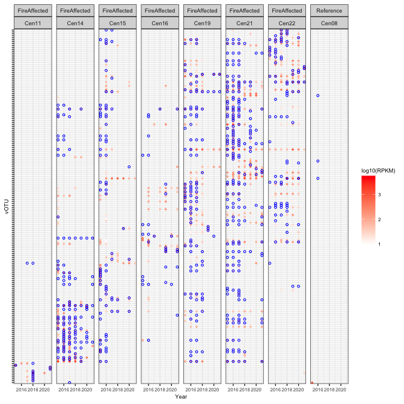<!-- -->

``` r
cooccurance.plot = ggplot(data=test.df, aes(x=Year, y=vOTU)) +
  geom_tile(data = filter(test.df, RPKM > 0), aes(fill = log10(RPKM)), color=NA) +
  geom_tile(fill=NA, aes(color=Occur), size=0.2) +
  #geom_tile(data = filter(test.df, n_arrays > 0), fill=NA, color="black") +
  #geom_point(data = filter(test.df, RPKM > 0), aes(color = log10(RPKM)), shape = 16, size=1) +
  #geom_point(data = filter(test.df, n_arrays > 0), shape = 21, color="blue", size=1) +
  scale_fill_gradient(low="white", high="red") +
  scale_color_manual(values = c("Co-ocurance" = "black", "CRISPR detected\nvOTU undetected" = "blue",
                                "vOTU detected\nCRISPR undetected" = "grey70")) +
  labs(fill="vOTU abundance (log10 RPKM)", color="vOTU/CRISPR detection") +
  publication_theme + 
  theme(axis.text.y = element_blank(),
        axis.text.x = element_text(angle=45, hjust=1),
        panel.grid = element_blank()) +
  facet_grid(~FireClassification*SiteID)
cooccurance.plot
```

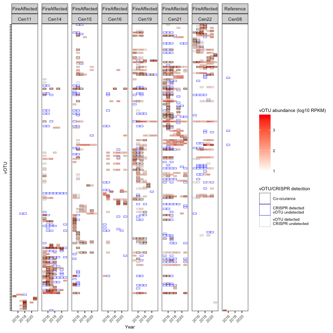<!-- -->

``` r
#ggsave(cooccurance.plot, file="/Users/sambarnett/Documents/Shade_lab/Centralia_project/Phage_analysis/Analysis/Figures/FigS4.tiff",
#       device="tiff", width=7, height=7, units="in", bg="white")
```

# Auxilliary metabolic genes

Now lets take a look at the annotated auxilliary metabolic genes (AMGs)
annotated on these vOTU. AMGs were annotated using DRAMv.

``` r
DRAMv.df = read.table("/Users/sambarnett/Documents/Shade_lab/Centralia_project/Phage_analysis/Data/DRAMv_annotations.txt",
                      header=TRUE, sep="\t", comment.char = "", quote = "") %>%
  mutate(vOTU = paste(SequenceID, gsub("-cat.*", "", scaffold), sep="__")) %>%
  select(-Unnamed..0, -fasta, -scaffold, -SequenceID) %>%
  filter(vOTU %in% unique(vOTU_coverage.df$vOTU))

AMGs.df = DRAMv.df %>%
  filter(auxiliary_score < 4,
         grepl("M", amg_flags),
         !grepl("A|V|T", amg_flags))

# How many AMG were found?
print(paste("There are", nrow(AMGs.df), "AMGs identified"))
```

    ## [1] "There are 790 AMGs identified"

``` r
print(paste("There are", length(unique(AMGs.df$vOTU)), "vOTU with identified AMG"))
```

    ## [1] "There are 533 vOTU with identified AMG"

``` r
print(paste("This is", 
            paste(round(length(unique(AMGs.df$vOTU))/length(unique(vOTU_coverage.df$vOTU))*100, digits = 2), "%", sep=""),
            "percent of all vOTU"))
```

    ## [1] "This is 7.69% percent of all vOTU"

## Occurance and abundance of vOTU containing AMGs

Lets see if there is a pattern in the percentage of vOTU containing AMGs
and their abundance across fire classification and temperature.

``` r
# Summarize number of AMG in vOTU
MetaAMGs.sum = AMGs.df %>%
  group_by(vOTU) %>%
  summarize(n_AMGs = n()) %>%
  ungroup

# Summarize the abundance and percentage of vOTU containing AMG
MetaAMGs_vOTU.sum = vOTU_coverage.df %>%
  left_join(MetaAMGs.sum, by = "vOTU") %>%
  filter(!(is.na(n_AMGs))) %>%
  group_by(SequenceID) %>%
  summarize(n_vOTU_AMG = n(),
            sum_RPKM_vOTU_AMG = sum(RPKM),
            mean_RPKM_vOTU_AMG = mean(RPKM),
            sd_RPKM_vOTU_AMG = sd(RPKM)) %>%
  ungroup %>%
  full_join(vOTU_coverage.df %>% 
              group_by(SequenceID) %>%
              summarize(total_vOTU = n()) %>%
              ungroup) %>%
  mutate(n_vOTU_AMG = ifelse(is.na(n_vOTU_AMG), 0, n_vOTU_AMG),
         sum_RPKM_vOTU_AMG = ifelse(is.na(sum_RPKM_vOTU_AMG), 0, sum_RPKM_vOTU_AMG),
         mean_RPKM_vOTU_AMG = ifelse(is.na(mean_RPKM_vOTU_AMG), 0, mean_RPKM_vOTU_AMG)) %>%
  mutate(perc_with_AMGs = n_vOTU_AMG/total_vOTU*100,
         SE_RPKM_vOTU_AMG = sd_RPKM_vOTU_AMG/sqrt(n_vOTU_AMG)) %>%
  left_join(sample.meta)
```

Percent of vOTU containing an AMG

``` r
# Wilcoxon test across fire classification
perc_with_AMGs.wilcox = wilcox.test(x=filter(MetaAMGs_vOTU.sum, FireClassification=="Reference")$perc_with_AMGs,
                                         y=filter(MetaAMGs_vOTU.sum, FireClassification=="FireAffected")$perc_with_AMGs,
                                         conf.int=TRUE, conf.level=0.95)
perc_with_AMGs.wilcox
```

    ## 
    ##  Wilcoxon rank sum test with continuity correction
    ## 
    ## data:  filter(MetaAMGs_vOTU.sum, FireClassification == "Reference")$perc_with_AMGs and filter(MetaAMGs_vOTU.sum, FireClassification == "FireAffected")$perc_with_AMGs
    ## W = 570, p-value = 0.293
    ## alternative hypothesis: true location shift is not equal to 0
    ## 95 percent confidence interval:
    ##  -0.4951883  1.4051304
    ## sample estimates:
    ## difference in location 
    ##              0.4872374

``` r
wilcox.p = ifelse(perc_with_AMGs.wilcox$p.value < 0.001, "p < 0.001",
                  paste("p = ", round(perc_with_AMGs.wilcox$p.value, digits = 3), sep=""))

# Linear mixed effects over time
perc_with_AMGs_time.model.df = data.frame()

for(FC in unique(MetaAMGs_vOTU.sum$FireClassification)){
  sub_perc_with_AMGs.model = lme(perc_with_AMGs ~ Year, random = ~1|SiteID,
                                      data=filter(MetaAMGs_vOTU.sum, FireClassification==FC))
  perc_with_AMGs_time.model.df = rbind(perc_with_AMGs_time.model.df,
                                            data.frame(summary(sub_perc_with_AMGs.model)$tTable) %>%
                                              tibble::rownames_to_column(var="factor") %>%
                                              mutate(FireClassification = FC))
}

perc_with_AMGs_time.model.reg = perc_with_AMGs_time.model.df %>%
  mutate(p_slope = ifelse(factor == "Year", p.value, 1),
         factor = ifelse(factor == "(Intercept)", "Intercept", factor)) %>%
  group_by(FireClassification) %>%
  mutate(p_slope = min(p_slope)) %>%
  ungroup %>%
  select(FireClassification, factor, Value, p_slope) %>%
  tidyr::spread(key="factor", value="Value") %>%
  mutate(sig = ifelse(p_slope < 0.05, "< 0.05", "≥ 0.05"))

perc_with_AMGs_time.model.reg
```

    ## # A tibble: 2 × 5
    ##   FireClassification  p_slope Intercept  Year sig   
    ##   <chr>                 <dbl>     <dbl> <dbl> <chr> 
    ## 1 FireAffected       0.000181     -671. 0.336 < 0.05
    ## 2 Reference          0.560        -298. 0.151 ≥ 0.05

``` r
# Linear mixed effects over temperature
perc_with_AMGs.model = lme(perc_with_AMGs ~ CoreTemp_C, random = ~1|SiteID, data=MetaAMGs_vOTU.sum)
perc_with_AMGs.model.sum = summary(perc_with_AMGs.model)
perc_with_AMGs.model.sum
```

    ## Linear mixed-effects model fit by REML
    ##   Data: MetaAMGs_vOTU.sum 
    ##        AIC      BIC    logLik
    ##   285.4053 294.2241 -138.7027
    ## 
    ## Random effects:
    ##  Formula: ~1 | SiteID
    ##         (Intercept) Residual
    ## StdDev:   0.6101732 1.675642
    ## 
    ## Fixed effects:  perc_with_AMGs ~ CoreTemp_C 
    ##                 Value Std.Error DF  t-value p-value
    ## (Intercept)  8.258567 0.7591459 58 10.87876  0.0000
    ## CoreTemp_C  -0.029967 0.0304041 58 -0.98563  0.3284
    ##  Correlation: 
    ##            (Intr)
    ## CoreTemp_C -0.93 
    ## 
    ## Standardized Within-Group Residuals:
    ##         Min          Q1         Med          Q3         Max 
    ## -4.50017455 -0.57664114  0.01979235  0.65359227  1.78702672 
    ## 
    ## Number of Observations: 69
    ## Number of Groups: 10

Now plot results.

``` r
# Plot boxplot over fire classification
perc_with_AMGs_FC.plot = ggplot(data=MetaAMGs_vOTU.sum, aes(x=FireClassification, y=perc_with_AMGs)) +
  geom_boxplot(outlier.shape = NA) +
  geom_jitter(aes(shape=FireClassification, fill=SiteID), size=2,
              width = 0.25, height = 0) +
  annotate("text", x=1.5, y=max(MetaAMGs_vOTU.sum$perc_with_AMGs), size = 6*5/14,
           label=wilcox.p) +
  scale_shape_manual(values=FC.shape) +
  scale_fill_manual(values=site.col) +
  labs(x="Fire Classification", y="Percent of vOTU with AMGs") +
  publication_theme +
  guides(fill=guide_legend(override.aes=list(shape=site.shape)))

# Plot lines over time
perc_with_AMGs_time.plot = ggplot(data=MetaAMGs_vOTU.sum, aes(x=Year, y=perc_with_AMGs)) +
  geom_line(aes(group=SiteID), color="black", size=1) + 
  geom_line(aes(color=SiteID), size=0.5) + 
  geom_point(aes(shape=FireClassification, fill=SiteID), size=2) +
  geom_abline(data=perc_with_AMGs_time.model.reg,
              aes(intercept = Intercept, slope = Year),
              linetype=1, size=2, color="black") +
  geom_abline(data=perc_with_AMGs_time.model.reg,
              aes(intercept = Intercept, slope = Year, linetype = sig)
              , size=1, color="white") +
  scale_shape_manual(values=FC.shape) +
  scale_fill_manual(values=site.col) +
  scale_color_manual(values=site.col) +
  scale_linetype_manual(values=c("< 0.05" = 1, "≥ 0.05" = 2)) +
  labs(x="Year", y="Percent of vOTU with AMGs",
       linetype = "LME p-value") +
  publication_theme +
  theme(legend.position = "bottom",
        legend.direction = "vertical") +
  guides(fill=guide_legend(override.aes=list(shape=site.shape), nrow = 2),
         linetype=guide_legend(override.aes=list(color="black"))) +
  facet_wrap(~FireClassification)

# Plot scatterplot with regression over temperature
perc_with_AMGs_temp.plot = ggplot(data=MetaAMGs_vOTU.sum, aes(x=CoreTemp_C, y=perc_with_AMGs)) +
  geom_point(aes(shape=FireClassification, fill=SiteID), size=2) +
  geom_abline(intercept = perc_with_AMGs.model.sum$tTable[1], 
              slope = perc_with_AMGs.model.sum$tTable[2],
              linetype = 1, size=2, color="black") +
  geom_abline(intercept = perc_with_AMGs.model.sum$tTable[1], 
              slope = perc_with_AMGs.model.sum$tTable[2],
              linetype = 2, size=1, color="white") +
  scale_shape_manual(values=FC.shape) +
  scale_fill_manual(values=site.col) +
  labs(x="Soil temperature (˚C)", y="Percent of vOTU with AMGs") +
  publication_theme +
  theme(legend.position = "bottom",
        legend.direction = "vertical") +
  guides(fill=guide_legend(override.aes=list(shape=site.shape), nrow = 3))

perc_with_AMGs.leg = g_legend(perc_with_AMGs_time.plot)


perc_with_AMGs.plot = cowplot::plot_grid(cowplot::plot_grid(perc_with_AMGs_FC.plot + theme(legend.position = "none"), 
                                                                 perc_with_AMGs_temp.plot + 
                                                                   theme(axis.title.y=element_blank(), 
                                                                         axis.text.y = element_blank(), 
                                                                         legend.position = "none",
                                                                         plot.margin = unit(c(0,2,0,5), "mm")),
                                                                 rel_widths = c(0.5, 1), nrow=, labels=c("A", "B"), label_size = 8, align = "h"),
                                              perc_with_AMGs_time.plot + theme(legend.position = "none"),
                                              perc_with_AMGs.leg, rel_heights = c(1, 1, 0.3), labels=c("", "C", ""), label_size = 8, ncol=1)
perc_with_AMGs.plot
```

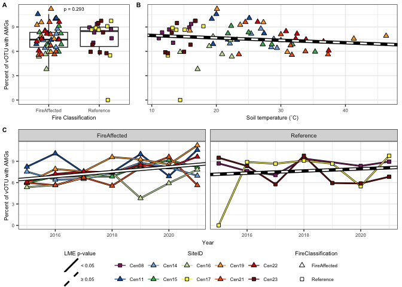<!-- -->

``` r
#ggsave(perc_with_AMGs.plot, file="/Users/sambarnett/Documents/Shade_lab/Centralia_project/Phage_analysis/Analysis/Figures/FigS5.tiff",
#       device="tiff", width=7, height=5, units="in", bg="white")
```

## Abundance of AMG containing vOTU

Now lets see what the total abundance (RPKM) of vOTU containing at least
one AMG is across samples.

``` r
# Wilcoxon test across fire classification
sum_RPKM_vOTU_AMG.wilcox = wilcox.test(x=filter(MetaAMGs_vOTU.sum, FireClassification=="Reference")$sum_RPKM_vOTU_AMG,
                                         y=filter(MetaAMGs_vOTU.sum, FireClassification=="FireAffected")$sum_RPKM_vOTU_AMG,
                                         conf.int=TRUE, conf.level=0.95)
sum_RPKM_vOTU_AMG.wilcox
```

    ## 
    ##  Wilcoxon rank sum exact test
    ## 
    ## data:  filter(MetaAMGs_vOTU.sum, FireClassification == "Reference")$sum_RPKM_vOTU_AMG and filter(MetaAMGs_vOTU.sum, FireClassification == "FireAffected")$sum_RPKM_vOTU_AMG
    ## W = 491, p-value = 0.9948
    ## alternative hypothesis: true location shift is not equal to 0
    ## 95 percent confidence interval:
    ##  -942.8997 1067.3801
    ## sample estimates:
    ## difference in location 
    ##               10.59301

``` r
wilcox.p = ifelse(sum_RPKM_vOTU_AMG.wilcox$p.value < 0.001, "p < 0.001",
                  paste("p = ", round(sum_RPKM_vOTU_AMG.wilcox$p.value, digits = 3), sep=""))

# Linear mixed effects over time
sum_RPKM_vOTU_AMG_time.model.df = data.frame()

for(FC in unique(MetaAMGs_vOTU.sum$FireClassification)){
  sub_sum_RPKM_vOTU_AMG.model = lme(sum_RPKM_vOTU_AMG ~ Year, random = ~1|SiteID,
                                      data=filter(MetaAMGs_vOTU.sum, FireClassification==FC))
  sum_RPKM_vOTU_AMG_time.model.df = rbind(sum_RPKM_vOTU_AMG_time.model.df,
                                            data.frame(summary(sub_sum_RPKM_vOTU_AMG.model)$tTable) %>%
                                              tibble::rownames_to_column(var="factor") %>%
                                              mutate(FireClassification = FC))
}

sum_RPKM_vOTU_AMG_time.model.reg = sum_RPKM_vOTU_AMG_time.model.df %>%
  mutate(p_slope = ifelse(factor == "Year", p.value, 1),
         factor = ifelse(factor == "(Intercept)", "Intercept", factor)) %>%
  group_by(FireClassification) %>%
  mutate(p_slope = min(p_slope)) %>%
  ungroup %>%
  select(FireClassification, factor, Value, p_slope) %>%
  tidyr::spread(key="factor", value="Value") %>%
  mutate(sig = ifelse(p_slope < 0.05, "< 0.05", "≥ 0.05"))

sum_RPKM_vOTU_AMG_time.model.reg
```

    ## # A tibble: 2 × 5
    ##   FireClassification p_slope Intercept  Year sig   
    ##   <chr>                <dbl>     <dbl> <dbl> <chr> 
    ## 1 FireAffected         0.713    80387. -36.9 ≥ 0.05
    ## 2 Reference            0.951    36870. -15.3 ≥ 0.05

``` r
# Linear mixed effects over temperature
sum_RPKM_vOTU_AMG.model = lme(sum_RPKM_vOTU_AMG ~ CoreTemp_C, random = ~1|SiteID, data=MetaAMGs_vOTU.sum)
sum_RPKM_vOTU_AMG.model.sum = summary(sum_RPKM_vOTU_AMG.model)
sum_RPKM_vOTU_AMG.model.sum
```

    ## Linear mixed-effects model fit by REML
    ##   Data: MetaAMGs_vOTU.sum 
    ##        AIC      BIC    logLik
    ##   1217.545 1226.363 -604.7723
    ## 
    ## Random effects:
    ##  Formula: ~1 | SiteID
    ##         (Intercept) Residual
    ## StdDev:    1047.315  1688.12
    ## 
    ## Fixed effects:  sum_RPKM_vOTU_AMG ~ CoreTemp_C 
    ##                Value Std.Error DF  t-value p-value
    ## (Intercept) 5514.363  916.0586 58 6.019662  0.0000
    ## CoreTemp_C    19.872   35.7823 58 0.555372  0.5808
    ##  Correlation: 
    ##            (Intr)
    ## CoreTemp_C -0.906
    ## 
    ## Standardized Within-Group Residuals:
    ##          Min           Q1          Med           Q3          Max 
    ## -3.671097248 -0.493324954 -0.005077533  0.439960797  2.366778332 
    ## 
    ## Number of Observations: 69
    ## Number of Groups: 10

Now plot

``` r
# Plot boxplot over fire classification
sum_RPKM_vOTU_AMG_FC.plot = ggplot(data=MetaAMGs_vOTU.sum, aes(x=FireClassification, y=sum_RPKM_vOTU_AMG)) +
  geom_boxplot(outlier.shape = NA) +
  geom_jitter(aes(shape=FireClassification, fill=SiteID), size=2,
              width = 0.25, height = 0) +
  annotate("text", x=1.5, y=max(MetaAMGs_vOTU.sum$sum_RPKM_vOTU_AMG), size = 6*5/14,
           label=wilcox.p) +
  scale_shape_manual(values=FC.shape) +
  scale_fill_manual(values=site.col) +
  labs(x="Fire Classification", y="Abundance vOTU with AMGs\n(summed RPKM)") +
  publication_theme +
  guides(fill=guide_legend(override.aes=list(shape=site.shape)))

# Plot lines over time
sum_RPKM_vOTU_AMG_time.plot = ggplot(data=MetaAMGs_vOTU.sum, aes(x=Year, y=sum_RPKM_vOTU_AMG)) +
  geom_line(aes(group=SiteID), color="black", size=1) + 
  geom_line(aes(color=SiteID), size=0.5) + 
  geom_point(aes(shape=FireClassification, fill=SiteID), size=2) +
  geom_abline(data=sum_RPKM_vOTU_AMG_time.model.reg,
              aes(intercept = Intercept, slope = Year),
              linetype=1, size=2, color="black") +
  geom_abline(data=sum_RPKM_vOTU_AMG_time.model.reg,
              aes(intercept = Intercept, slope = Year, linetype = sig)
              , size=1, color="white") +
  scale_shape_manual(values=FC.shape) +
  scale_fill_manual(values=site.col) +
  scale_color_manual(values=site.col) +
  scale_linetype_manual(values=c("< 0.05" = 1, "≥ 0.05" = 2)) +
  labs(x="Year", y="Abundance vOTU with AMGs\n(summed RPKM)",
       linetype = "LME p-value") +
  publication_theme +
  theme(legend.position = "bottom",
        legend.direction = "vertical") +
  guides(fill=guide_legend(override.aes=list(shape=site.shape), nrow = 2),
         linetype=guide_legend(override.aes=list(color="black"))) +
  facet_wrap(~FireClassification)

# Plot scatterplot with regression over temperature
sum_RPKM_vOTU_AMG_temp.plot = ggplot(data=MetaAMGs_vOTU.sum, aes(x=CoreTemp_C, y=sum_RPKM_vOTU_AMG)) +
  geom_point(aes(shape=FireClassification, fill=SiteID), size=2) +
  geom_abline(intercept = sum_RPKM_vOTU_AMG.model.sum$tTable[1], 
              slope = sum_RPKM_vOTU_AMG.model.sum$tTable[2],
              linetype = 1, size=2, color="black") +
  geom_abline(intercept = sum_RPKM_vOTU_AMG.model.sum$tTable[1], 
              slope = sum_RPKM_vOTU_AMG.model.sum$tTable[2],
              linetype = 2, size=1, color="white") +
  scale_shape_manual(values=FC.shape) +
  scale_fill_manual(values=site.col) +
  labs(x="Soil temperature (˚C)", y="Abundance vOTU with AMGs\n(summed RPKM)") +
  publication_theme +
  theme(legend.position = "bottom",
        legend.direction = "vertical") +
  guides(fill=guide_legend(override.aes=list(shape=site.shape), nrow = 3))

sum_RPKM_vOTU_AMG.leg = g_legend(sum_RPKM_vOTU_AMG_time.plot)


sum_RPKM_vOTU_AMG.plot = cowplot::plot_grid(cowplot::plot_grid(sum_RPKM_vOTU_AMG_FC.plot + theme(legend.position = "none"), 
                                                                 sum_RPKM_vOTU_AMG_temp.plot + 
                                                                   theme(axis.title.y=element_blank(), 
                                                                         axis.text.y = element_blank(), 
                                                                         legend.position = "none",
                                                                         plot.margin = unit(c(0,2,0,5), "mm")),
                                                                 rel_widths = c(0.5, 1), nrow=, labels=c("A", "B"), label_size = 8, align = "h"),
                                              sum_RPKM_vOTU_AMG_time.plot + theme(legend.position = "none"),
                                              sum_RPKM_vOTU_AMG.leg, rel_heights = c(1, 1, 0.3), labels=c("", "C", ""), label_size = 8, ncol=1)
sum_RPKM_vOTU_AMG.plot
```

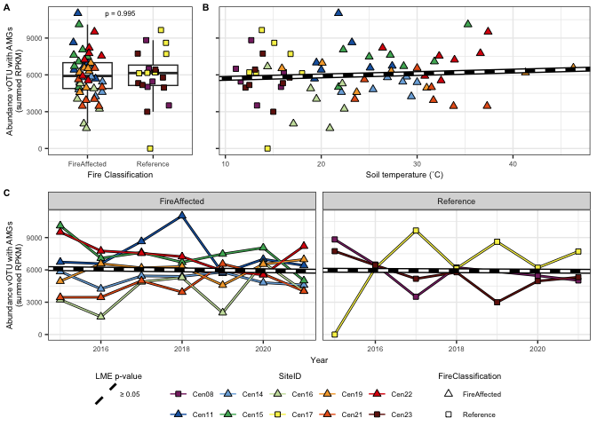<!-- -->

``` r
#ggsave(sum_RPKM_vOTU_AMG.plot, file="/Users/sambarnett/Documents/Shade_lab/Centralia_project/Phage_analysis/Analysis/Figures/FigS5.tiff",
#       device="tiff", width=7, height=5, units="in", bg="white")
```

## Specific types of AMGs

### CAZymes

Now lets just look at CAZyme annotated AMGs.

``` r
CAZY_MetaAMGs.sum = AMGs.df %>%
  filter(!is.na(cazy_ids) & cazy_ids != "") %>%
  group_by(vOTU) %>%
  summarize(n_AMGs = n()) %>%
  ungroup

CAZY_MetaAMGs_vOTU.sum = vOTU_coverage.df %>%
  left_join(CAZY_MetaAMGs.sum, by = "vOTU") %>%
  filter(!(is.na(n_AMGs))) %>%
  group_by(SequenceID) %>%
  summarize(n_vOTU_AMG = n(),
            sum_RPKM_vOTU_CAZyme_AMG = sum(RPKM),
            mean_RPKM_vOTU_AMG = mean(RPKM),
            sd_RPKM_vOTU_AMG = sd(RPKM)) %>%
  ungroup %>%
  full_join(vOTU_coverage.df %>% 
              group_by(SequenceID) %>%
              summarize(total_vOTU = n()) %>%
              ungroup) %>%
  mutate(n_vOTU_AMG = ifelse(is.na(n_vOTU_AMG), 0, n_vOTU_AMG),
         sum_RPKM_vOTU_CAZyme_AMG = ifelse(is.na(sum_RPKM_vOTU_CAZyme_AMG), 0, sum_RPKM_vOTU_CAZyme_AMG),
         mean_RPKM_vOTU_AMG = ifelse(is.na(mean_RPKM_vOTU_AMG), 0, mean_RPKM_vOTU_AMG)) %>%
  mutate(perc_with_CAZyme_AMGs = n_vOTU_AMG/total_vOTU*100,
         SE_RPKM_vOTU_AMG = sd_RPKM_vOTU_AMG/sqrt(n_vOTU_AMG)) %>%
  left_join(sample.meta)
```

``` r
# Wilcoxon test across fire classification
sum_RPKM_vOTU_CAZyme_AMG.wilcox = wilcox.test(x=filter(CAZY_MetaAMGs_vOTU.sum, FireClassification=="Reference")$sum_RPKM_vOTU_CAZyme_AMG,
                                         y=filter(CAZY_MetaAMGs_vOTU.sum, FireClassification=="FireAffected")$sum_RPKM_vOTU_CAZyme_AMG,
                                         conf.int=TRUE, conf.level=0.95)
sum_RPKM_vOTU_CAZyme_AMG.wilcox
```

    ## 
    ##  Wilcoxon rank sum test with continuity correction
    ## 
    ## data:  filter(CAZY_MetaAMGs_vOTU.sum, FireClassification == "Reference")$sum_RPKM_vOTU_CAZyme_AMG and filter(CAZY_MetaAMGs_vOTU.sum, FireClassification == "FireAffected")$sum_RPKM_vOTU_CAZyme_AMG
    ## W = 192, p-value = 7.186e-05
    ## alternative hypothesis: true location shift is not equal to 0
    ## 95 percent confidence interval:
    ##  -766.5461 -262.3137
    ## sample estimates:
    ## difference in location 
    ##              -519.6336

``` r
wilcox.p = ifelse(sum_RPKM_vOTU_CAZyme_AMG.wilcox$p.value < 0.001, "p < 0.001",
                  paste("p = ", round(sum_RPKM_vOTU_CAZyme_AMG.wilcox$p.value, digits = 3), sep=""))

# Linear mixed effects over time
sum_RPKM_vOTU_CAZyme_AMG_time.model.df = data.frame()

for(FC in unique(CAZY_MetaAMGs_vOTU.sum$FireClassification)){
  sub_sum_RPKM_vOTU_CAZyme_AMG.model = lme(sum_RPKM_vOTU_CAZyme_AMG ~ Year, random = ~1|SiteID,
                                      data=filter(CAZY_MetaAMGs_vOTU.sum, FireClassification==FC))
  sum_RPKM_vOTU_CAZyme_AMG_time.model.df = rbind(sum_RPKM_vOTU_CAZyme_AMG_time.model.df,
                                            data.frame(summary(sub_sum_RPKM_vOTU_CAZyme_AMG.model)$tTable) %>%
                                              tibble::rownames_to_column(var="factor") %>%
                                              mutate(FireClassification = FC))
}

sum_RPKM_vOTU_CAZyme_AMG_time.model.reg = sum_RPKM_vOTU_CAZyme_AMG_time.model.df %>%
  mutate(p_slope = ifelse(factor == "Year", p.value, 1),
         factor = ifelse(factor == "(Intercept)", "Intercept", factor)) %>%
  group_by(FireClassification) %>%
  mutate(p_slope = min(p_slope)) %>%
  ungroup %>%
  select(FireClassification, factor, Value, p_slope) %>%
  tidyr::spread(key="factor", value="Value") %>%
  mutate(sig = ifelse(p_slope < 0.05, "< 0.05", "≥ 0.05"))

sum_RPKM_vOTU_CAZyme_AMG_time.model.reg
```

    ## # A tibble: 2 × 5
    ##   FireClassification p_slope Intercept  Year sig   
    ##   <chr>                <dbl>     <dbl> <dbl> <chr> 
    ## 1 FireAffected       0.0759    307580. -152. ≥ 0.05
    ## 2 Reference          0.00910   244631. -121. < 0.05

``` r
# Linear mixed effects over temperature
sum_RPKM_vOTU_CAZyme_AMG.model = lme(sum_RPKM_vOTU_CAZyme_AMG ~ CoreTemp_C, random = ~1|SiteID, data=CAZY_MetaAMGs_vOTU.sum)
sum_RPKM_vOTU_CAZyme_AMG.model.sum = summary(sum_RPKM_vOTU_CAZyme_AMG.model)
sum_RPKM_vOTU_CAZyme_AMG.model.sum
```

    ## Linear mixed-effects model fit by REML
    ##   Data: CAZY_MetaAMGs_vOTU.sum 
    ##        AIC      BIC    logLik
    ##   1151.433 1160.252 -571.7166
    ## 
    ## Random effects:
    ##  Formula: ~1 | SiteID
    ##         (Intercept) Residual
    ## StdDev:     578.232 1041.028
    ## 
    ## Fixed effects:  sum_RPKM_vOTU_CAZyme_AMG ~ CoreTemp_C 
    ##                  Value Std.Error DF    t-value p-value
    ## (Intercept) -245.35707  542.5722 58 -0.4522109  0.6528
    ## CoreTemp_C    44.86152   21.3545 58  2.1007960  0.0400
    ##  Correlation: 
    ##            (Intr)
    ## CoreTemp_C -0.913
    ## 
    ## Standardized Within-Group Residuals:
    ##        Min         Q1        Med         Q3        Max 
    ## -1.6326600 -0.4341493 -0.1562225  0.1503181  5.5569166 
    ## 
    ## Number of Observations: 69
    ## Number of Groups: 10

``` r
# Plot boxplot over fire classification
sum_RPKM_vOTU_CAZyme_AMG_FC.plot = ggplot(data=CAZY_MetaAMGs_vOTU.sum, aes(x=FireClassification, y=sum_RPKM_vOTU_CAZyme_AMG)) +
  geom_boxplot(outlier.shape = NA) +
  geom_jitter(aes(shape=FireClassification, fill=SiteID), size=2,
              width = 0.25, height = 0) +
  annotate("text", x=1.5, y=max(CAZY_MetaAMGs_vOTU.sum$sum_RPKM_vOTU_CAZyme_AMG) + 500, size = 6*5/14,
           label=wilcox.p) +
  scale_shape_manual(values=FC.shape) +
  scale_fill_manual(values=site.col) +
  labs(x="Fire Classification", y="Abundance vOTU with CAZyme AMGs\n(summed RPKM)") +
  lims(y=c(0, max(CAZY_MetaAMGs_vOTU.sum$sum_RPKM_vOTU_CAZyme_AMG) +500)) +
  publication_theme +
  guides(fill=guide_legend(override.aes=list(shape=site.shape)))

# Plot lines over time
sum_RPKM_vOTU_CAZyme_AMG_time.plot = ggplot(data=CAZY_MetaAMGs_vOTU.sum, aes(x=Year, y=sum_RPKM_vOTU_CAZyme_AMG)) +
  geom_line(aes(group=SiteID), color="black", size=1) + 
  geom_line(aes(color=SiteID), size=0.5) + 
  geom_point(aes(shape=FireClassification, fill=SiteID), size=2) +
  geom_abline(data=sum_RPKM_vOTU_CAZyme_AMG_time.model.reg,
              aes(intercept = Intercept, slope = Year),
              linetype=1, size=2, color="black") +
  geom_abline(data=sum_RPKM_vOTU_CAZyme_AMG_time.model.reg,
              aes(intercept = Intercept, slope = Year, linetype = sig), 
              size=1, color="white") +
  scale_shape_manual(values=FC.shape) +
  scale_fill_manual(values=site.col) +
  scale_color_manual(values=site.col) +
  scale_linetype_manual(values=c("< 0.05" = 1, "≥ 0.05" = 2)) +
  labs(x="Year", y="Abundance vOTU with CAZyme AMGs\n(summed RPKM)",
       linetype = "LME p-value") +
  lims(y=c(0, max(CAZY_MetaAMGs_vOTU.sum$sum_RPKM_vOTU_CAZyme_AMG) +500)) +
  publication_theme +
  theme(legend.position = "bottom",
        legend.direction = "vertical") +
  guides(fill=guide_legend(override.aes=list(shape=site.shape), nrow = 2),
         linetype=guide_legend(override.aes=list(color="black"))) +
  facet_wrap(~FireClassification)

# Plot scatterplot with regression over temperature
sum_RPKM_vOTU_CAZyme_AMG_temp.plot = ggplot(data=CAZY_MetaAMGs_vOTU.sum, aes(x=CoreTemp_C, y=sum_RPKM_vOTU_CAZyme_AMG)) +
  geom_point(aes(shape=FireClassification, fill=SiteID), size=2) +
  geom_abline(intercept = sum_RPKM_vOTU_CAZyme_AMG.model.sum$tTable[1], 
              slope = sum_RPKM_vOTU_CAZyme_AMG.model.sum$tTable[2],
              linetype = 1, size=2, color="black") +
  geom_abline(intercept = sum_RPKM_vOTU_CAZyme_AMG.model.sum$tTable[1], 
              slope = sum_RPKM_vOTU_CAZyme_AMG.model.sum$tTable[2],
              linetype = 1, size=1, color="white") +
  scale_shape_manual(values=FC.shape) +
  scale_fill_manual(values=site.col) +
  labs(x="Soil temperature (˚C)", y="Abundance vOTU with CAZyme AMGs\n(summed RPKM)") +
  lims(y=c(0, max(CAZY_MetaAMGs_vOTU.sum$sum_RPKM_vOTU_CAZyme_AMG) +500)) +
  publication_theme +
  theme(legend.position = "bottom",
        legend.direction = "vertical") +
  guides(fill=guide_legend(override.aes=list(shape=site.shape), nrow = 3))

sum_RPKM_vOTU_CAZyme_AMG.leg = g_legend(sum_RPKM_vOTU_CAZyme_AMG_time.plot)


sum_RPKM_vOTU_CAZyme_AMG.plot = cowplot::plot_grid(cowplot::plot_grid(sum_RPKM_vOTU_CAZyme_AMG_FC.plot + theme(legend.position = "none"), 
                                                                 sum_RPKM_vOTU_CAZyme_AMG_temp.plot + 
                                                                   theme(axis.title.y=element_blank(), 
                                                                         axis.text.y = element_blank(), 
                                                                         legend.position = "none",
                                                                         plot.margin = unit(c(0,2,0,5), "mm")),
                                                                 rel_widths = c(0.5, 1), nrow=, labels=c("A", "B"), label_size = 8, align = "h"),
                                              sum_RPKM_vOTU_CAZyme_AMG_time.plot + theme(legend.position = "none"),
                                              sum_RPKM_vOTU_CAZyme_AMG.leg, rel_heights = c(1, 1, 0.3), labels=c("", "C", ""), label_size = 8, ncol=1)
sum_RPKM_vOTU_CAZyme_AMG.plot
```

<!-- -->

``` r
#ggsave(sum_RPKM_vOTU_CAZyme_AMG.plot, file="/Users/sambarnett/Documents/Shade_lab/Centralia_project/Phage_analysis/Analysis/Figures/FigS6.tiff",
#       device="tiff", width=7, height=5, units="in", bg="white")
```

### Peptidases

Now lets just look at Peptidase annotated AMGs.

``` r
peptidase_MetaAMGs.sum = AMGs.df %>%
  filter(!is.na(peptidase_id) & peptidase_id != "") %>%
  group_by(vOTU) %>%
  summarize(n_AMGs = n()) %>%
  ungroup

peptidase_MetaAMGs_vOTU.sum = vOTU_coverage.df %>%
  left_join(peptidase_MetaAMGs.sum, by = "vOTU") %>%
  filter(!(is.na(n_AMGs))) %>%
  group_by(SequenceID) %>%
  summarize(n_vOTU_AMG = n(),
            sum_RPKM_vOTU_peptidase_AMG = sum(RPKM),
            mean_RPKM_vOTU_AMG = mean(RPKM),
            sd_RPKM_vOTU_AMG = sd(RPKM)) %>%
  ungroup %>%
  full_join(vOTU_coverage.df %>% 
              group_by(SequenceID) %>%
              summarize(total_vOTU = n()) %>%
              ungroup) %>%
  mutate(n_vOTU_AMG = ifelse(is.na(n_vOTU_AMG), 0, n_vOTU_AMG),
         sum_RPKM_vOTU_peptidase_AMG = ifelse(is.na(sum_RPKM_vOTU_peptidase_AMG), 0, sum_RPKM_vOTU_peptidase_AMG),
         mean_RPKM_vOTU_AMG = ifelse(is.na(mean_RPKM_vOTU_AMG), 0, mean_RPKM_vOTU_AMG)) %>%
  mutate(perc_with_peptidase_AMGs = n_vOTU_AMG/total_vOTU*100,
         SE_RPKM_vOTU_AMG = sd_RPKM_vOTU_AMG/sqrt(n_vOTU_AMG)) %>%
  left_join(sample.meta)
```

``` r
# Wilcoxon test across fire classification
sum_RPKM_vOTU_peptidase_AMG.wilcox = wilcox.test(x=filter(peptidase_MetaAMGs_vOTU.sum, FireClassification=="Reference")$sum_RPKM_vOTU_peptidase_AMG,
                                         y=filter(peptidase_MetaAMGs_vOTU.sum, FireClassification=="FireAffected")$sum_RPKM_vOTU_peptidase_AMG,
                                         conf.int=TRUE, conf.level=0.95)
sum_RPKM_vOTU_peptidase_AMG.wilcox
```

    ## 
    ##  Wilcoxon rank sum test with continuity correction
    ## 
    ## data:  filter(peptidase_MetaAMGs_vOTU.sum, FireClassification == "Reference")$sum_RPKM_vOTU_peptidase_AMG and filter(peptidase_MetaAMGs_vOTU.sum, FireClassification == "FireAffected")$sum_RPKM_vOTU_peptidase_AMG
    ## W = 192, p-value = 7.653e-05
    ## alternative hypothesis: true location shift is not equal to 0
    ## 95 percent confidence interval:
    ##  -424.3248 -162.5708
    ## sample estimates:
    ## difference in location 
    ##              -285.5223

``` r
wilcox.p = ifelse(sum_RPKM_vOTU_peptidase_AMG.wilcox$p.value < 0.001, "p < 0.001",
                  paste("p = ", round(sum_RPKM_vOTU_peptidase_AMG.wilcox$p.value, digits = 3), sep=""))

# Linear mixed effects over time
sum_RPKM_vOTU_peptidase_AMG_time.model.df = data.frame()

for(FC in unique(peptidase_MetaAMGs_vOTU.sum$FireClassification)){
  sub_sum_RPKM_vOTU_peptidase_AMG.model = lme(sum_RPKM_vOTU_peptidase_AMG ~ Year, random = ~1|SiteID,
                                      data=filter(peptidase_MetaAMGs_vOTU.sum, FireClassification==FC))
  sum_RPKM_vOTU_peptidase_AMG_time.model.df = rbind(sum_RPKM_vOTU_peptidase_AMG_time.model.df,
                                            data.frame(summary(sub_sum_RPKM_vOTU_peptidase_AMG.model)$tTable) %>%
                                              tibble::rownames_to_column(var="factor") %>%
                                              mutate(FireClassification = FC))
}

sum_RPKM_vOTU_peptidase_AMG_time.model.reg = sum_RPKM_vOTU_peptidase_AMG_time.model.df %>%
  mutate(p_slope = ifelse(factor == "Year", p.value, 1),
         factor = ifelse(factor == "(Intercept)", "Intercept", factor)) %>%
  group_by(FireClassification) %>%
  mutate(p_slope = min(p_slope)) %>%
  ungroup %>%
  select(FireClassification, factor, Value, p_slope) %>%
  tidyr::spread(key="factor", value="Value") %>%
  mutate(sig = ifelse(p_slope < 0.05, "< 0.05", "≥ 0.05"))

sum_RPKM_vOTU_peptidase_AMG_time.model.reg
```

    ## # A tibble: 2 × 5
    ##   FireClassification p_slope Intercept  Year sig   
    ##   <chr>                <dbl>     <dbl> <dbl> <chr> 
    ## 1 FireAffected         0.117   -64922.  32.4 ≥ 0.05
    ## 2 Reference            0.124   148474. -73.5 ≥ 0.05

``` r
# Linear mixed effects over temperature
sum_RPKM_vOTU_peptidase_AMG.model = lme(sum_RPKM_vOTU_peptidase_AMG ~ CoreTemp_C, random = ~1|SiteID, data=peptidase_MetaAMGs_vOTU.sum)
sum_RPKM_vOTU_peptidase_AMG.model.sum = summary(sum_RPKM_vOTU_peptidase_AMG.model)
sum_RPKM_vOTU_peptidase_AMG.model.sum
```

    ## Linear mixed-effects model fit by REML
    ##   Data: peptidase_MetaAMGs_vOTU.sum 
    ##        AIC     BIC    logLik
    ##   1007.121 1015.94 -499.5606
    ## 
    ## Random effects:
    ##  Formula: ~1 | SiteID
    ##         (Intercept) Residual
    ## StdDev:    314.7184 336.5381
    ## 
    ## Fixed effects:  sum_RPKM_vOTU_peptidase_AMG ~ CoreTemp_C 
    ##                Value Std.Error DF    t-value p-value
    ## (Intercept) 468.2830 213.09700 58  2.1975111  0.0320
    ## CoreTemp_C   -2.1128   7.94441 58 -0.2659449  0.7912
    ##  Correlation: 
    ##            (Intr)
    ## CoreTemp_C -0.864
    ## 
    ## Standardized Within-Group Residuals:
    ##        Min         Q1        Med         Q3        Max 
    ## -1.4814324 -0.4072716 -0.1670944  0.1711798  4.6514766 
    ## 
    ## Number of Observations: 69
    ## Number of Groups: 10

``` r
# Plot boxplot over fire classification
sum_RPKM_vOTU_peptidase_AMG_FC.plot = ggplot(data=peptidase_MetaAMGs_vOTU.sum, aes(x=FireClassification, y=sum_RPKM_vOTU_peptidase_AMG)) +
  geom_boxplot(outlier.shape = NA) +
  geom_jitter(aes(shape=FireClassification, fill=SiteID), size=2,
              width = 0.25, height = 0) +
  annotate("text", x=1.5, y=max(peptidase_MetaAMGs_vOTU.sum$sum_RPKM_vOTU_peptidase_AMG) + 150, size = 6*5/14,
           label=wilcox.p) +
  scale_shape_manual(values=FC.shape) +
  scale_fill_manual(values=site.col) +
  labs(x="Fire Classification", y="Abundance vOTU with peptidase AMGs\n(summed RPKM)") +
  lims(y=c(0, max(peptidase_MetaAMGs_vOTU.sum$sum_RPKM_vOTU_peptidase_AMG) + 150)) +
  publication_theme +
  guides(fill=guide_legend(override.aes=list(shape=site.shape)))

# Plot lines over time
sum_RPKM_vOTU_peptidase_AMG_time.plot = ggplot(data=peptidase_MetaAMGs_vOTU.sum, aes(x=Year, y=sum_RPKM_vOTU_peptidase_AMG)) +
  geom_line(aes(group=SiteID), color="black", size=1) + 
  geom_line(aes(color=SiteID), size=0.5) + 
  geom_point(aes(shape=FireClassification, fill=SiteID), size=2) +
  geom_abline(data=sum_RPKM_vOTU_peptidase_AMG_time.model.reg,
              aes(intercept = Intercept, slope = Year),
              linetype=1, size=2, color="black") +
  geom_abline(data=sum_RPKM_vOTU_peptidase_AMG_time.model.reg,
              aes(intercept = Intercept, slope = Year, linetype = sig)
              , size=1, color="white") +
  scale_shape_manual(values=FC.shape) +
  scale_fill_manual(values=site.col) +
  scale_color_manual(values=site.col) +
  scale_linetype_manual(values=c("< 0.05" = 1, "≥ 0.05" = 2)) +
  labs(x="Year", y="Abundance vOTU with peptidase AMGs\n(summed RPKM)",
       linetype = "LME p-value") +
  lims(y=c(0, max(peptidase_MetaAMGs_vOTU.sum$sum_RPKM_vOTU_peptidase_AMG) + 150)) +
  publication_theme +
  theme(legend.position = "bottom",
        legend.direction = "vertical") +
  guides(fill=guide_legend(override.aes=list(shape=site.shape), nrow = 2),
         linetype=guide_legend(override.aes=list(color="black"))) +
  facet_wrap(~FireClassification)

# Plot scatterplot with regression over temperature
sum_RPKM_vOTU_peptidase_AMG_temp.plot = ggplot(data=peptidase_MetaAMGs_vOTU.sum, aes(x=CoreTemp_C, y=sum_RPKM_vOTU_peptidase_AMG)) +
  geom_point(aes(shape=FireClassification, fill=SiteID), size=2) +
  geom_abline(intercept = sum_RPKM_vOTU_peptidase_AMG.model.sum$tTable[1], 
              slope = sum_RPKM_vOTU_peptidase_AMG.model.sum$tTable[2],
              linetype = 1, size=2, color="black") +
  geom_abline(intercept = sum_RPKM_vOTU_peptidase_AMG.model.sum$tTable[1], 
              slope = sum_RPKM_vOTU_peptidase_AMG.model.sum$tTable[2],
              linetype = 2, size=1, color="white") +
  scale_shape_manual(values=FC.shape) +
  scale_fill_manual(values=site.col) +
  labs(x="Soil temperature (˚C)", y="Abundance vOTU with peptidase AMGs\n(summed RPKM)") +
  lims(y=c(0, max(peptidase_MetaAMGs_vOTU.sum$sum_RPKM_vOTU_peptidase_AMG) + 150)) +
  publication_theme +
  theme(legend.position = "bottom",
        legend.direction = "vertical") +
  guides(fill=guide_legend(override.aes=list(shape=site.shape), nrow = 3))

sum_RPKM_vOTU_peptidase_AMG.leg = g_legend(sum_RPKM_vOTU_peptidase_AMG_time.plot)


sum_RPKM_vOTU_peptidase_AMG.plot = cowplot::plot_grid(cowplot::plot_grid(sum_RPKM_vOTU_peptidase_AMG_FC.plot + theme(legend.position = "none"), 
                                                                 sum_RPKM_vOTU_peptidase_AMG_temp.plot + 
                                                                   theme(axis.title.y=element_blank(), 
                                                                         axis.text.y = element_blank(), 
                                                                         legend.position = "none",
                                                                         plot.margin = unit(c(0,2,0,5), "mm")),
                                                                 rel_widths = c(0.5, 1), nrow=, labels=c("A", "B"), label_size = 8, align = "h"),
                                              sum_RPKM_vOTU_peptidase_AMG_time.plot + theme(legend.position = "none"),
                                              sum_RPKM_vOTU_peptidase_AMG.leg, rel_heights = c(1, 1, 0.3), labels=c("", "C", ""), label_size = 8, ncol=1)
sum_RPKM_vOTU_peptidase_AMG.plot
```

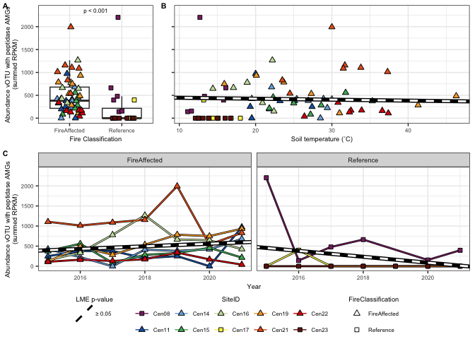<!-- -->

``` r
#ggsave(sum_RPKM_vOTU_peptidase_AMG.plot, file="/Users/sambarnett/Documents/Shade_lab/Centralia_project/Phage_analysis/Analysis/Figures/FigS7.tiff",
#       device="tiff", width=7, height=5, units="in", bg="white")
```

### Combine specific AMG figures together

``` r
sum_RPKM_vOTU_specific_AMG.plot = cowplot::plot_grid(cowplot::plot_grid(sum_RPKM_vOTU_CAZyme_AMG_FC.plot + theme(legend.position = "none"), 
                                                                        sum_RPKM_vOTU_CAZyme_AMG_temp.plot + 
                                                                          theme(axis.title.y=element_blank(), axis.text.y = element_blank(), 
                                                                                plot.margin = unit(c(0,2,0,4), "mm"), legend.position = "none"),
                                                                        rel_widths = c(0.8, 1), nrow=, labels=c("A", "B"), label_size = 8, align = "h"),
                                                     cowplot::plot_grid(sum_RPKM_vOTU_peptidase_AMG_FC.plot + theme(legend.position = "none"), 
                                                                        sum_RPKM_vOTU_peptidase_AMG_temp.plot + 
                                                                          theme(axis.title.y=element_blank(), axis.text.y = element_blank(), 
                                                                                plot.margin = unit(c(0,2,0,4), "mm"), legend.position = "none"),
                                                                        rel_widths = c(0.8, 1), nrow=, labels=c("C", "D"), label_size = 8, align = "h"),
                                                     g_legend(sum_RPKM_vOTU_CAZyme_AMG_time.plot + 
                                                                theme(legend.position = "right") +
                                                                guides(fill=guide_legend(override.aes=list(shape=site.shape), nrow = 2),
                                                                       shape="none", linetype="none")), 
                                                     g_legend(sum_RPKM_vOTU_CAZyme_AMG_time.plot + 
                                                                theme(legend.position = "bottom", legend.direction = "vertical") +
                                                                guides(fill="none", color="none", linetype=guide_legend(override.aes=list(color="black")))),
                                                     rel_heights = c(1, 1, 0.3, 0.3), ncol=1)
sum_RPKM_vOTU_specific_AMG.plot
```

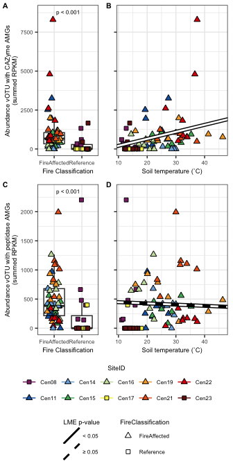<!-- -->

``` r
#ggsave(sum_RPKM_vOTU_specific_AMG.plot, file="/Users/sambarnett/Documents/Shade_lab/Centralia_project/Phage_analysis/Analysis/Figures/Fig5.tiff",
#       device="tiff", width=3.5, height=7, units="in", bg="white")
```

# vOTU abundances

Lets make some heatmaps of the vOTU abundances. These will probably be a
mess due to how many vOTUs we have but lets look anyways.

## Log10 RPKM abundance

First try making the plot with the log10 of the RPKM abundance.

``` r
# Make a tree of the vOTUs based on their RPKM
vOTU.dist = dist(vOTU_RPKM.mat)
vOTU.clust = hclust(vOTU.dist)

vOTU.tree.plot = ggtree(vOTU.clust) + 
  geom_tiplab(size=0, align=TRUE, linesize=.5) +
  theme(plot.margin = unit(c(0, 0, 0, 0), "in"))

# Order vOTU by tree
vOTU_order.df = data.frame(vOTU = rev(get_taxa_name(vOTU.tree.plot))) %>%
  mutate(vOTU_order = row_number()) %>%
  arrange(vOTU_order)

# Get genome abundances grouped by vOTU and plot
SequenceID.order = arrange(sample.meta, FireClassification, SiteID, Year)$SequenceID
Site.order = sample.meta %>%
  group_by(SiteID) %>%
  summarize(maxTemp = max(CoreTemp_C)) %>%
  ungroup %>%
  arrange(-maxTemp) %>%
  mutate(site_order = row_number())

vOTU_abundance.df = vOTU_coverage.df %>%
  left_join(sample.meta, by = "SequenceID") %>%
  left_join(vOTU_order.df, by = "vOTU") %>%
  mutate(logRPKM = log10(RPKM),
         SequenceID = factor(SequenceID, levels = SequenceID.order),
         SiteID = factor(SiteID, levels = Site.order$SiteID))


full_abundance.plot = ggplot(data=vOTU_abundance.df, 
                                 aes(x=as.factor(Year), y=vOTU)) +
    geom_tile(aes(fill=logRPKM), color=NA) +
    scale_fill_gradientn(colors=c("white", "purple"), na.value = "white") +
    labs(fill="Log10 RPKM", x="Year") +
    publication_theme +
    theme(axis.text.x = element_text(angle=45, hjust=1),
          axis.text.y = element_blank(),
          axis.title.y = element_blank(),
          axis.ticks = element_blank(),
          legend.position = "bottom",
          plot.margin = unit(c(0, 0, 0, 0), "cm"),
          panel.grid = element_blank()) +
  facet_nested(~ FireClassification + SiteID)

full_abundance.leg = g_legend(full_abundance.plot)

## Plot together
full_abundance_tree.plot = cowplot::plot_grid(vOTU.tree.plot, 
                                              full_abundance.plot + theme(axis.text.x = element_blank(), axis.title.x = element_blank(), legend.position = "none"),
                                              align = "h", axis = "bt", 
                                              rel_widths= c(0.5, 1), nrow=1)

## Add in a plot below with the temperature of the samples.
soiltemp.df = sample.meta %>%
  mutate(SequenceID = factor(SequenceID, levels = SequenceID.order),
         SiteID = factor(SiteID, levels = Site.order$SiteID))

heat.plot = ggplot(data=soiltemp.df, aes(x=as.factor(Year), y=1)) +
    geom_tile(aes(fill=CoreTemp_C), color=NA) +
    scale_fill_gradientn(colors=c("skyblue", "red"), na.value = "white") +
    labs(fill="Soil temperature (˚C)", x="Year") +
    publication_theme +
    theme(axis.text.x = element_text(angle=45, hjust=1),
          axis.text.y = element_blank(),
          axis.title.y = element_blank(),
          axis.ticks.y = element_blank(),
          strip.background = element_blank(),
          strip.text.x = element_blank(),
          legend.position = "bottom",
          plot.margin = unit(c(0, 0, 0, 0), "cm"),
          panel.grid = element_blank()) +
  facet_nested(~ FireClassification + SiteID)

temp.leg = g_legend(heat.plot)


heat.plotcomb = cowplot::plot_grid(NA, 
                                   heat.plot + theme(legend.position = "none"),
                                   align = "hv", axis = "btlr", 
                                   rel_widths= c(0.5, 1),
                                   nrow=1)

## Plot all together
full_abundance_tree_heat.plot = cowplot::plot_grid(full_abundance_tree.plot, 
                                                   heat.plotcomb,
                                                   align = "v", axis = "lr", 
                                                   rel_heights = c(1,0.05),
                                                   nrow=2)

leg.plot = cowplot::plot_grid(full_abundance.leg, temp.leg)

cowplot::plot_grid(full_abundance_tree_heat.plot, leg.plot,
                   rel_heights = c(1,0.05),
                   nrow=2)
```

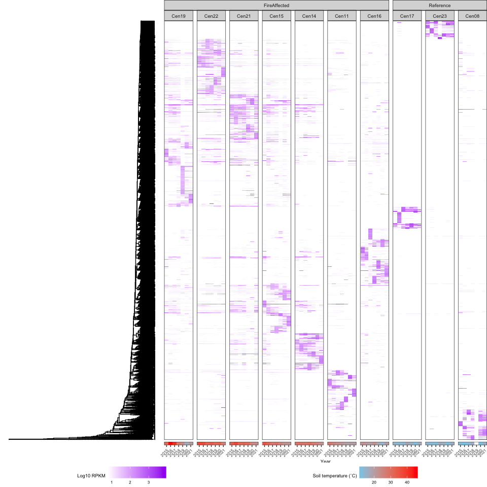<!-- -->

## Abundance zscores

Another way to look at this is using the zscores of the abundances.

``` r
# Make a tree of the vOTUs based on their RPKMs
vOTU_RPKM.NS_Z.mat = data.frame(vOTU_RPKM.mat) %>%
  tibble::rownames_to_column(var="vOTU") %>%
  tidyr::gather(key="SequenceID", value="RPKM", -vOTU) %>%
  mutate(present = ifelse(RPKM > 0, 1, 0)) %>%
  group_by(vOTU) %>%
  mutate(n_samples = sum(present),
         mean_RPKM = mean(RPKM),
         sd_RPKM = sd(RPKM)) %>%
  ungroup %>%
  filter(n_samples > 1) %>%
  mutate(zscore = (RPKM-mean_RPKM)/sd_RPKM) %>%
  select(vOTU, SequenceID, zscore) %>%
  tidyr::spread(key=SequenceID, value=zscore) %>%
  tibble::column_to_rownames(var="vOTU") %>%
  as.matrix

vOTU.dist = dist(vOTU_RPKM.NS_Z.mat)
vOTU.clust = hclust(vOTU.dist)

vOTU.clust = pvclust(t(vOTU_RPKM.NS_Z.mat), method.hclust = "ward.D2",
                     method.dist = "correlation", nboot = 10)
```

    ## Bootstrap (r = 0.49)... Done.
    ## Bootstrap (r = 0.59)... Done.
    ## Bootstrap (r = 0.7)... Done.
    ## Bootstrap (r = 0.8)... Done.
    ## Bootstrap (r = 0.9)... Done.
    ## Bootstrap (r = 1.0)... Done.
    ## Bootstrap (r = 1.09)... Done.
    ## Bootstrap (r = 1.19)... Done.
    ## Bootstrap (r = 1.29)... Done.
    ## Bootstrap (r = 1.39)... Done.

``` r
vOTU.tree.plot = ggtree(vOTU.clust) + 
  geom_tiplab(size=0, align=TRUE, linesize=.5) +
  theme(plot.margin = unit(c(0, 0, 0, 0), "in"))

# Get vOTU order from tree
vOTU_order.df = data.frame(vOTU = rev(get_taxa_name(vOTU.tree.plot))) %>%
  mutate(vOTU_order = row_number()) %>%
  arrange(vOTU_order)

# Get genome abundances grouped by vOTU
SequenceID.order = arrange(sample.meta, FireClassification, SiteID, Year)$SequenceID
Site.order = sample.meta %>%
  group_by(SiteID) %>%
  summarize(maxTemp = max(CoreTemp_C)) %>%
  ungroup %>%
  arrange(-maxTemp) %>%
  mutate(site_order = row_number())

vOTU_abundance.df = data.frame(vOTU_RPKM.NS_Z.mat) %>%
  tibble::rownames_to_column(var="vOTU") %>%
  tidyr::gather(key="SequenceID", value="zscore", -vOTU) %>%
  left_join(sample.meta, by = "SequenceID") %>%
  inner_join(vOTU_order.df, by = "vOTU") %>%
  mutate(SequenceID = factor(SequenceID, levels = SequenceID.order),
         SiteID = factor(SiteID, levels = Site.order$SiteID))

full_abundance.plot = ggplot(data=vOTU_abundance.df, 
                                 aes(x=as.factor(Year), y=vOTU)) +
    geom_tile(aes(fill=zscore), color=NA) +
    scale_fill_gradient2(midpoint = 0, low="blue", high="red", na.value = "white") +
    labs(fill="z-score", x="Year") +
    publication_theme +
    theme(axis.text.x = element_text(angle=45, hjust=1),
          axis.text.y = element_blank(),
          axis.title.y = element_blank(),
          axis.ticks.y = element_blank(),
          legend.position = "bottom",
          plot.margin = unit(c(0, 0, 0, 0), "in"),
          panel.grid = element_blank()) +
  facet_nested(~ FireClassification + SiteID)

full_abundance.leg = g_legend(full_abundance.plot)

## Plot together
full_abundance_tree.plot = cowplot::plot_grid(vOTU.tree.plot, 
                                              full_abundance.plot,
                                              align = "h", axis = "bt", 
                                              rel_widths= c(0.5, 1), nrow=1)
full_abundance_tree.plot
```

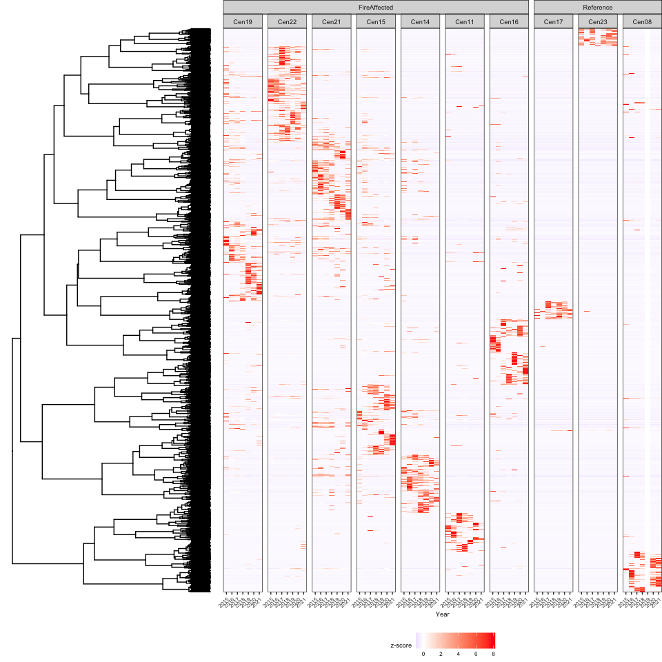<!-- -->

# Session info

``` r
sessionInfo()
```

    ## R version 4.2.2 (2022-10-31)
    ## Platform: aarch64-apple-darwin20 (64-bit)
    ## Running under: macOS Ventura 13.0.1
    ## 
    ## Matrix products: default
    ## BLAS:   /Library/Frameworks/R.framework/Versions/4.2-arm64/Resources/lib/libRblas.0.dylib
    ## LAPACK: /Library/Frameworks/R.framework/Versions/4.2-arm64/Resources/lib/libRlapack.dylib
    ## 
    ## locale:
    ## [1] en_US.UTF-8/en_US.UTF-8/en_US.UTF-8/C/en_US.UTF-8/en_US.UTF-8
    ## 
    ## attached base packages:
    ## [1] stats     graphics  grDevices utils     datasets  methods   base     
    ## 
    ## other attached packages:
    ##  [1] ggh4x_0.2.6      ggnewscale_0.4.9 treeio_1.22.0    ggtree_3.6.2    
    ##  [5] ggdendro_0.1.23  ggnetwork_0.5.12 ggplot2_3.4.4    pvclust_2.2-0   
    ##  [9] betapart_1.5.6   ecotraj_0.0.3    Rcpp_1.0.10      Nonpareil_3.4.0 
    ## [13] picante_1.8.2    nlme_3.1-160     vegan_2.6-4      lattice_0.20-45 
    ## [17] permute_0.9-7    network_1.18.1   readxl_1.4.1     ape_5.6-2       
    ## [21] phyloseq_1.42.0  dplyr_1.0.10    
    ## 
    ## loaded via a namespace (and not attached):
    ##  [1] colorspace_2.0-3       XVector_0.38.0         aplot_0.1.10          
    ##  [4] rstudioapi_0.14        farver_2.1.1           fansi_1.0.3           
    ##  [7] codetools_0.2-18       splines_4.2.2          knitr_1.40            
    ## [10] itertools_0.1-3        ade4_1.7-20            jsonlite_1.8.3        
    ## [13] cluster_2.1.4          Kendall_2.2.1          compiler_4.2.2        
    ## [16] assertthat_0.2.1       Matrix_1.5-3           fastmap_1.1.0         
    ## [19] lazyeval_0.2.2         cli_3.4.1              htmltools_0.5.3       
    ## [22] tools_4.2.2            igraph_1.4.1           coda_0.19-4           
    ## [25] gtable_0.3.1           glue_1.6.2             GenomeInfoDbData_1.2.9
    ## [28] reshape2_1.4.4         fastmatch_1.1-3        Biobase_2.58.0        
    ## [31] cellranger_1.1.0       statnet.common_4.9.0   vctrs_0.5.2           
    ## [34] Biostrings_2.66.0      rhdf5filters_1.10.0    multtest_2.54.0       
    ## [37] iterators_1.0.14       xfun_0.34              stringr_1.5.0         
    ## [40] lifecycle_1.0.3        zlibbioc_1.44.0        MASS_7.3-58.1         
    ## [43] scales_1.2.1           rcdd_1.5               doSNOW_1.0.20         
    ## [46] parallel_4.2.2         biomformat_1.26.0      rhdf5_2.42.0          
    ## [49] yaml_2.3.6             ggfun_0.1.1            yulab.utils_0.0.6     
    ## [52] stringi_1.7.8          highr_0.9              S4Vectors_0.36.0      
    ## [55] foreach_1.5.2          tidytree_0.4.4         measurements_1.4.0    
    ## [58] BiocGenerics_0.44.0    boot_1.3-28            geometry_0.4.6.1      
    ## [61] GenomeInfoDb_1.34.3    rlang_1.1.0            pkgconfig_2.0.3       
    ## [64] bitops_1.0-7           evaluate_0.18          purrr_1.0.1           
    ## [67] Rhdf5lib_1.20.0        patchwork_1.1.2        labeling_0.4.2        
    ## [70] cowplot_1.1.1          tidyselect_1.2.0       plyr_1.8.8            
    ## [73] magrittr_2.0.3         R6_2.5.1               IRanges_2.32.0        
    ## [76] snow_0.4-4             generics_0.1.3         DBI_1.1.3             
    ## [79] pillar_1.8.1           withr_2.5.0            mgcv_1.8-41           
    ## [82] survival_3.4-0         abind_1.4-5            RCurl_1.98-1.9        
    ## [85] tibble_3.1.8           crayon_1.5.2           utf8_1.2.2            
    ## [88] rmarkdown_2.18         grid_4.2.2             data.table_1.14.4     
    ## [91] digest_0.6.30          tidyr_1.3.0            gridGraphics_0.5-1    
    ## [94] stats4_4.2.2           munsell_0.5.0          ggplotify_0.1.1       
    ## [97] magic_1.6-1
