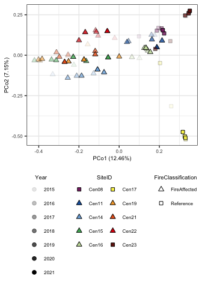
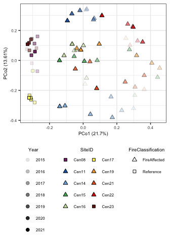
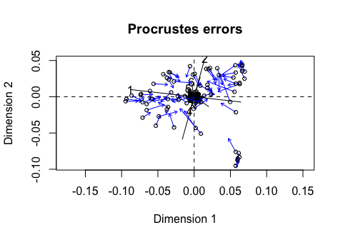
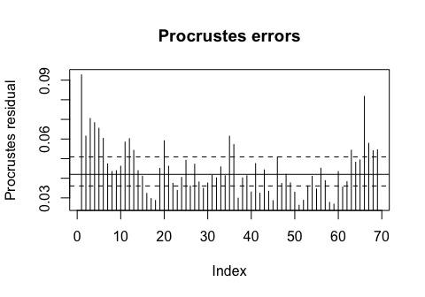
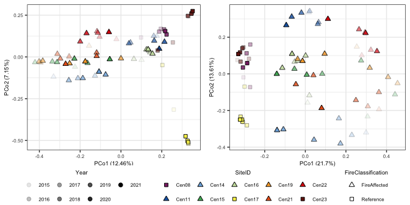

Centralia viral community compared to bacterial community
================
Sam Barnett
24 May, 2024

-   [Introduction](#introduction)
    -   [Import data](#import-data)
-   [Soil viruses](#soil-viruses)
    -   [Get vOTU coverages so we can calulate
        abundances](#get-votu-coverages-so-we-can-calulate-abundances)
    -   [Beta diversity](#beta-diversity)
-   [Soil bacteria](#soil-bacteria)
    -   [Data import](#data-import)
-   [Compare vOTU to bacterial OTU
    communities](#compare-votu-to-bacterial-otu-communities)
    -   [Mantel test](#mantel-test)
    -   [Procrustes](#procrustes)
    -   [Variance partitioning](#variance-partitioning)
-   [Session info](#session-info)

# Introduction

Since we also have the bacterial community for these same Centralia
sites from 16S rRNA gene amplicon sequencing of the same DNA extracts,
we can compare the vOTU community to the bacterial community. Lets take
a look here.

``` r
# Libraries for data
library(dplyr)
library(phyloseq)
library(readxl)

# Libraries for analysis
library(vegan)
library(ape)

# Libraries for plotting
library(ggplot2)
source("/Users/sambarnett/Documents/Misc_code/paul_tol_colors.R")

# Functon for extracting legends
g_legend<-function(a.gplot){
  tmp <- ggplot_gtable(ggplot_build(a.gplot))
  leg <- which(sapply(tmp$grobs, function(x) x$name) == "guide-box")
  legend <- tmp$grobs[[leg]]
  return(legend)} 


# Site lists
used_sites = c("Cen08", "Cen11", "Cen14", "Cen15", "Cen16", "Cen17", "Cen19", 
               "Cen21", "Cen22", "Cen23")

# Setting repeated plot aesthetics
## Sites
site.col = paultol_colors(length(used_sites))
names(site.col) = used_sites

site.shape = c(22, 24, 24, 24, 24, 22, 24, 24, 24, 22)
names(site.shape) = used_sites

## Fire Classifications
FC.col = c("FireAffected" = "red", "Reference" = "grey")
FC.shape = c("FireAffected" = 24, "Reference" = 22)

# Basic plotting theme so as not to continually repeat it
publication_theme = theme_bw() +
  theme(axis.text = element_text(size=6),
        axis.title = element_text(size=7),
        legend.text = element_text(size=6),
        legend.title = element_text(size=7, hjust=0.5),
        strip.text = element_text(size=7),
        plot.title = element_text(size=8, hjust=0.5))

present_theme = theme_bw() +
  theme(axis.text = element_text(size=10),
        axis.title = element_text(size=12),
        legend.text = element_text(size=10),
        legend.title = element_text(size=12, hjust=0.5),
        strip.text = element_text(size=10),
        plot.title = element_text(size=14, hjust=0.5))
```

## Import data

Lets import the initial data used for this analysis including metadata.

### Metadata and read stats

Metadata and number of reads mapped in the metagenome.

``` r
# Sample metadata
sample.meta = read_xlsx("/Users/sambarnett/Documents/Shade_lab/Centralia_project/Centralia_soil_metadata.xlsx", 
                        sheet = "Metagenomic_samples", na="NA") %>%
  filter(SampleID != "Cen08_07102019_R1") %>%
  arrange(SiteID, Year) %>%
  mutate(Seq_number = row_number()) %>%
  mutate(nonpareil_file = paste("/Users/sambarnett/Documents/Shade_lab/Centralia_project/Metagenomics/Data/nonpareil/", SampleID, "_S", Seq_number, ".npo", sep=""),
         SequenceID = paste(SampleID, Seq_number, sep="_S"))

# Read stats
total_reads.df = read.table("/Users/sambarnett/Documents/Shade_lab/Centralia_project/Metagenomics/Data/Filtered_read_statistics.txt", 
                            header=TRUE, sep="\t", comment.char = "", quote = "") %>%
  mutate(total_reads = Forward_read_count + Reverse_read_count) %>%
  select(SampleID, total_reads) %>%
  rename(SequenceID = SampleID) 


mapped_reads.df = read.table("/Users/sambarnett/Documents/Shade_lab/Centralia_project/Metagenomics/Data/Mapped_read_totals.txt", 
                          header=TRUE, sep="\t", comment.char = "", quote = "")
```

# Soil viruses

First lets get all the soil viruses. Some of this is the same as in the
other analysis file.

## Get vOTU coverages so we can calulate abundances

``` r
# Read in the vOTU coverage table
vOTU_coverage.df = read.table("/Users/sambarnett/Documents/Shade_lab/Centralia_project/Phage_analysis/Data/vOTU.comb_cov.txt",
           header=TRUE, sep="\t", comment.char = "", quote = "") %>%
  filter(Covered_percent >= 75,
         Avg_fold >= 1) %>%
  rename(vOTU = ContigID) %>%
  left_join(total_reads.df, by = "SequenceID") %>%
  mutate(vOTU = gsub(" ", "", vOTU),
         mapped_reads = Plus_reads + Minus_reads) %>%
  group_by(SequenceID) %>%
  mutate(total_mapped_reads = sum(mapped_reads)) %>%
  ungroup %>%
  mutate(RPKM = mapped_reads/((Length/1000)*(total_mapped_reads/1000000))) %>%
  mutate(RPKM = ifelse(is.na(RPKM), 0, RPKM))

vOTU.sum = vOTU_coverage.df %>%
  group_by(SequenceID, total_mapped_reads) %>%
  summarize(n_vOTU = n(),
            median_length = median(Length),
            mean_length = mean(Length),
            wmean_length = weighted.mean(Length, w = RPKM),
            mean_RPKM = mean(RPKM),
            sum_RPKM = sum(RPKM)) %>%
  left_join(sample.meta, by="SequenceID") %>%
  left_join(total_reads.df, by = "SequenceID") %>%
  mutate(n_vOTU_per100000r = n_vOTU/total_mapped_reads*100000,
         perc_reads_mapped = total_mapped_reads/total_reads*100)

# How many vOTU are there?
paste("There are", length(unique(vOTU_coverage.df$vOTU)), "vOTU found")
```

    ## [1] "There are 6929 vOTU found"

``` r
# Make vOTU matrix
vOTU_RPKM.mat = vOTU_coverage.df %>%
  select(vOTU, SequenceID, RPKM) %>%
  tidyr::spread(key=SequenceID, value=RPKM) %>%
  tibble::column_to_rownames(var="vOTU") %>%
  as.matrix

vOTU_RPKM.mat[is.na(vOTU_RPKM.mat)] = 0
```

## Beta diversity

Now lets see how the vOTU community varies across samples. For this we
will use Bray-Curtis dissimilarity. For the most part, this is identical
to the other analysis file.

First lets use a permanova to see if there is variation explained by
fire classification, time, and their interaction.

``` r
# Get the Bray-Curtis dissimilarity
vOTU_BC.dist = vegdist(t(vOTU_RPKM.mat), method="bray", binary=FALSE, diag=TRUE, upper=TRUE)
vOTU_BC.dist = as.dist(as.matrix(vOTU_BC.dist)[sample.meta$SequenceID,sample.meta$SequenceID])


# Set up the blocking design for the permanova. In this case since we are repeatedly sampling the same sites over multiple years I include SiteID as the block. This is similar to "strata" in the old version of adonis.
perm <- how(nperm = 999)
setBlocks(perm) <- with(sample.meta, SiteID)

# Run adonis2 
set.seed(4242)
vOTU_BC.adonis = adonis2(formula = vOTU_BC.dist ~ FireClassification*as.factor(Year), 
                    permutations = perm, data = sample.meta)
vOTU_BC.adonis
```

    ## Permutation test for adonis under reduced model
    ## Terms added sequentially (first to last)
    ## Blocks:  with(sample.meta, SiteID) 
    ## Permutation: free
    ## Number of permutations: 999
    ## 
    ## adonis2(formula = vOTU_BC.dist ~ FireClassification * as.factor(Year), data = sample.meta, permutations = perm)
    ##                                    Df SumOfSqs      R2      F Pr(>F)    
    ## FireClassification                  1   2.5774 0.08585 5.9706  0.002 ** 
    ## as.factor(Year)                     6   1.9138 0.06374 0.7389  0.001 ***
    ## FireClassification:as.factor(Year)  6   1.7900 0.05962 0.6911  0.005 ** 
    ## Residual                           55  23.7428 0.79079                  
    ## Total                              68  30.0240 1.00000                  
    ## ---
    ## Signif. codes:  0 '***' 0.001 '**' 0.01 '*' 0.05 '.' 0.1 ' ' 1

Lets visualize that with an ordination

``` r
set.seed(4242)
vOTU_BC.ord = pcoa(vOTU_BC.dist)
Xaxis = paste("PCo1 (", round(vOTU_BC.ord$values[1,2]*100, digits=2), "%)", sep="")
Yaxis = paste("PCo2 (", round(vOTU_BC.ord$values[2,2]*100, digits=2), "%)", sep="")

vOTU_BC.ord.df = data.frame(vOTU_BC.ord$vectors) %>%
  tibble::rownames_to_column(var="SequenceID") %>%
  select(SequenceID, Axis.1, Axis.2) %>%
  left_join(sample.meta, by = "SequenceID")

vOTU_BC_pcoa.plot = ggplot(data=vOTU_BC.ord.df, aes(x=Axis.1, y=Axis.2)) +
  geom_point(aes(shape=FireClassification, fill=SiteID, alpha=Year), size=2) +
  scale_shape_manual(values=FC.shape) +
  scale_fill_manual(values=site.col) +
  labs(x=Xaxis, y=Yaxis) +
  publication_theme +
  theme(legend.position = "bottom", 
        legend.direction = "vertical") +
  guides(fill=guide_legend(override.aes=list(shape=site.shape), ncol=2))
vOTU_BC_pcoa.plot
```

<!-- -->

# Soil bacteria

Now lets pull in the bacterial amplicon sequencing data. This data is
from the study published previously:

Barnett, S.E. & Shade, A. (2024) Arrive and wait: Inactive bacterial
taxa contribute to perceived soil microbiome resilience after a
multidecadal press disturbance. Ecology Letters, 27:e14393.
<https://doi.org/10.1111/ele.14393>

OTU processing will be the same as in that study with few exceptions.
Since the samples used in the metagenome are only a subset of those used
in the amplicon study, we will be rarefying the OTU data based on the
subset sequencing.

## Data import

Import the amplicon data but filter to only those samples included in
the metagenome study. Then rarefy to the smallest sampling depth

``` r
# Import filtered phyloseq
DNA_RNA.physeq = readRDS(file="/Users/sambarnett/Documents/Shade_lab/Centralia_project/Multi_year_project/Data/RNA_DNA_physeq.RDS")
DNA_RNA.physeq
```

    ## phyloseq-class experiment-level object
    ## otu_table()   OTU Table:         [ 67553 taxa and 309 samples ]
    ## sample_data() Sample Data:       [ 309 samples by 48 sample variables ]
    ## tax_table()   Taxonomy Table:    [ 67553 taxa by 7 taxonomic ranks ]
    ## phy_tree()    Phylogenetic Tree: [ 67553 tips and 67549 internal nodes ]

``` r
# Remove RNA samples
DNA.physeq = subset_samples(DNA_RNA.physeq, NucAcid_type == "DNA")
DNA.physeq = prune_taxa(taxa_sums(DNA.physeq) > 0, DNA.physeq)
DNA.physeq
```

    ## phyloseq-class experiment-level object
    ## otu_table()   OTU Table:         [ 61387 taxa and 181 samples ]
    ## sample_data() Sample Data:       [ 181 samples by 48 sample variables ]
    ## tax_table()   Taxonomy Table:    [ 61387 taxa by 7 taxonomic ranks ]
    ## phy_tree()    Phylogenetic Tree: [ 61387 tips and 61383 internal nodes ]

``` r
DNA_RNA.physeq = NULL

# Remove samples not included in the metagenome
meta.DNA.physeq = subset_samples(DNA.physeq, SampleID %in% sample.meta$SampleID)
meta.DNA.physeq = prune_taxa(taxa_sums(meta.DNA.physeq) > 0, meta.DNA.physeq)
DNA.physeq = NULL


# Rarefy
set.seed(4242)
meta.rare.physeq = rarefy_even_depth(meta.DNA.physeq)
meta.rare.physeq
```

    ## phyloseq-class experiment-level object
    ## otu_table()   OTU Table:         [ 36885 taxa and 69 samples ]
    ## sample_data() Sample Data:       [ 69 samples by 48 sample variables ]
    ## tax_table()   Taxonomy Table:    [ 36885 taxa by 7 taxonomic ranks ]
    ## phy_tree()    Phylogenetic Tree: [ 36885 tips and 36884 internal nodes ]

``` r
meta.DNA.physeq = NULL

rare_depth = mean(colSums(otu_table(meta.rare.physeq)))
print(paste("Rarifying to:", rare_depth))
```

    ## [1] "Rarifying to: 161171"

``` r
sample_data(meta.rare.physeq)$SiteID = factor(sample_data(meta.rare.physeq)$SiteID, levels=used_sites)
```

### PERMANOVA

Does fire class or sampling year explain any of the variation in
community compositional differences?

``` r
# Set up the blocking design for the permanova. In this case since we are repeatedly sampling the same sites over multiple years I include SiteID as the block. This is similar to "strata" in the old version of adonis.
perm <- how(nperm = 999)
dat = data.frame(sample_data(meta.rare.physeq))
setBlocks(perm) <- with(dat, SiteID)

# Get the Bray-Curtis dissimilarity
OTU_BC.dist = vegdist(t(otu_table(meta.rare.physeq)), method="bray", binary=FALSE, diag=TRUE, upper=TRUE)

# Run adonis2 
set.seed(4242)
OTU_BC.adonis = adonis2(formula = OTU_BC.dist ~ FireClassification*as.factor(Year), 
                        permutations = perm, data = dat)
OTU_BC.adonis
```

    ## Permutation test for adonis under reduced model
    ## Terms added sequentially (first to last)
    ## Blocks:  with(dat, SiteID) 
    ## Permutation: free
    ## Number of permutations: 999
    ## 
    ## adonis2(formula = OTU_BC.dist ~ FireClassification * as.factor(Year), data = dat, permutations = perm)
    ##                                    Df SumOfSqs      R2       F Pr(>F)    
    ## FireClassification                  1   3.0389 0.16211 12.3303  0.001 ***
    ## as.factor(Year)                     6   1.3972 0.07453  0.9448  0.001 ***
    ## FireClassification:as.factor(Year)  6   0.7546 0.04026  0.5103  0.001 ***
    ## Residual                           55  13.5554 0.72310                   
    ## Total                              68  18.7461 1.00000                   
    ## ---
    ## Signif. codes:  0 '***' 0.001 '**' 0.01 '*' 0.05 '.' 0.1 ' ' 1

### Ordination

``` r
set.seed(4242)
OTU_BC.ord = pcoa(OTU_BC.dist)
Xaxis = paste("PCo1 (", round(OTU_BC.ord$values[1,2]*100, digits=2), "%)", sep="")
Yaxis = paste("PCo2 (", round(OTU_BC.ord$values[2,2]*100, digits=2), "%)", sep="")

OTU_BC.ord.df = data.frame(OTU_BC.ord$vectors) %>%
  tibble::rownames_to_column(var="SampleID") %>%
  select(SampleID, Axis.1, Axis.2) %>%
  left_join(sample_data(meta.rare.physeq), by = "SampleID") %>%
  arrange(Year) %>%
  group_by(SiteID) %>%
  mutate(YearRank = row_number()) %>%
  ungroup %>%
  mutate(AirTemperature_C = as.numeric(AirTemperature_C)) %>%
  mutate(diff_temp = CoreTemp_C-AirTemperature_C)

# Now plot
OTU_BC_pcoa.plot = ggplot(data=OTU_BC.ord.df, aes(x=Axis.1, y=Axis.2)) +
  geom_point(aes(shape=FireClassification, fill=SiteID, alpha=Year), size=2) +
  scale_shape_manual(values=FC.shape) +
  scale_fill_manual(values=site.col) +
  labs(x=Xaxis, y=Yaxis) +
  publication_theme +
  theme(legend.position = "bottom", 
        legend.direction = "vertical") +
  guides(fill=guide_legend(override.aes=list(shape=site.shape), ncol=2))
OTU_BC_pcoa.plot
```

<!-- -->

# Compare vOTU to bacterial OTU communities

Now that we have both communities, lets compare them. We will do this
using Mantel tests and Procrustes analysis.

First we need the Bray-Curtis distances in a matrix form.

``` r
OTU_BC.dist.mat = as.matrix(OTU_BC.dist)
OTU_BC.dist.mat = OTU_BC.dist.mat[sample.meta$SampleID, sample.meta$SampleID]
vOTU_BC.dist.mat = as.matrix(vOTU_BC.dist)
rownames(vOTU_BC.dist.mat) = gsub("_S.*", "", rownames(vOTU_BC.dist.mat))
colnames(vOTU_BC.dist.mat) = gsub("_S.*", "", colnames(vOTU_BC.dist.mat))
vOTU_BC.dist.mat = vOTU_BC.dist.mat[sample.meta$SampleID, sample.meta$SampleID]
```

## Mantel test

We will use a mantel test to see how correlated these two distance
matrices are.

``` r
# Full on mantel test between bacterial OTUs and phage vOTUs
OTU_vOTU.mantel = mantel(OTU_BC.dist.mat, vOTU_BC.dist.mat, permutations = 9999)
OTU_vOTU.mantel
```

    ## 
    ## Mantel statistic based on Pearson's product-moment correlation 
    ## 
    ## Call:
    ## mantel(xdis = OTU_BC.dist.mat, ydis = vOTU_BC.dist.mat, permutations = 9999) 
    ## 
    ## Mantel statistic r: 0.5113 
    ##       Significance: 1e-04 
    ## 
    ## Upper quantiles of permutations (null model):
    ##    90%    95%  97.5%    99% 
    ## 0.0480 0.0626 0.0755 0.0910 
    ## Permutation: free
    ## Number of permutations: 9999

Now lets try a partial mantel test to account for community
dissimilarity due to soil pH and temperature. These are two factors
known to influence both bacterial and viral communities.

``` r
# First get the Euclidian distance matrix including both pH and temperature, which are scaled and centered.
pH_temp.mat = sample.meta %>%
  select(SampleID, pH, CoreTemp_C) %>%
  tibble::column_to_rownames(var="SampleID") %>%
  as.matrix

pH_temp.dist <- vegdist(scale(pH_temp.mat), "euclid")
pH_temp.dist.mat = as.matrix(pH_temp.dist)
pH_temp.dist.mat = pH_temp.dist.mat[sample.meta$SampleID, sample.meta$SampleID]

# Run a mantel test to see how bacterial OTUs were correlated to pH and temp differences.
print("Mantel test: Bacterial OTUs vs. pH and temperature")
```

    ## [1] "Mantel test: Bacterial OTUs vs. pH and temperature"

``` r
OTU_pH_Temp.mantel = mantel(OTU_BC.dist.mat, pH_temp.dist.mat, permutations = 9999)
OTU_pH_Temp.mantel
```

    ## 
    ## Mantel statistic based on Pearson's product-moment correlation 
    ## 
    ## Call:
    ## mantel(xdis = OTU_BC.dist.mat, ydis = pH_temp.dist.mat, permutations = 9999) 
    ## 
    ## Mantel statistic r: 0.6717 
    ##       Significance: 1e-04 
    ## 
    ## Upper quantiles of permutations (null model):
    ##    90%    95%  97.5%    99% 
    ## 0.0546 0.0715 0.0846 0.1025 
    ## Permutation: free
    ## Number of permutations: 9999

``` r
# Now run the partial mantel test comparing OTUs and vOTUs taking into account pH and temp difference.
print("Partial Mantel test: Bacterial OTUs vs. viral vOTU considering pH and temperature")
```

    ## [1] "Partial Mantel test: Bacterial OTUs vs. viral vOTU considering pH and temperature"

``` r
OTU_vOTU_C_pH_Temp.pmantel = mantel.partial(xdis = OTU_BC.dist.mat, ydis = vOTU_BC.dist.mat, zdis = pH_temp.dist.mat, 
               permutations = 9999)
OTU_vOTU_C_pH_Temp.pmantel
```

    ## 
    ## Partial Mantel statistic based on Pearson's product-moment correlation 
    ## 
    ## Call:
    ## mantel.partial(xdis = OTU_BC.dist.mat, ydis = vOTU_BC.dist.mat,      zdis = pH_temp.dist.mat, permutations = 9999) 
    ## 
    ## Mantel statistic r: 0.3863 
    ##       Significance: 1e-04 
    ## 
    ## Upper quantiles of permutations (null model):
    ##    90%    95%  97.5%    99% 
    ## 0.0544 0.0703 0.0846 0.1002 
    ## Permutation: free
    ## Number of permutations: 9999

## Procrustes

Now the Procrustes analysis using the PCoA ordinations for bacterial
OTUs and viral vOTUs.

``` r
# Rerun the PCoA ordinations with the sampe ordered samples. Note this is important otherwise the comparison doesnt work right.
ordered_OTU_BC.ord = pcoa(as.dist(OTU_BC.dist.mat))
ordered_vOTU_BC.ord = pcoa(as.dist(vOTU_BC.dist.mat))

# Run the Procrustes analysis
protest(X = ordered_vOTU_BC.ord$vectors, Y = ordered_OTU_BC.ord$vectors, permutations = 999, symmetric = TRUE)
```

    ## 
    ## Call:
    ## protest(X = ordered_vOTU_BC.ord$vectors, Y = ordered_OTU_BC.ord$vectors,      permutations = 999, symmetric = TRUE) 
    ## 
    ## Procrustes Sum of Squares (m12 squared):        0.1502 
    ## Correlation in a symmetric Procrustes rotation: 0.9218 
    ## Significance:  0.001 
    ## 
    ## Permutation: free
    ## Number of permutations: 999

``` r
# Run the Procrustes analysis again and plot
vOTU_OTU.procrustes = procrustes(X = ordered_vOTU_BC.ord$vectors, Y = ordered_OTU_BC.ord$vectors, permutations = 999, symmetric = TRUE)
vOTU_OTU.procrustes
```

    ## 
    ## Call:
    ## procrustes(X = ordered_vOTU_BC.ord$vectors, Y = ordered_OTU_BC.ord$vectors,      symmetric = TRUE, permutations = 999) 
    ## 
    ## Procrustes sum of squares:
    ## 0.1502

``` r
plot(vOTU_OTU.procrustes, kind=1)
```

<!-- -->

``` r
plot(vOTU_OTU.procrustes, kind=2)
```

<!-- -->

``` r
cowplot::plot_grid(cowplot::plot_grid(vOTU_BC_pcoa.plot + theme(legend.position = "none"),
                                      OTU_BC_pcoa.plot + theme(legend.position = "none"), nrow=1),
                   g_legend(vOTU_BC_pcoa.plot + guides(fill=guide_legend(override.aes=list(shape=site.shape), nrow=2),
                                                       alpha=guide_legend(nrow=2))),
                   ncol=1, rel_heights = c(1,0.2))
```

<!-- -->

## Variance partitioning

Now lets try partitioning the variance to see what percentage of
bacterial variation is due to the viral community compared to
temperature and pH.

``` r
# Get the tables used to explain the variance in bacterial communities
vOTU.meta = data.frame(t(vOTU_RPKM.mat))
rownames(vOTU.meta) = gsub("_S.*", "", rownames(vOTU.meta))
vOTU.meta = vOTU.meta[sample.meta$SampleID,]

temp_pH.meta = sample.meta %>%
  select(SampleID, CoreTemp_C, pH) %>%
  tibble::column_to_rownames(var="SampleID")
temp_pH.meta = temp_pH.meta[sample.meta$SampleID,]

# Run the variance partitioning
OTU.part.all <- varpart(as.dist(OTU_BC.dist.mat), temp_pH.meta, vOTU.meta)
OTU.part.all$part
```

    ## No. of explanatory tables: 2 
    ## Total variation (SS): 18.746 
    ## No. of observations: 69 
    ## 
    ## Partition table:
    ##                      Df R.squared Adj.R.squared Testable
    ## [a+c] = X1            2   0.27888       0.25703     TRUE
    ## [b+c] = X2           68   1.00000                   TRUE
    ## [a+b+c] = X1+X2      68   1.00000                   TRUE
    ## Individual fractions                                    
    ## [a] = X1|X2           0                            FALSE
    ## [b] = X2|X1          66                             TRUE
    ## [c]                   0                            FALSE
    ## [d] = Residuals                                    FALSE
    ## ---
    ## Use function 'dbrda' to test significance of fractions of interest

# Session info

``` r
sessionInfo()
```

    ## R version 4.2.2 (2022-10-31)
    ## Platform: aarch64-apple-darwin20 (64-bit)
    ## Running under: macOS Ventura 13.0.1
    ## 
    ## Matrix products: default
    ## BLAS:   /Library/Frameworks/R.framework/Versions/4.2-arm64/Resources/lib/libRblas.0.dylib
    ## LAPACK: /Library/Frameworks/R.framework/Versions/4.2-arm64/Resources/lib/libRlapack.dylib
    ## 
    ## locale:
    ## [1] en_US.UTF-8/en_US.UTF-8/en_US.UTF-8/C/en_US.UTF-8/en_US.UTF-8
    ## 
    ## attached base packages:
    ## [1] stats     graphics  grDevices utils     datasets  methods   base     
    ## 
    ## other attached packages:
    ## [1] ggplot2_3.4.4   ape_5.6-2       vegan_2.6-4     lattice_0.20-45
    ## [5] permute_0.9-7   readxl_1.4.1    phyloseq_1.42.0 dplyr_1.0.10   
    ## 
    ## loaded via a namespace (and not attached):
    ##  [1] Rcpp_1.0.10            tidyr_1.3.0            Biostrings_2.66.0     
    ##  [4] assertthat_0.2.1       digest_0.6.30          foreach_1.5.2         
    ##  [7] utf8_1.2.2             cellranger_1.1.0       R6_2.5.1              
    ## [10] GenomeInfoDb_1.34.3    plyr_1.8.8             stats4_4.2.2          
    ## [13] evaluate_0.18          highr_0.9              pillar_1.8.1          
    ## [16] zlibbioc_1.44.0        rlang_1.1.0            rstudioapi_0.14       
    ## [19] data.table_1.14.4      S4Vectors_0.36.0       Matrix_1.5-3          
    ## [22] rmarkdown_2.18         labeling_0.4.2         splines_4.2.2         
    ## [25] stringr_1.5.0          igraph_1.4.1           RCurl_1.98-1.9        
    ## [28] munsell_0.5.0          compiler_4.2.2         xfun_0.34             
    ## [31] pkgconfig_2.0.3        BiocGenerics_0.44.0    multtest_2.54.0       
    ## [34] mgcv_1.8-41            htmltools_0.5.3        biomformat_1.26.0     
    ## [37] tidyselect_1.2.0       tibble_3.1.8           GenomeInfoDbData_1.2.9
    ## [40] IRanges_2.32.0         codetools_0.2-18       fansi_1.0.3           
    ## [43] withr_2.5.0            crayon_1.5.2           MASS_7.3-58.1         
    ## [46] bitops_1.0-7           rhdf5filters_1.10.0    grid_4.2.2            
    ## [49] nlme_3.1-160           jsonlite_1.8.3         gtable_0.3.1          
    ## [52] lifecycle_1.0.3        DBI_1.1.3              magrittr_2.0.3        
    ## [55] scales_1.2.1           cli_3.4.1              stringi_1.7.8         
    ## [58] farver_2.1.1           XVector_0.38.0         reshape2_1.4.4        
    ## [61] generics_0.1.3         vctrs_0.5.2            cowplot_1.1.1         
    ## [64] Rhdf5lib_1.20.0        iterators_1.0.14       tools_4.2.2           
    ## [67] ade4_1.7-20            Biobase_2.58.0         glue_1.6.2            
    ## [70] purrr_1.0.1            survival_3.4-0         parallel_4.2.2        
    ## [73] fastmap_1.1.0          yaml_2.3.6             colorspace_2.0-3      
    ## [76] rhdf5_2.42.0           cluster_2.1.4          knitr_1.40
